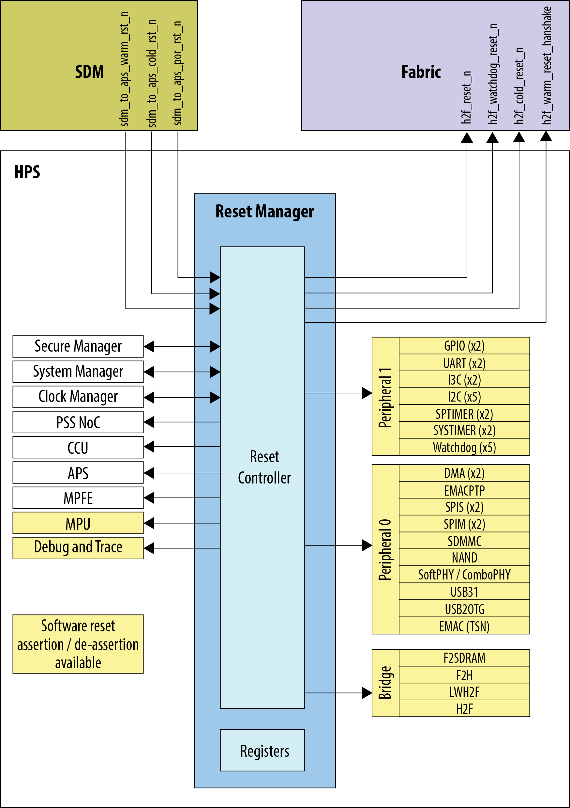
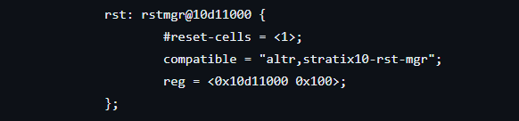

# **Reset Manager Driver for Hard Processor System**

Last updated: **March 18, 2025** 

**Upstream Status**: Not Upstreamed

**Devices supported**: Agilex 5

## **Introduction**

The reset manager generates module reset signals based on reset requests from various sources in the HPS, and performs software writing to the module-reset control registers.

The HPS contains multiple reset domains. Each reset domain can be reset
independently. A reset can be initiated externally, internally, or through software.  For more information about the reset manager, please refer to the [Intel Agilex 5 Hard Processor System Technical Reference Manual](https://www.intel.com/content/www/us/en/docs/programmable/814346).

{: style="height:450px;width:450px"}

## **Driver Sources**

The source code for this driver can be found at:

[https://github.com/altera-opensource/linux-socfpga/blob/socfpga-6.1.55-lts/drivers/reset/reset-simple.c](https://github.com/altera-opensource/linux-socfpga/blob/socfpga-6.1.55-lts/drivers/reset/reset-simple.c)

## **Driver Capabilities**

* Manage the system level reset.
* Support Assert and De-assert of the reset signal.
* Monitor the status of the reset signal.

## **Kernel Configurations**

CONFIG_RESET_SIMPLE

## **Device Tree**

Example Device tree location for reset signal parameter:

[https://github.com/altera-opensource/linux-socfpga/blob/socfpga-6.1.55-lts/arch/arm64/boot/dts/intel/socfpga_agilex5.dtsi](https://github.com/altera-opensource/linux-socfpga/blob/socfpga-6.1.55-lts/arch/arm64/boot/dts/intel/socfpga_agilex5.dtsi)

Also dt-bindings can be found at:

[https://github.com/altera-opensource/linux-socfpga/blob/socfpga-6.1.55-lts/include/dt-bindings/reset/altr%2Crst-mgr-agilex5.h](https://github.com/altera-opensource/linux-socfpga/blob/socfpga-6.1.55-lts/include/dt-bindings/reset/altr%2Crst-mgr-agilex5.h)

## **Known Issues**

None Known

