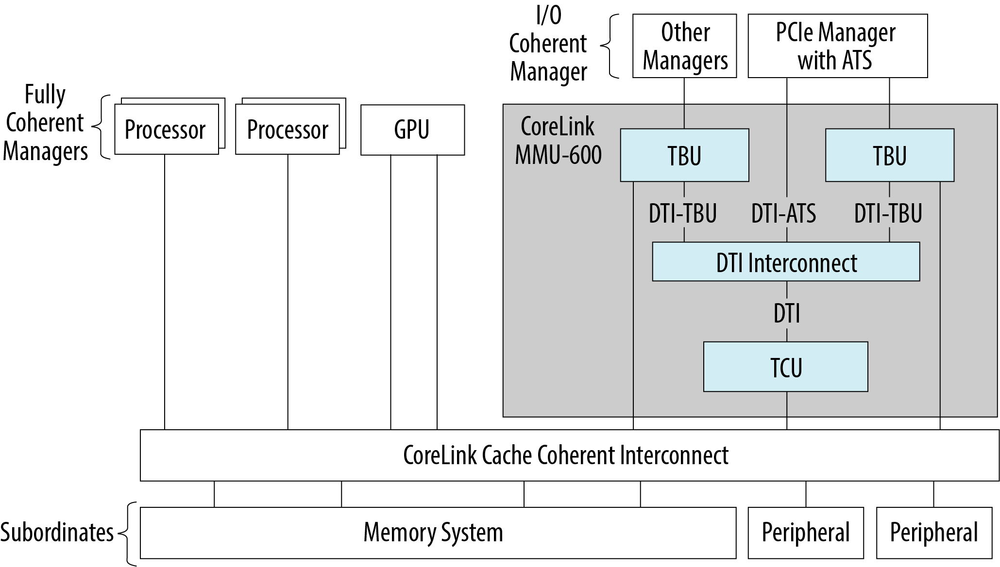
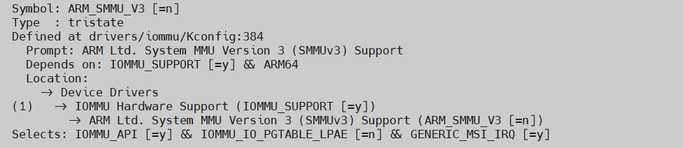
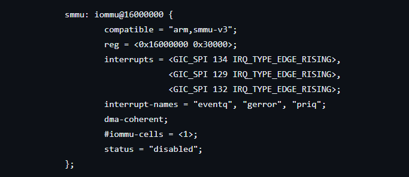

# **System Memory Management Unit (SMMU) Driver for Hard Processor System**

Last updated: **August 07, 2024** 

**Upstream Status**: [Upstreamed](https://git.kernel.org/pub/scm/linux/kernel/git/torvalds/linux.git/tree/drivers/iommu/arm/arm-smmu-v3)

**Devices supported**: Agilex 5

## **Introduction**

SMMU converts virtual addresses to physical addresses for external peripheral devices. This allows multiple external devices to perform direct memory access (DMA) to the entire range of the system physical memory.

As an example, certain peripheral devices limited to accessing only 24 bits of address space would now be able to access all 64 bits addresssing through the memory translation tables of the SMMU.

The SDM SMMU is used solely by the FCS Cryptography feature. The accelerator like FCS_Crytpo sends a VA to SMMU and SMMU queries the PA from the page table.

SMMU registers are configured through ARM Trusted firmware (ATF) BL31 SMC calls by the Crytography device drivers. The ATF performs default SMMU initializations of the stream IDs through the system manager and SMMU secure registers configuration during the boot-up process.

For More information please refer to the following link:

[Agilex 5 Hard Processor System Technical Reference Manual](https://www.intel.com/content/www/us/en/docs/programmable/814346)

{: style="height:450px"}

## **Driver Sources**

The source code for this driver can be found at:

[https://git.kernel.org/pub/scm/linux/kernel/git/torvalds/linux.git/tree/drivers/iommu/arm/arm-smmu-v3](https://git.kernel.org/pub/scm/linux/kernel/git/torvalds/linux.git/tree/drivers/iommu/arm/arm-smmu-v3)

## **Driver Capabilities**

* Queue manipulation, sizing
* Command queue locking or insertion
* Error reporting
* Updating Stream Table Entry

## **Kernel Configurations**

CONFIG_ARM_SMMU_V3

## **Device Tree**

Example Device tree location to configure the smmu:

[https://github.com/altera-opensource/linux-socfpga/blob/socfpga_agilex5-ES_RC/arch/arm64/boot/dts/intel/socfpga_agilex5.dtsi](https://github.com/altera-opensource/linux-socfpga/blob/socfpga_agilex5-ES_RC/arch/arm64/boot/dts/intel/socfpga_agilex5.dtsi)

## **Known Issues**

None known

## Notices & Disclaimers

Altera&reg; Corporation technologies may require enabled hardware, software or service activation.
No product or component can be absolutely secure. 
Performance varies by use, configuration and other factors.
Your costs and results may vary. 
You may not use or facilitate the use of this document in connection with any infringement or other legal analysis concerning Altera or Intel products described herein. You agree to grant Altera Corporation a non-exclusive, royalty-free license to any patent claim thereafter drafted which includes subject matter disclosed herein.
No license (express or implied, by estoppel or otherwise) to any intellectual property rights is granted by this document, with the sole exception that you may publish an unmodified copy. You may create software implementations based on this document and in compliance with the foregoing that are intended to execute on the Altera or Intel product(s) referenced in this document. No rights are granted to create modifications or derivatives of this document.
The products described may contain design defects or errors known as errata which may cause the product to deviate from published specifications.  Current characterized errata are available on request.
Altera disclaims all express and implied warranties, including without limitation, the implied warranties of merchantability, fitness for a particular purpose, and non-infringement, as well as any warranty arising from course of performance, course of dealing, or usage in trade.
You are responsible for safety of the overall system, including compliance with applicable safety-related requirements or standards. 
&copy; Altera Corporation.  Altera, the Altera logo, and other Altera marks are trademarks of Altera Corporation.  Other names and brands may be claimed as the property of others. 

OpenCL and the OpenCL logo are trademarks of Apple Inc. used by permission of the Khronos Group™. 
