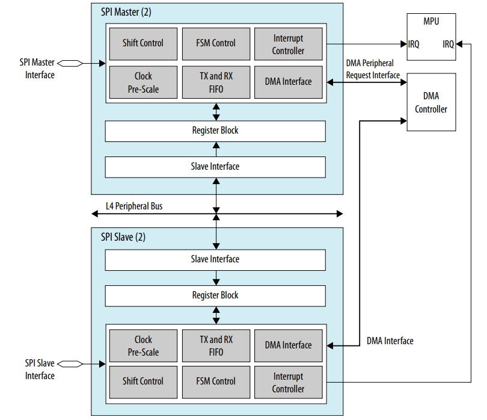

# **SPI Driver for Hard Processor System**

Last updated: **January 28, 2025** 

**Upstream Status**: [Upstreamed](https://git.kernel.org/pub/scm/linux/kernel/git/torvalds/linux.git/tree/drivers/spi)

**Devices supported**: Agilex7, Agilex 5

## **Introduction**

Serial master and serial slave controllers are instances of the Synopsys DesignWare Synchronous Serial Interface (SSI) controller.   These enable serial communication with serial-master or serial-slave peripheral devices.
Each SPI master has a maximum bit rate of 60 Mbps.
Each SPI slave has a maximum bit rate of 33.33 Mbps.
The DMA controller interface is integrated with the HPS DMA controller.

For More information please refer to the following link:

[Agilex 5 Hard Processor System Technical Reference Manual](https://www.intel.com/content/www/us/en/docs/programmable/814346)

{: style="height:450px;width:450px"}

## **Driver Sources**

The source code for this driver can be found at [https://git.kernel.org/pub/scm/linux/kernel/git/torvalds/linux.git/tree/drivers/spi/spi-dw-mmio.c](https://git.kernel.org/pub/scm/linux/kernel/git/torvalds/linux.git/tree/drivers/spi/spi-dw-mmio.c).


## **Driver Capabilities**

* Handle the data transfer between connected devices over the SPI bus.
* Support the peripheral slave DMA.


## **Kernel Configurations**

**CONFIG_SPI_DW_MMIO**

```
Symbol: SPI_DW_MMIO [=y]                                                                               
  Type  : tristate                                                                                       
  Defined at drivers/spi/Kconfig:313                                                                     
     Prompt: Memory-mapped io interface driver for DW SPI core                                           
     Depends on: SPI [=y] && SPI_MASTER [=y] && SPI_DESIGNWARE [=y] && \                                 
     HAS_IOMEM [=y]                                                                                         
     Location:                                                                                             
       -> Device Drivers                                                                                    
         -> SPI support (SPI [=y])                                                                        
           -> DesignWare SPI controller core support (SPI_DESIGNWARE [=y])                                 
             -> Memory-mapped io interface driver for DW SPI core (SPI_DW_MMIO [=y])

```

**SPI_DW_DMA**

```
Symbol: SPI_DW_DMA [=y]                                                                                  
   Type  : bool                                                                                          
   Defined at drivers/spi/Kconfig:306                                                                      
     Prompt: DMA support for DW SPI controller                                                              
     Depends on: SPI [=y] && SPI_MASTER [=y] && SPI_DESIGNWARE [=y]                                         
     Location:                                                                                              
       -> Device Drivers                                                                                    
         -> SPI support (SPI [=y])                                                                          
           -> DesignWare SPI controller core support (SPI_DESIGNWARE [=y])                                  
             -> DMA support for DW SPI controller (SPI_DW_DMA [=y])  
```

**Note:** The DMA feature in the SPI controller depends on the HPS DMA controller driver. This driver uses the **CONFIG_DW_AXI_DMAC** configuration which need to be set to **y** to be included in the kernel image.

## **Device Tree**

An example of the device tree configuration of the SPI driver for the Synopsys DesignWare Synchronous Serial Interface (SSI) controller in the HPS is shown next:

[https://git.kernel.org/pub/scm/linux/kernel/git/torvalds/linux.git/tree/arch/arm64/boot/dts/intel/socfpga_agilex5.dtsi](https://git.kernel.org/pub/scm/linux/kernel/git/torvalds/linux.git/tree/arch/arm64/boot/dts/intel/socfpga_agilex5.dtsi)

```
spi0: spi@10da4000 {
			compatible = "snps,dw-apb-ssi";
			reg = <0x10da4000 0x1000>;
			#address-cells = <1>;
			#size-cells = <0>;
			interrupts = <GIC_SPI 99 IRQ_TYPE_LEVEL_HIGH>;
			resets = <&rst SPIM0_RESET>;
			reset-names = "spi";
			reg-io-width = <4>;
			num-cs = <4>;
			clocks = <&clkmgr AGILEX5_L4_MAIN_CLK>;
			dmas = <&dmac0 16>, <&dmac0 17>;
			dma-names ="tx", "rx";
			status = "disable";
		};
```

**Note:** This node is disabled by default in the **socfpga_agilex5.dtsi**. This is enabled in the **arch/arm64/boot/dts/intel/socfpga_agilex5_socdk_debug.dts** as shown in the [Test procedure](#test-procedure) section. 

## **Test Procedure**
The **spidev_test** tool can be used to demonstrate the SPI capabilities on Linux. This application can be made available for Linux in any of the following ways:

- **From GSRD build flow:** Include this application during **Customize Yocto** stage by adding **spidev-test** to the list of tools in the [packagegroup-dev-tools-essential.bb](https://github.com/altera-opensource/meta-intel-fpga-refdes/blob/master/recipes-images/packagegroups/packagegroup-dev-tools-essential.bb) Yocto recipe.
- **From the Linux Boot example build flow:** Include this application during the **Build Rootfs** stage by adding  **spidev-test** to the list of applications to be included in the file system defined with the **CORE_IMAGE_EXTRA_INSTALL** configuration.

The **spidev-test** application depends on the **drivers/spi/spidev.c** driver to access the SPI devices throught regular userspace I/O calls. This driver is built through the **CONFIG_SPI_SPIDEV** kernel configuration. This driver also must be enabled in the device tree through the **spidev** node  as shown next. This is already done in the **arch/arm64/boot/dts/intel/socfpga_agilex5_socdk_debug.dts** file.

```
&spi0 {
	status= "okay";
	spidev@0{
		compatible = "rohm,dh2228fv";
		reg = <0>;
		spi-max-frequency = <10000000>;
	};
};
```

**Note:** When building binaries to exercise this test procedure using the Linux Boot example build flow, it is necessary to enable the drivers and their dependencies as indicated in [Kernel Configurations](#kernel-configurations) section. In the case of the GSRB build flow, all the required drivers are already included either as part of the kernel image (included through kernel configuration) or including and loading the **.ko** driver file from the file system. 

The following test procedure can be exercised using the Agilex 5 E-Series device using the DEBUG2 daughter card for the Premium development kit, in which the **spidev-test** application targets the built-in Microchip 25AA128 EEPROM device. The **spidev** driver is compatible with this device.

The test procedure consist on enabling the writing in the EEPROM device, then writing a byte (0xC6) to a memory location (0x68D) and then reading this back.

1. Send the 'Transmits the Write Enable' (WREN) instruction code (0x06).
```
root@testsocfpga# spidev_test -D /dev/spidev1.0 -v -p "\x06"
spi mode: 0x0
bits per word: 8
max speed: 500000 Hz (500 kHz)
TX | 06 __ __ __ __ __ __ __ __ __ __ __ __ __ __ __ __ __ __ __ __ __ __ __ __ __ __ __ __ __ __ __  |.|
RX | FF __ __ __ __ __ __ __ __ __ __ __ __ __ __ __ __ __ __ __ __ __ __ __ __ __ __ __ __ __ __ __  |.|
```

2. Perform byte write (instruction code x02) with random value (xC6) and offset (MSB x06, LSB x8D)
```
root@testsocfpga# spidev_test -D /dev/spidev1.0 -v -p "\x02\x06\x8D\xC6"
spi mode: 0x0
bits per word: 8
max speed: 500000 Hz (500 kHz)
TX | 02 06 8D C6 __ __ __ __ __ __ __ __ __ __ __ __ __ __ __ __ __ __ __ __ __ __ __ __ __ __ __ __  |....|
RX | FF FF FF FF __ __ __ __ __ __ __ __ __ __ __ __ __ __ __ __ __ __ __ __ __ __ __ __ __ __ __ __  |....|
```

3. Perform byte read (instruction code x03) on the previously written offset. xC6 will be received.
```
root@testsocfpga# spidev_test -D /dev/spidev1.0 -v -p "\x03\x06\x8D\x00"
spi mode: 0x0
bits per word: 8
max speed: 500000 Hz (500 kHz)
TX | 03 06 8D 00 __ __ __ __ __ __ __ __ __ __ __ __ __ __ __ __ __ __ __ __ __ __ __ __ __ __ __ __  |....|
RX | FF FF FF C6 __ __ __ __ __ __ __ __ __ __ __ __ __ __ __ __ __ __ __ __ __ __ __ __ __ __ __ __  |....|
```


## **Known Issues**

None Known

## Notices & Disclaimers

Altera<sup>&reg;</sup> Corporation technologies may require enabled hardware, software or service activation.
No product or component can be absolutely secure. 
Performance varies by use, configuration and other factors.
Your costs and results may vary. 
You may not use or facilitate the use of this document in connection with any infringement or other legal analysis concerning Altera or Intel products described herein. You agree to grant Altera Corporation a non-exclusive, royalty-free license to any patent claim thereafter drafted which includes subject matter disclosed herein.
No license (express or implied, by estoppel or otherwise) to any intellectual property rights is granted by this document, with the sole exception that you may publish an unmodified copy. You may create software implementations based on this document and in compliance with the foregoing that are intended to execute on the Altera or Intel product(s) referenced in this document. No rights are granted to create modifications or derivatives of this document.
The products described may contain design defects or errors known as errata which may cause the product to deviate from published specifications.  Current characterized errata are available on request.
Altera disclaims all express and implied warranties, including without limitation, the implied warranties of merchantability, fitness for a particular purpose, and non-infringement, as well as any warranty arising from course of performance, course of dealing, or usage in trade.
You are responsible for safety of the overall system, including compliance with applicable safety-related requirements or standards. 
<sup>&copy;</sup> Altera Corporation.  Altera, the Altera logo, and other Altera marks are trademarks of Altera Corporation.  Other names and brands may be claimed as the property of others. 

OpenCL* and the OpenCL* logo are trademarks of Apple Inc. used by permission of the Khronos Group™. 
