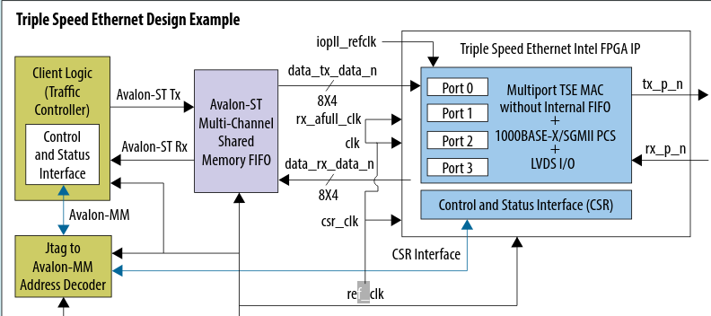
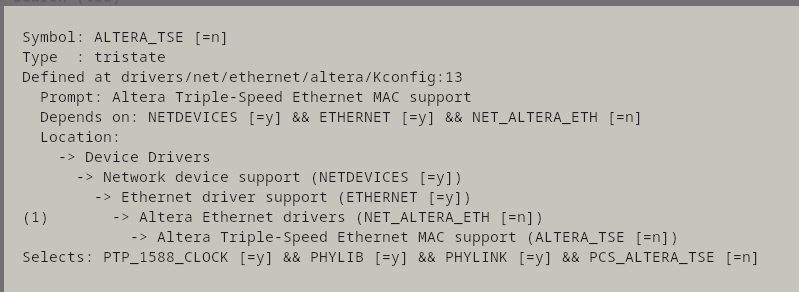

# **Triple Speed Ethernet Driver**


Last updated: **August 30, 2024** 

**Upstream Status**: Upstreamed

**Devices supported**:Agilex 5,  Agilex 7, Stratix10, Cyclone V

## **Introduction**

The Triple-Speed Ethernet, SGDMA, and MSGDMA components are all soft IP components that can be assembled and built into an FPGA using the Altera Quartus toolchain. The controller uses the SGDMA and MSGDMA soft DMA IP components.

| Driver | Capability |
|:-------|:----------|
| /drivers/net/ethernet/altera/altera_tse_main.c |  Main network device driver  |
| /drivers/net/ethernet/altera/altera_tse_ethtool.c | Ethtool support

The following group of drivers is required to support TSE driver:

| Driver | Capability |
|:-------|:----------|
| /drivers/net/ethernet/altera/altera_msgdma.c | MSGDMA implementation |
| /drivers/net/ethernet/altera/altera_utils.c   | Driver utility functions |

### **Triple Speed Ethernet Overview**

The Triple-Speed Ethernet FPGA IP core consists of a 10/100/1000 Mbps Ethernet media access control (MAC) and physical coding sublayer (PCS) Intellectual Property (IP). This IP function enables FPGAs to interface to an external Ethernet PHY device, which interfaces to the Ethernet network.

This IP is offered in MAC-only mode or in MAC+PHY mode. In the MAC only mode, the IP uses an external PHY chip to do signaling. The two supported interfaces to the external PHYs are: GMII (8-bit interface at 125 MHz SDR) and RGMII (4-bit interface at 125 MHz DDR).

In the MAC+PHY mode, the PHY is realized using on-chip transceivers or LVDS I/O with dynamic phase alignment (DPA) logic that can operate up to 1.25 Gbps. SGMII or 1000Base-X protocol is used in this case. The usage of LVDS I/Os enables very scalable multiport gigabit Ethernet (GbE) system designs while saving the serial transceivers for higher performance protocols.


Features

- Complete 10/100/1000 Mbps Ethernet IP with all the necessary IP modules
  - 10/100/1000 Mbps MAC, PCS, and PMA
- Flexible IP options
  - MAC only, PCS only, MAC + PCS, MAC + PCS + PMA, PCS + PMA
  - Many options for various applications and sizes as small as 900 logic elements (small-MAC)
  - Standard-based statistics counters supporting simple network management protocol (SNMP) Management Information Base (MIB and MIB-II) and Remote Network Monitoring (RMON)
  - Parameterizable FIFO or FIFO-less MAC options
  - IEEE 1588 v2 high accuracy and high precision time stamping option in hardware IP
    - 1-step and 2-step time sync
    - Supports IEEE 1588 v2 PTP packet encapsulation in IPv4, IPv6, and Ethernet
    - Real time of day clock generator (ToD) IP in design example
- Many external Ethernet interface options for various FPGA families
  - MII (10/100 Mbps), GMII, RGMII, and SGMII (10/100/1000 Mbps), 1000BASE-X, and TBI (1 Gbps)
  - Management data I/O (MDIO) for external PHY device management


{: style="height:500px"}


## **Driver Sources**

The source code for this driver can be found at [https://github.com/altera-opensource/linux-socfpga/blob/socfpga-6.1.55-lts/drivers/net/ethernet/altera/altera_tse*](https://github.com/altera-opensource/linux-socfpga/blob/socfpga-6.1.55-lts/drivers/net/ethernet/altera/).  

## **Kernel Configurations**



## **Device Tree**

```
tse_sub_0: ethernet@c0100000 {
        compatible = "altr,tse-msgdma-1.0";
        reg = <0xc0100000 0x00000400>,
              <0xc0101000 0x00000020>,
              <0xc0102000 0x00000020>,
              <0xc0103000 0x00000008>,
              <0xc0104000 0x00000020>,
              <0xc0105000 0x00000020>,
              <0xc0106000 0x00000100>;
        reg-names = "control_port", "rx_csr", "rx_desc", "rx_resp", "tx_csr", "tx_desc", "pcs";
        interrupt-parent = <&intc>;
        interrupts = <0 44 4>,<0 45 4>; 
        interrupt-names = "rx_irq","tx_irq";
        rx-fifo-depth = <2048>;
        tx-fifo-depth = <2048>;
        max-frame-size = <1500>;
        local-mac-address = [ 00 00 00 00 00 00 ];
        altr,has-supplementary-unicast;
        altr,has-hash-multicast-filter;
        sfp = <&sfp0>;
        phy-mode = "sgmii";
        managed = "in-band-status";
    };  
    tse_sub_1_eth_tse_0: ethernet@1,00001000 {
        compatible = "altr,tse-msgdma-1.0";
        reg = <0x00001000 0x00000400>,
              <0x00001460 0x00000020>,
              <0x00001480 0x00000020>,
              <0x000014A0 0x00000008>,
              <0x00001400 0x00000020>,
CONFIG_ALTERA_TSE              <0x00001420 0x00000020>;
        reg-names = "control_port", "rx_csr", "rx_desc", "rx_resp", "tx_csr", "tx_desc";
        interrupt-parent = <&hps_0_arm_gic_0>;
        interrupts = <0 43 4>, <0 42 4>; 
        interrupt-names = "rx_irq", "tx_irq";
        rx-fifo-depth = <2048>;
        tx-fifo-depth = <2048>;
        max-frame-size = <1500>;
        local-mac-address = [ 00 00 00 00 00 00 ];
        phy-mode = "gmii";
        altr,has-supplementary-unicast;
        altr,has-hash-multicast-filter;
        phy-handle = <&phy1>;
        mdio {
            compatible = "altr,tse-mdio";
            #address-cells = <1>;
            #size-cells = <0>;
            phy1: ethernet-phy@1 {
                reg = <0x1>;
            };
        };
    };  
```

## **PTP Support**

Ensure the board supports Precision Time Protocol (PTP). Then, append the following to your Triple Speed Ethernet (TSE) device tree node:
```
altr,has-ptp
```

Note: For this feature only Agilex 7 has been well tested.
## **Known Issues**

None known

## Notices & Disclaimers

Altera<sup>&reg;</sup> Corporation technologies may require enabled hardware, software or service activation.
No product or component can be absolutely secure. 
Performance varies by use, configuration and other factors.
Your costs and results may vary. 
You may not use or facilitate the use of this document in connection with any infringement or other legal analysis concerning Altera or Intel products described herein. You agree to grant Altera Corporation a non-exclusive, royalty-free license to any patent claim thereafter drafted which includes subject matter disclosed herein.
No license (express or implied, by estoppel or otherwise) to any intellectual property rights is granted by this document, with the sole exception that you may publish an unmodified copy. You may create software implementations based on this document and in compliance with the foregoing that are intended to execute on the Altera or Intel product(s) referenced in this document. No rights are granted to create modifications or derivatives of this document.
The products described may contain design defects or errors known as errata which may cause the product to deviate from published specifications.  Current characterized errata are available on request.
Altera disclaims all express and implied warranties, including without limitation, the implied warranties of merchantability, fitness for a particular purpose, and non-infringement, as well as any warranty arising from course of performance, course of dealing, or usage in trade.
You are responsible for safety of the overall system, including compliance with applicable safety-related requirements or standards. 
<sup>&copy;</sup> Altera Corporation.  Altera, the Altera logo, and other Altera marks are trademarks of Altera Corporation.  Other names and brands may be claimed as the property of others. 

OpenCL and the OpenCL logo are trademarks of Apple Inc. used by permission of the Khronos Group™. 


