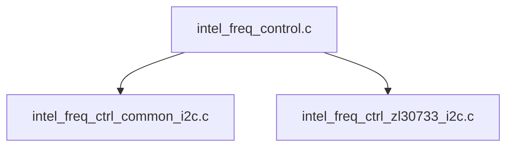
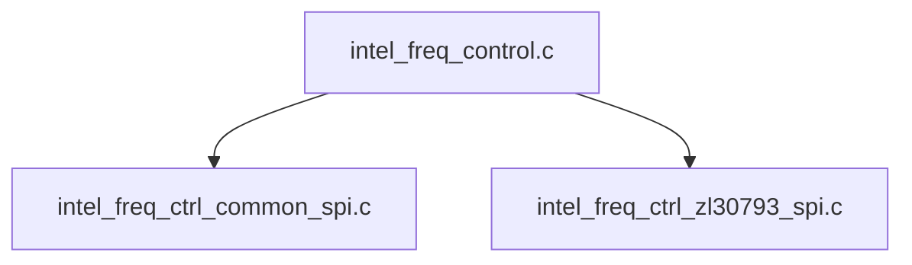
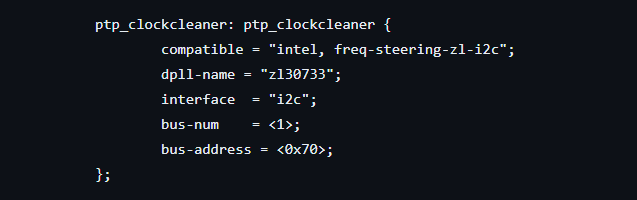

# **Zarlink Clock Synchronizer Driver for Hard Processor System**

Last updated: **August 14, 2024** 

**Upstream Status**: Not Upstreamed

**Devices supported**: Agilex 7

## **Introduction**

The Microchip&reg; Zarlink ZL30733 3-Channel SyncE & 1588 Network Synchronizer takes charge of frequency synchronization, monitors reference clock quality, manages reference clock switching, and provides holdover functionality for SyncE and PTP1588 support. It has support for multiple reference clocks and can be used to generate the outputs. The device is constantly monitoring the quality of the reference clocks and it switches to an alternative clock source when the measured period of the current reference signal is incorrect, or if it has excessive jitter.

**I2C based zl30733**

**SPI based zl30793**

## **Zarlink chip information**

For Microchip&reg; Zarlink ZL30733 documentation please refer to [https://www.microchip.com/en-us/product/zl30733](https://www.microchip.com/en-us/product/zl30733) and [https://www.microchip.com/en-us/product/zl30793](https://www.microchip.com/en-us/product/zl30793).

## **Driver Sources**

The source code for this driver can be found at:

- General Frequency control driver

[https://github.com/altera-opensource/linux-socfpga/blob/socfpga-5.15.90-lts-ftile-1588ptp/drivers/net/ethernet/altera/intel_freq_control.c](https://github.com/altera-opensource/linux-socfpga/blob/socfpga-5.15.90-lts-ftile-1588ptp/drivers/net/ethernet/altera/intel_freq_control.c)

- I2C based ZL30733 support

[https://github.com/altera-opensource/linux-socfpga/blob/socfpga-5.15.90-lts-ftile-1588ptp/drivers/net/ethernet/altera/intel_freq_ctrl_zl30733_i2c.c](https://github.com/altera-opensource/linux-socfpga/blob/socfpga-5.15.90-lts-ftile-1588ptp/drivers/net/ethernet/altera/intel_freq_ctrl_zl30733_i2c.c)

- I2C based common api for frequency control

[https://github.com/altera-opensource/linux-socfpga/blob/socfpga-5.15.90-lts-ftile-1588ptp/drivers/net/ethernet/altera/intel_freq_ctrl_common_i2c.c](https://github.com/altera-opensource/linux-socfpga/blob/socfpga-5.15.90-lts-ftile-1588ptp/drivers/net/ethernet/altera/intel_freq_ctrl_common_i2c.c)

- SPI based zl30793 support

[https://github.com/altera-opensource/linux-socfpga/blob/socfpga-5.15.90-lts-ftile-1588ptp/drivers/net/ethernet/altera/intel_freq_ctrl_zl30793_spi.c](https://github.com/altera-opensource/linux-socfpga/blob/socfpga-5.15.90-lts-ftile-1588ptp/drivers/net/ethernet/altera/intel_freq_ctrl_zl30793_spi.c)

- SPI based common api for frequency control

[https://github.com/altera-opensource/linux-socfpga/blob/socfpga-5.15.90-lts-ftile-1588ptp/drivers/net/ethernet/altera/intel_freq_ctrl_common_spi.c](https://github.com/altera-opensource/linux-socfpga/blob/socfpga-5.15.90-lts-ftile-1588ptp/drivers/net/ethernet/altera/intel_freq_ctrl_common_spi.c)

## **Driver Capabilities**

* Support frequency synchronization, monitor reference clock quality, manage reference clock switching.
* Provides holdover functionality for SyncE and PTP1588 support.

## **Device Tree**

Example Device tree location:

[https://github.com/altera-opensource/linux-socfpga/blob/socfpga-5.15.90-lts-ftile-1588ptp/arch/arm64/boot/dts/intel/fm87_ftile_25g_2port_ptp.dtsi](https://github.com/altera-opensource/linux-socfpga/blob/socfpga-5.15.90-lts-ftile-1588ptp/arch/arm64/boot/dts/intel/fm87_ftile_25g_2port_ptp.dtsi)

## **Known Issues**

None known

## **Example Designs**

Zarlink driver is used in the [Agilex 7 SoC F-Tile Design Example for 25/10 GbE with IEEE1588PTP](https://www.rocketboards.org/foswiki/Projects/Agilex7SoCFTileDesignExampleWithIEEE1588PTP25GE).

## Notices & Disclaimers

Altera&reg; Corporation technologies may require enabled hardware, software or service activation.
No product or component can be absolutely secure. 
Performance varies by use, configuration and other factors.
Your costs and results may vary. 
You may not use or facilitate the use of this document in connection with any infringement or other legal analysis concerning Altera or Intel products described herein. You agree to grant Altera Corporation a non-exclusive, royalty-free license to any patent claim thereafter drafted which includes subject matter disclosed herein.
No license (express or implied, by estoppel or otherwise) to any intellectual property rights is granted by this document, with the sole exception that you may publish an unmodified copy. You may create software implementations based on this document and in compliance with the foregoing that are intended to execute on the Altera or Intel product(s) referenced in this document. No rights are granted to create modifications or derivatives of this document.
The products described may contain design defects or errors known as errata which may cause the product to deviate from published specifications.  Current characterized errata are available on request.
Altera disclaims all express and implied warranties, including without limitation, the implied warranties of merchantability, fitness for a particular purpose, and non-infringement, as well as any warranty arising from course of performance, course of dealing, or usage in trade.
You are responsible for safety of the overall system, including compliance with applicable safety-related requirements or standards. 
&copy; Altera Corporation.  Altera, the Altera logo, and other Altera marks are trademarks of Altera Corporation.  Other names and brands may be claimed as the property of others. 

OpenCL and the OpenCL logo are trademarks of Apple Inc. used by permission of the Khronos Group™. 
