# Agilex &trade; 5 HPS CPU Cluster Latency

## Overview

This page examines the Arm DynamIQ Cluster implementation within the Agilex &trade; 5 Hard Processor System (HPS). It explains the operation of the cache system, including the interactions between L1, L2, and L3 caches, and describes the function of the snoop filter in the Dynamic Shared Unit (DSU).

We explore how these components along with components outside of the cluster can influence core latency, particularly as workloads increase and generate complex access patterns that challenge the cache system and DSU. This analysis highlights the factors affecting performance in demanding high stress conditions.

The page also covers mitigations that can reduce latency in these scenarios. These strategies provide practical approaches to maintain performance for hard real-time and complex applications.

We also discuss how other system level components within the SoC can be impacted by the behavior of the DSU within the system to impact the latencies observed by challenging workloads.

## Agilex &trade; 5 HPS CPU Cluster

This is a simplified representation of the Arm DynamIQ Cluster architecture deployed in the Agilex &trade; 5 HPS.

The Agilex &trade; 5 DynamIQ Cluster consists of two Cortex A55 cores, two Cortex A76 cores, and a DynamIQ Shared Unit (DSU).

The DSU contains an L3 cache and a snoop filter that maintains cache coherency within the DynamIQ Cluster.

<span style="display:inline-block; max-width:500px;">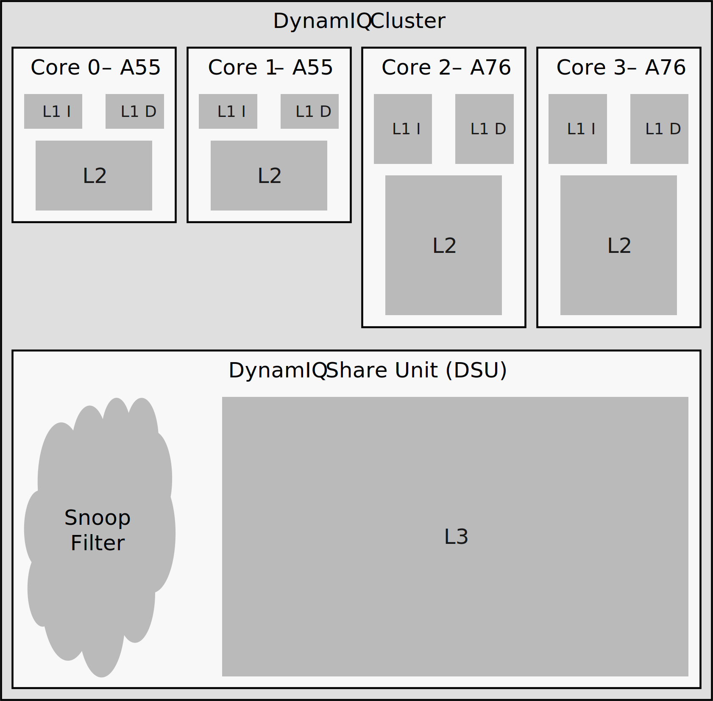</span>

## Cache Basics

Imagine that Core 0 wishes to access a cache line that is not held in any of the caches within the cluster.  The data only resides in the main system memory.

The red rectangle in the External Memory block represents the cache line that will be accessed.

NOTE: The cache operation described on the following slides is not an exhaustive explanation, it describes the most common use cases, not every corner case.

<span style="display:inline-block; max-width:500px;">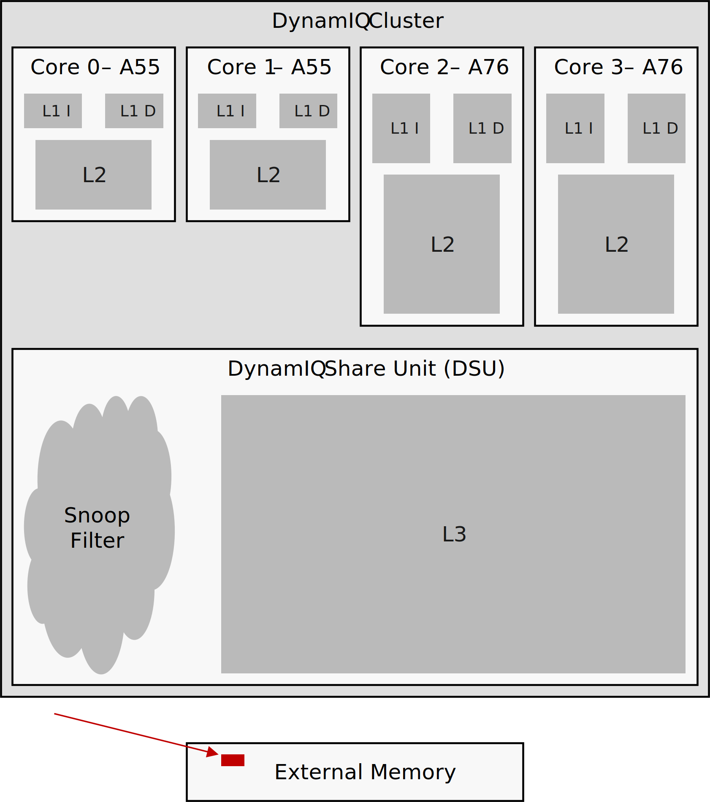</span>

### Initial Cache Line Fill

When Core 0 reads from the address for that cache line, the cache system fetches that cache line into the L1 data cache or instruction cache based on whether it is an instruction fetch or a data load.

For this example, we assume that it was a data load, the cache line is allocated into the L1 data cache.

Core 0 can now access that cache line from the L1 data cache which is the lowest latency cache and closest to the processing pipelines of the core.

<span style="display:inline-block; max-width:500px;">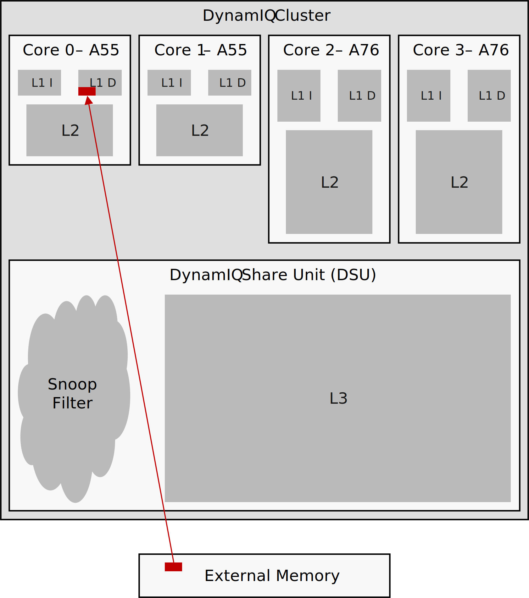</span>

### L1 Eviction Into L2

Eventually the L1 data cache will need to evict that cache line to make room for new data that Core 0 accesses, and it needs to allocate that new data into the L1 data cache.

The L2 cache in Core 0 behaves like a victim cache that allocates the evicted cache line from the L1 data cache into the L2 cache.

When Core 0 references this cache line again, the L2 cache can refill the L1 cache with lower latency than the L3 cache and external memory.

<span style="display:inline-block; max-width:500px;">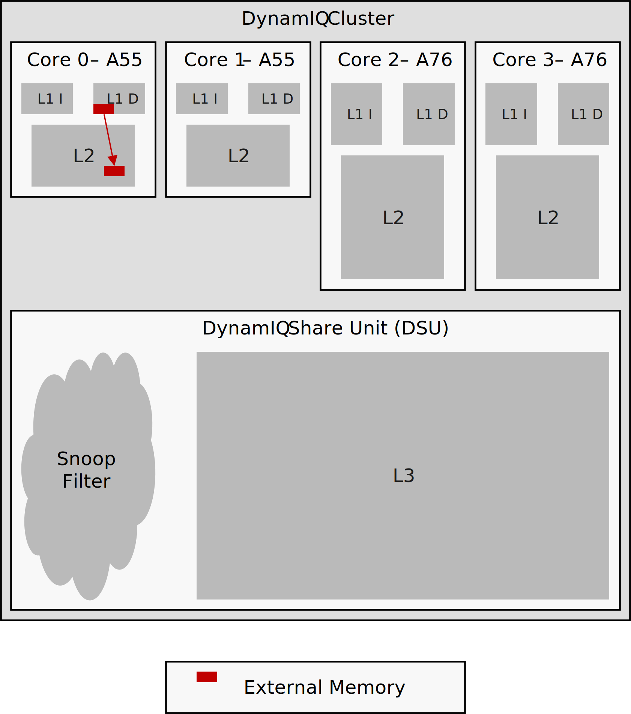</span>

### L2 Eviction Into L3

Eventually the L2 cache will need to evict that cache line to make room for new data that the L1 cache evicts, and it needs to allocate this evicted data into the L2 cache.

The L3 cache in the DSU behaves like a victim cache that allocates the evicted cache line from the L2 cache into the L3 cache.

When Core 0 references this cache line again, the L3 cache can refill the L1 cache with greater latency than the L2 cache but lower latency than the external memory.

<span style="display:inline-block; max-width:500px;">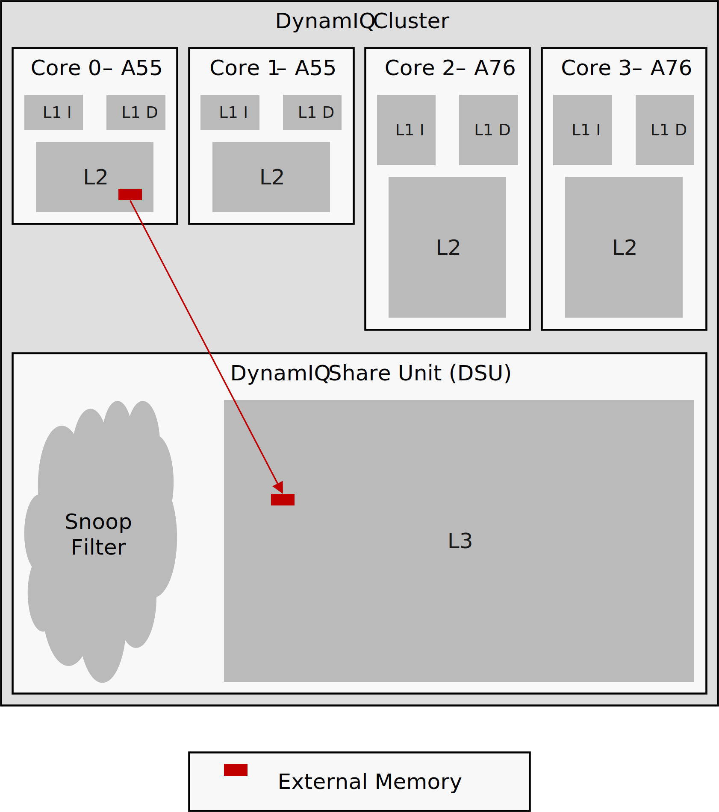</span>

### L3 Exclusive Mode

An important fact about the L3 cache operation within the DSU is that it operates in exclusive mode rather than inclusive mode.  This means that a cache line can either exist in the L1/L2 caches of a core in the cluster, or it can exist in the L3 cache, but not in both locations simultaneously.

When a cache line from the L3 cache is refilled into the L1 cache of a core, it is evicted from the L3 cache at that time.  And when a cache line is evicted from the L1/L2 caches within the core, it is allocated into the L3 cache.

There are corner cases where the same cache line can be allocated in both the L1/L2 caches of multiple cores as well as the L3 cache.  We will show an example of this inclusive cache behavior later.

<span style="display:inline-block; max-width:500px;">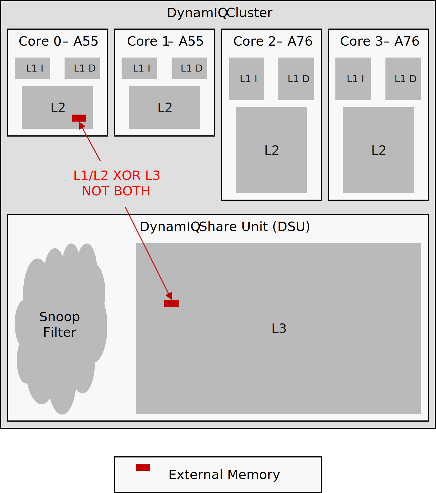</span>

### L3 Cache Partitioning

The L3 cache can deploy 2MB of cache data organized into 16 ways.  These ways can be partitioned into 4 groups of 4 ways, and each core can be given access to any of these way groups as required.

The cache partition access is controlled by the core scheme ID and the scheme ID assigned to each cache partition.

This feature can be useful in situations where it is desirable to isolate a core or group of cores to only participate in certain cache ways and prevent the activity of other cores from disrupting the L3 cache operation for those isolated cores.

<span style="display:inline-block; max-width:500px;">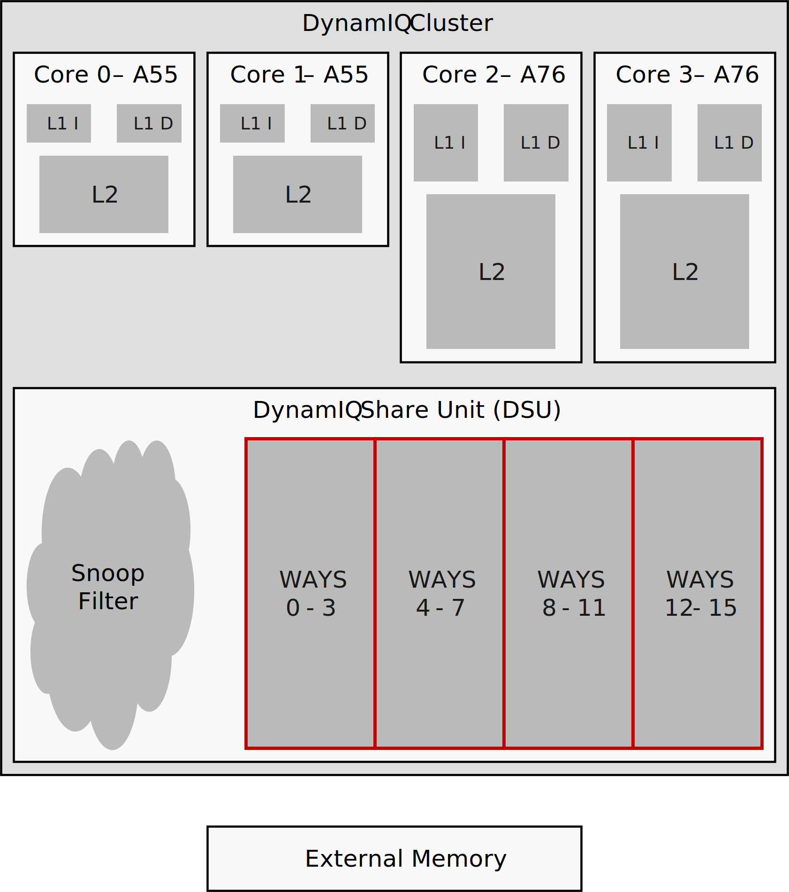</span>

## Snoop Filter Basics

The DSU snoop filter tracks all the cache lines allocated within the CPU cores inside the DynamIQ Cluster.  It is responsible for maintaining cache coherency across the cluster.

The snoop filter tracks which cache lines are allocated within the L1/L2 caches of each core in the cluster.

Since the L3 cache and the snoop filter exist within the DSU, the DSU can determine the cache state of any cache line allocated within the entire DynamIQ Cluster.

NOTE: The snoop filter description on the following slides is not an exhaustive explanation, it describes the most common use cases, not every corner case.

<span style="display:inline-block; max-width:500px;">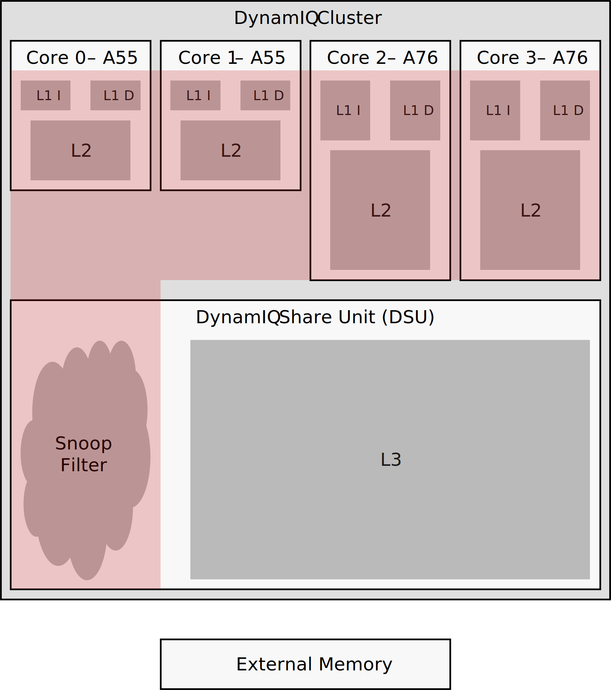</span>

### Coherency Coordination Among Cores

Imagine there is a cache line currently cached in one of the caches in Core 0 and Core 1 attempts to access that same cache line with a shareable read operation.

<span style="display:inline-block; max-width:500px;">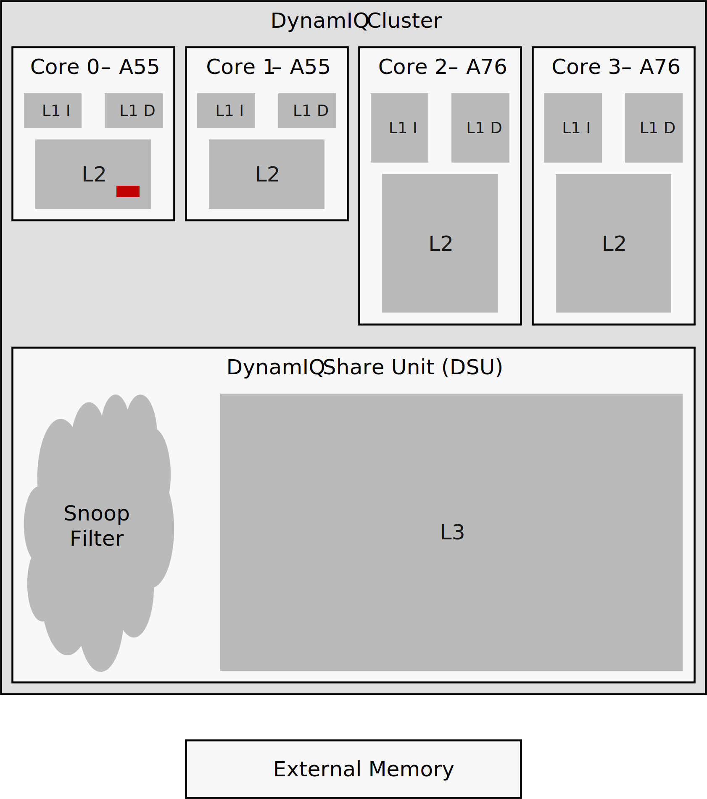</span>

### Core 1 Access Cache Line From Core 0

Core 1 messages the snoop filter in the DSU regarding the cache line of interest. The snoop filter knows that Core 0 is holding that cache line, the DSU negotiates with Core 0 to provide the cache line to Core 1.

<span style="display:inline-block; max-width:500px;">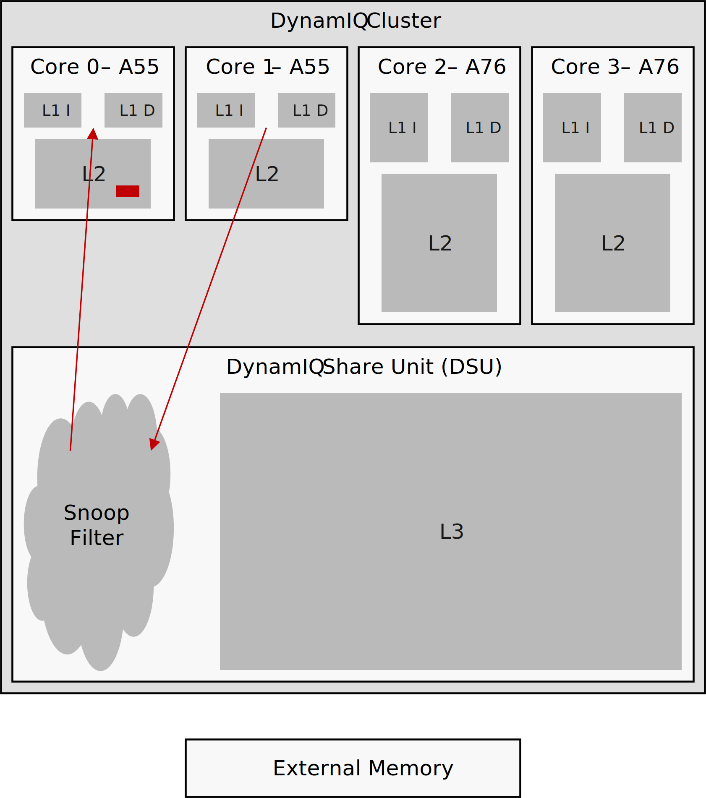</span>

### Core 1 Coherent Update With Core 0

When the DSU completes the negotiation with Core 0 and Core 1, the cache line from Core 0 is allocated into the cache of Core 1 as well as the L3 cache and it becomes an inclusive cache line.

Depending on the state of that cache line, this can be a simple and short negotiation, or it can be a longer negotiation.

Certain events like cache maintenance operations can require the DSU to negotiate evictions and back invalidations across the cluster.

<span style="display:inline-block; max-width:500px;">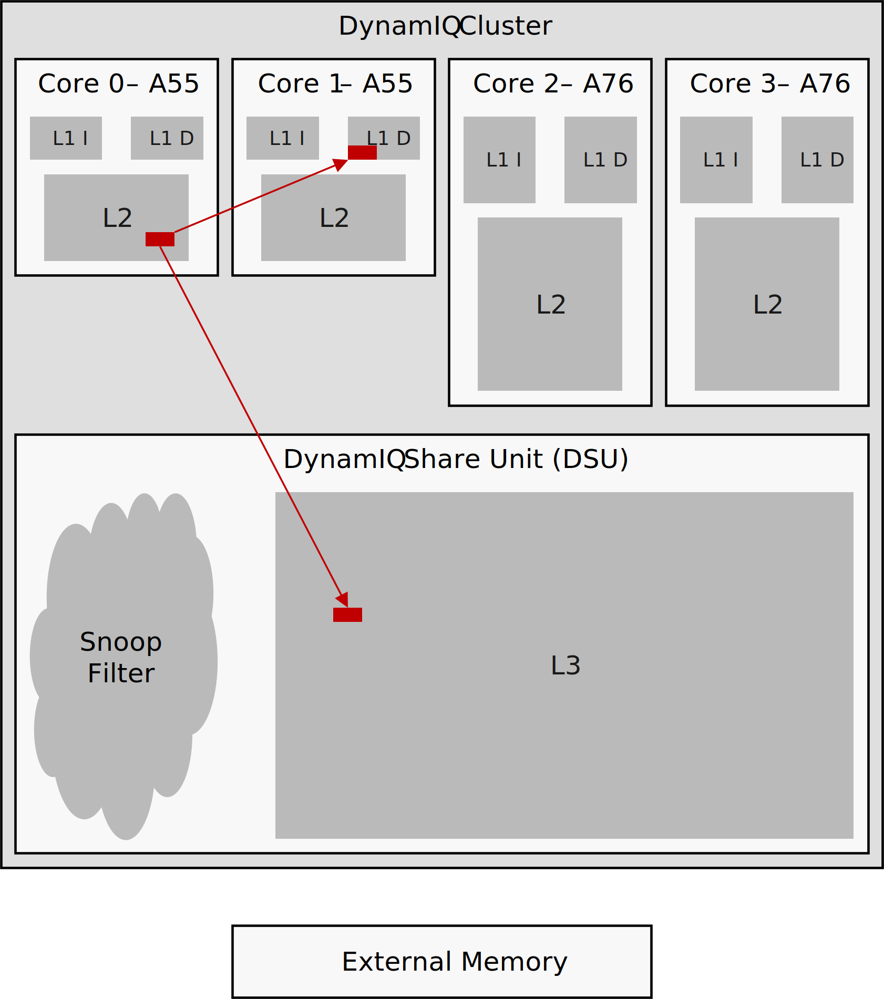</span>

### Full Cluster Coherency

The snoop filter is involved in maintaining coherency across the entire cluster and there is constant communication between the individual cores and the DSU to clear coherency issues.

When light workloads are operating across the cores in the cluster, this communication can be light and uncongested.  When heavier workloads are operating across the cores in the cluster, this communication can be heavy and congested.

 <span style="display:inline-block; max-width:500px;">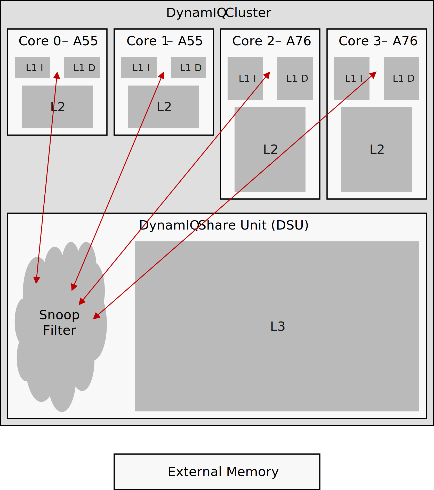</span>

## Latency Effects Within the Cluster

### Interference from Within the SMP Cluster

It should be clear that the cache operation and snoop filter interactions described previously can impact the execution performance of each core within the cluster.  It can introduce non-deterministic latency into the execution of each core.

It is possible to minimize this impact by isolating workloads and minimizing the interactions within the cluster.  But even when we implement basic isolation techniques there can be events that occur within the cluster that can interfere with the isolated workload.

Imagine that we have a tiny workload that we deploy on Core 1 that can completely execute out of the L1 instruction and data cache.  It shares no data with other cores in the cluster, it should not have any interaction with the snoop filter to maintain coherency with other cores.  Once all the cache lines are allocated in its L1 caches, it requires nothing outside the core.

<span style="display:inline-block; max-width:500px;"></span>

### Idle Cluster Expectations

If we deploy a trivial workload on Core 1 that calculates statistics about how long it takes to read the system counter in each pass through an infinite loop, this could completely execute from within the L1 instruction and data cache.  When executing on an idle cluster this loop would not likely observe any jitter from pass to pass through the loop.

Since this workload doesn’t interact with anything outside of Core 1, we can even run some workloads on the other cores in the cluster which would not impact the performance of this isolated workload on Core 1.

<span style="display:inline-block; max-width:500px;">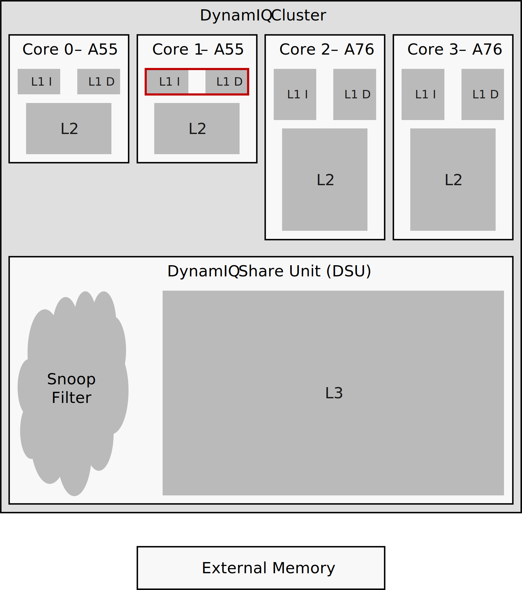</span>

### Active Cluster Expectations

We can even run moderate workloads on the other three cores in the cluster without impacting our isolated workload on Core 1.  Those cores can be exercising resources outside of themselves requiring them to interact with the snoop filter in the DSU.

If this activity is not heavy, the impact on the isolated workload on Core 1 will remain insignificant.

<span style="display:inline-block; max-width:500px;">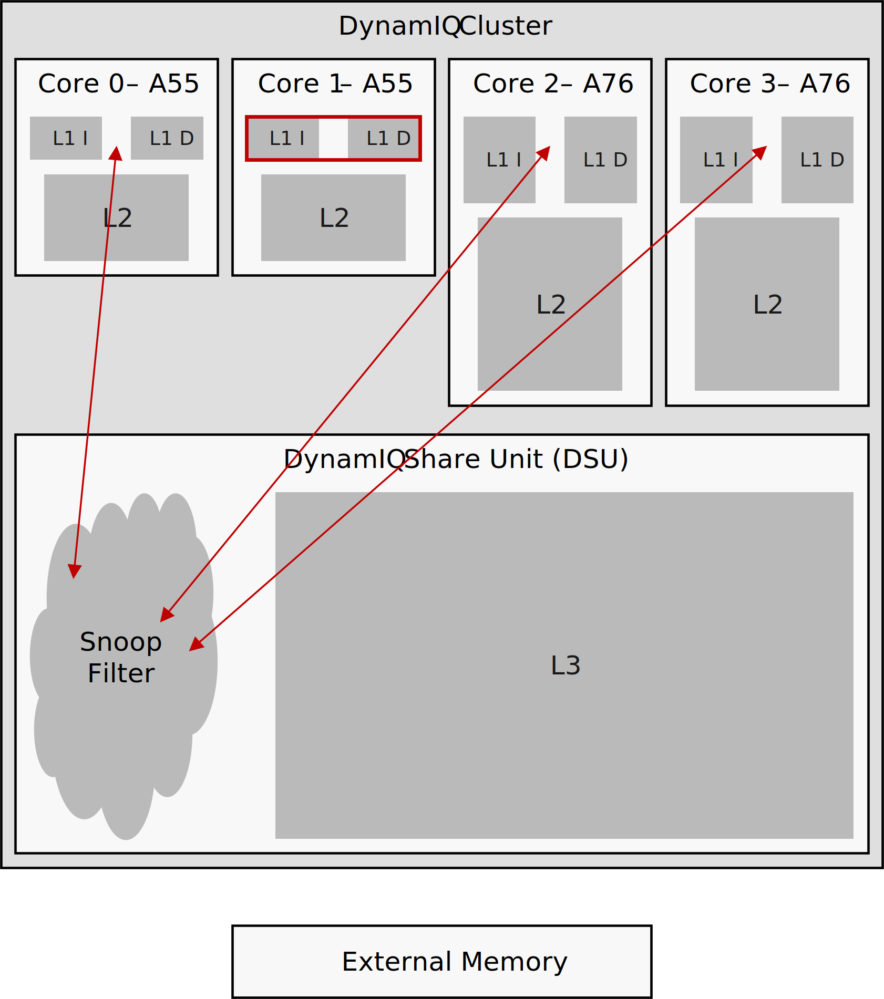</span>

### Busy Cluster Expectations

When we run heavy workloads on the other three cores in the cluster that hammer the snoop filter with extreme access patterns that are challenging for the snoop filter to manage, the behavior of the DSU can change and it can defensively modify the way the DSU operates.

In this environment, the snoop filter can experience capacity evictions within itself which require it to back invalidate into the caches in the cores in the cluster which causes those cache lines to be evicted.

<span style="display:inline-block; max-width:500px;">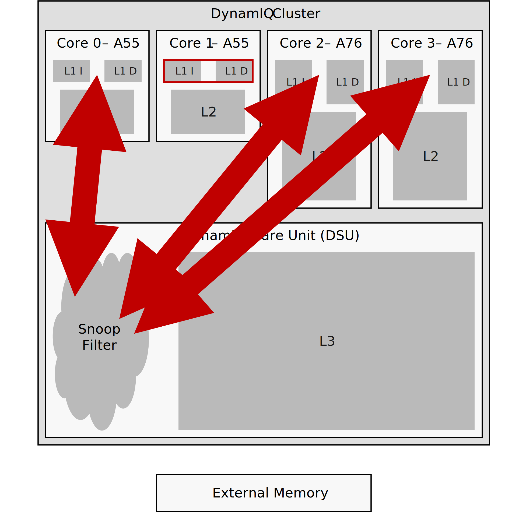</span>

### Snoop Filter Capacity Evictions – Random Victim Selection

The challenge with the capacity evictions from the snoop filter is that victim selection is random.  This means that any cache line in any of the cores in the cluster are candidates for eviction.

<span style="display:inline-block; max-width:500px;">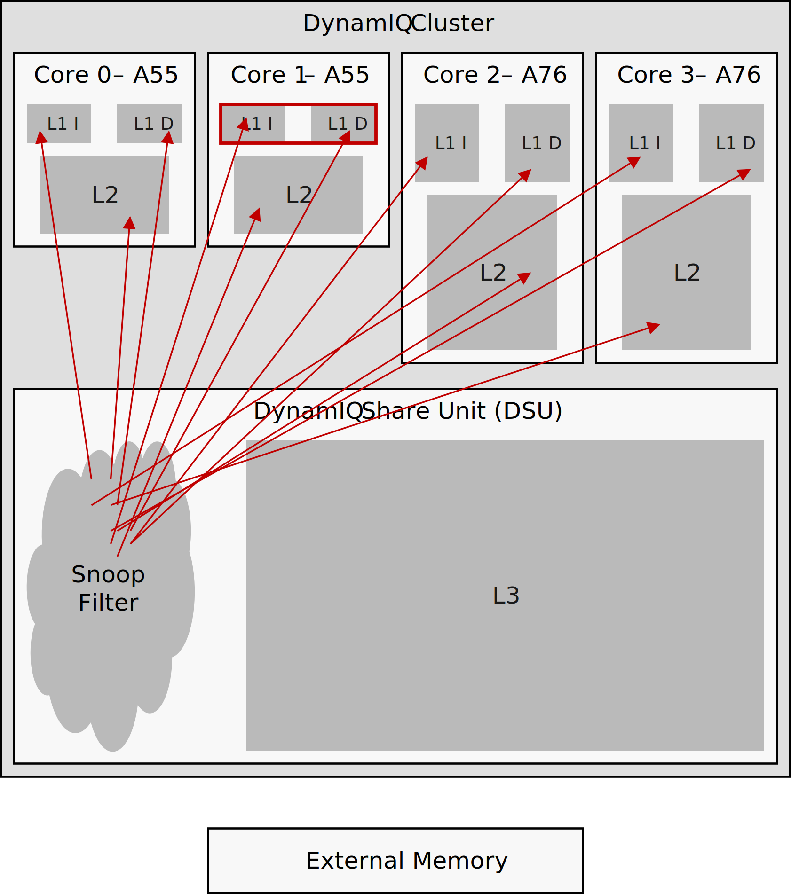</span>

### Snoop Filter Capacity Evictions – Overlapping Isolated Workload

When we consider the isolated workload that we proposed running out of the L1 caches on Core1, these random capacity evictions from the snoop filter can easily evict cache lines that our isolated workload relies on and push them out of the L1 cache into the L3 cache.

When Core 1 accesses that cache line the next time, it must refill the L1 cache from the L3 cache which means that pass through the loop will experience a higher latency as it pauses for that cache line refill.

<span style="display:inline-block; max-width:500px;">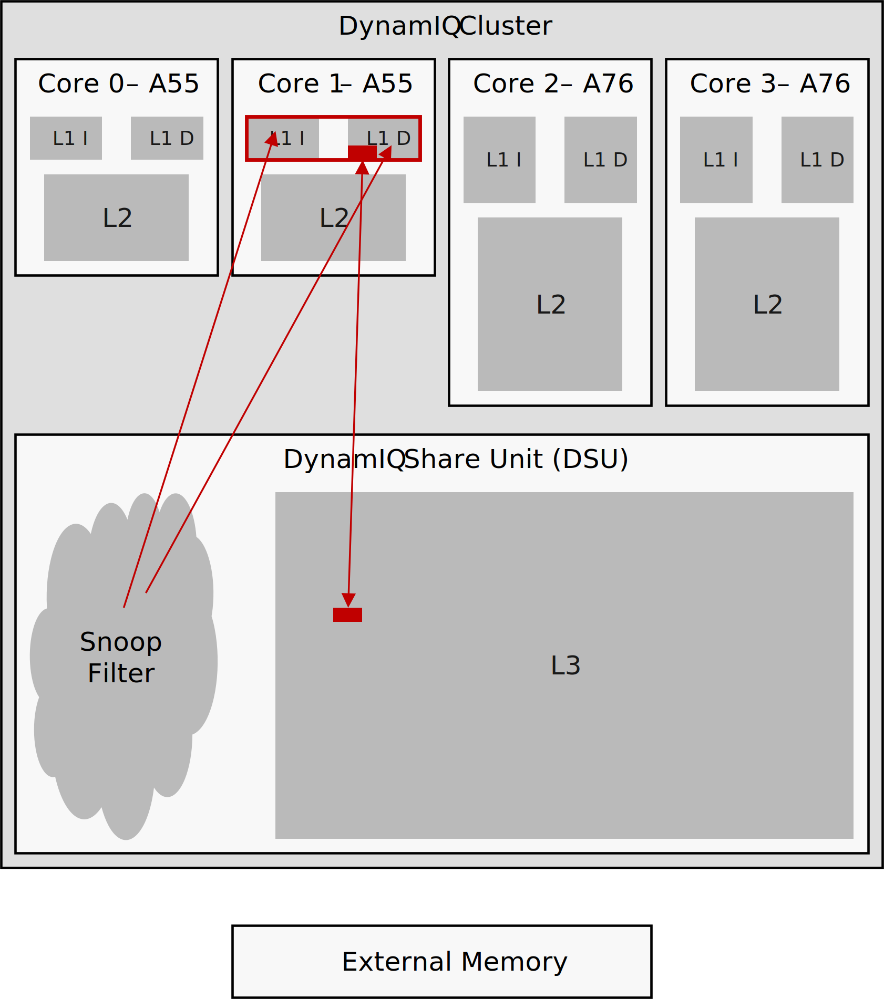</span>

### No L3 Allocate Mode – Heavy Pressure Response

When the snoop filter experiences extremely challenging patterns, it can cause the DSU to enter a defensive mode called “no L3 allocate”.  In no L3 allocate mode the DSU does not allocate L1/L2 evictions from the cores in the cluster into the L3 cache.  Instead, the L1/L2 evictions bypass the L3 cache and are pushed out to external memory.

When Core 1 accesses that cache line the next time, it must refill the L1 cache from the external memory which means that pass through the loop will experience a significantly higher latency as it pauses for that cache line refill.

<span style="display:inline-block; max-width:500px;">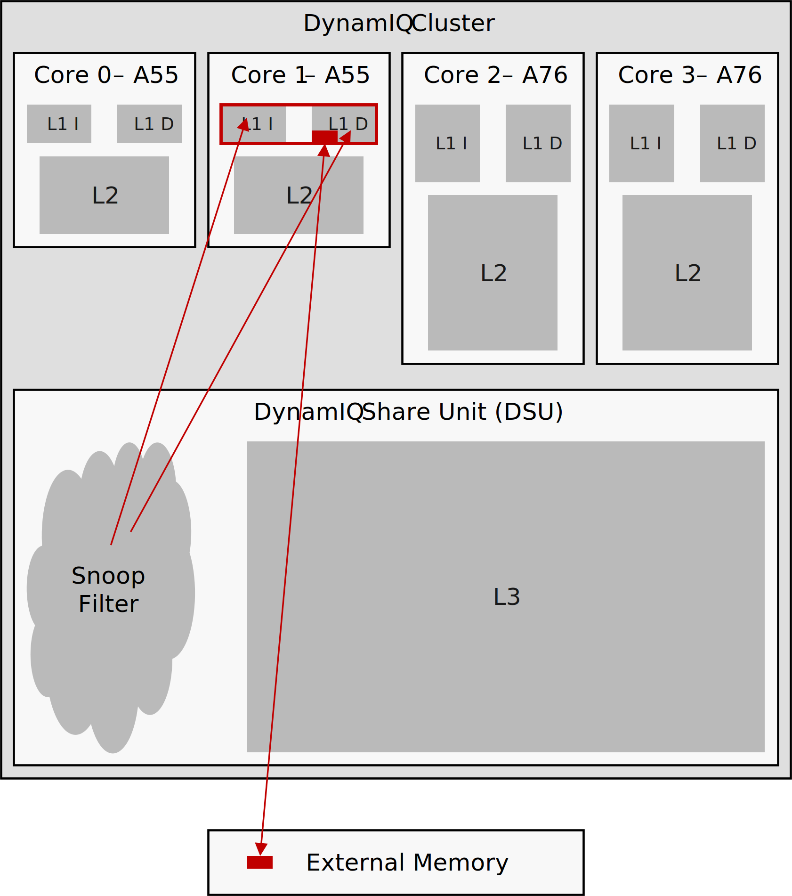</span>

## Witnessing the latency effects

### Measuring Core Latency on the Agilex &trade; 5 HPS Cluster

We can configure a test setup on the Agilex &trade; 5 HPS that allows us to measure the latency impact that one core within the cluster observes while various workloads are deployed on the other cores.

As shown in the diagram we can boot Core 0 into the u-boot console and then orchestrate the testing from that environment.

<span style="display:inline-block; max-width:500px;">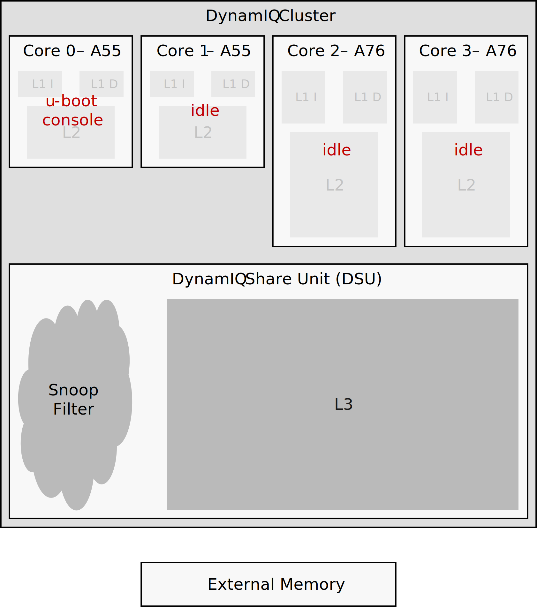</span>

### The Latency Measurement Loop

We can use the u-boot console to start a latency measurement loop on Core 1.  This is basically an infinite loop that computes statistics about how long it takes to read the system counter value on each pass through the loop and stores the statistics.

Here is some pseudo code to illustrate what this loop does:

```C
while(1) {
	curr_cnt = read_system_counter();
	calculate_stats(curr_cnt, last_cnt);
	last_cnt = curr_cnt;
}
```

Using a default configuration of hardware and bootloader software, this loop executes in a minimum of 57ns, and it experiences very little jitter from pass to pass.  The maximum excursion beyond the minimum time with Core 2 and Core 3 idle is 75ns.  That is 18ns of jitter between maximum and minimum loop times.

<span style="display:inline-block; max-width:500px;">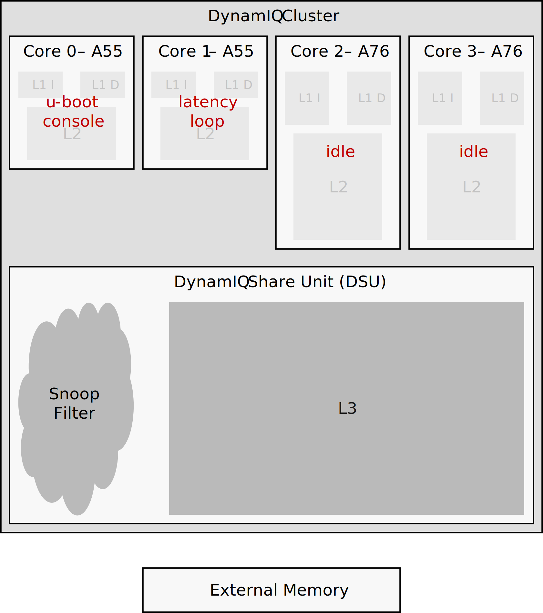</span>

### Adding the Hammer Patterns

We can use the u-boot console to start hammer patterns on Core 2 and Core 3.  The hammer pattern is a loop that reads from a cache line in each way of the L3 cache and then increments to the next set until it covers four times the cache density.  This effectively thrashes the L3 cache from Core 2 and Core 3 and produces very challenging access patterns for the DSU snoop filter to manage.

Here is some pseudo code to illustrate what this loop does:

```C
for(set_idx = 0 ; set_idx < NUM_SETS ; set_idx++) {
	for(way_idx = 0 ; way_idx < NUM_WAYS ; way_idx++) {
		temp = hammer_buffer[ ((way_idx * WAY_BYTES) +
			(set_idx * CACHE_LINE_BYTES)) / sizeof(uint64_t) ];

	}
}
```

Adding this workload to Core 2 and Core 3 cause the latency loop to measure excursions out to ~11us.

<span style="display:inline-block; max-width:500px;">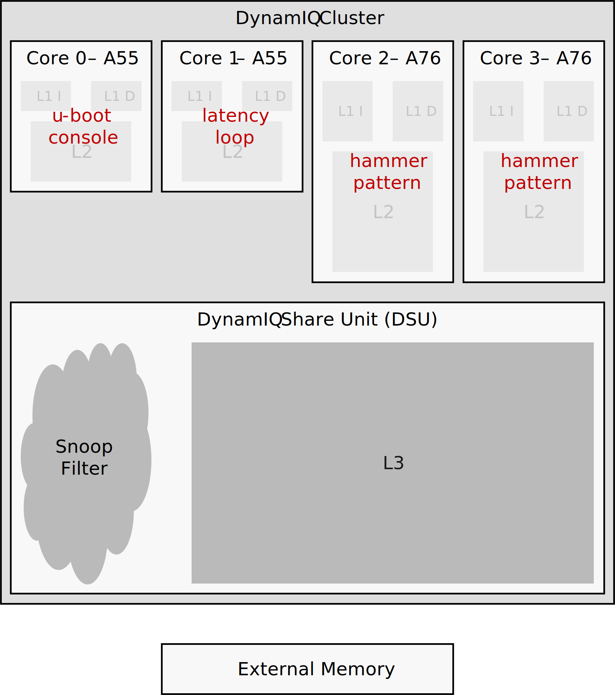</span>

### Where Does this Latency Come from?

It's important to understand that this maximum excursion of 11us that this system can produce does not mean that every pass through the latency loop takes that long, in fact the minimum latency through the loop under these conditions is still 57ns, but when we allow this configuration to run long enough we will witness a significant number of excursions well beyond the typical time and they will be distributed out to the maximum excursion time that we have measured.

There is not one simple thing that causes this high latency, it is a system wide effect that is influenced by many things including the DynamIQ Cluster and the NOCs and data path that connect it all the way out to the external memory, including the memory controller.

Tuning something in any one of these areas can produce significant improvements in lowering the maximum excursions that we witness.

<span style="display:inline-block; max-width:500px;">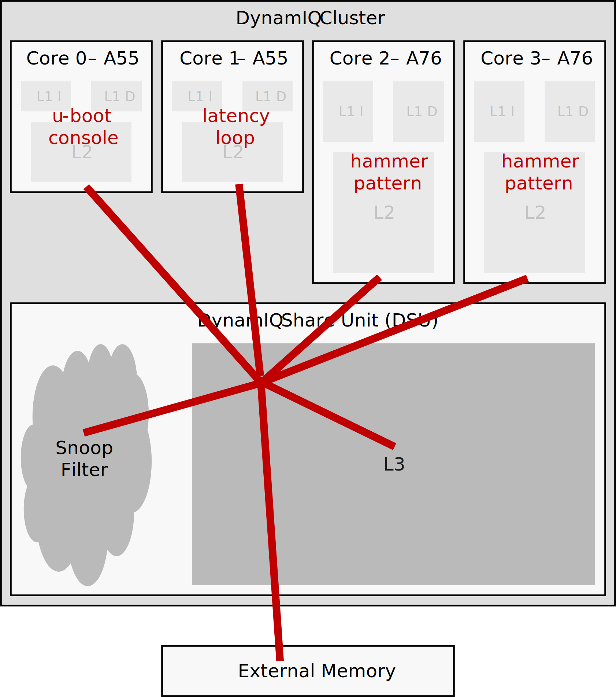</span>

### But How Does this Impact the Isolated Loop on Core 1?

If Core 1 is just minding its own business running exclusively out of L1 cache, how can the operation of the rest of the cluster impact it?

The hammer patterns on Core 2 and Core 3 become very challenging for the DSU snoop filter to manage, the first thing that happens is it begins issuing capacity evictions.  And those random capacity evictions eventually evict contents from the Core 1 L1 caches.

The hammer patterns are so challenging that the next thing that happens is the DSU enters no L3 allocate mode.  Now those random capacity evictions push the Core 1 L1 cache contents all the way out to external memory.

In this situation, Core 1 finds itself having to refill the L1 caches from external memory.

<span style="display:inline-block; max-width:500px;">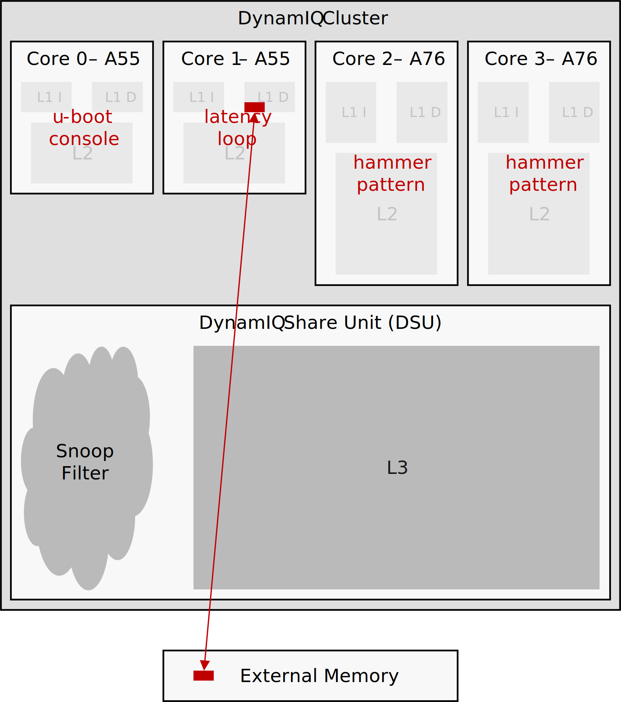</span>

### Other Contributions to the Problem

In the default hardware and bootloader configuration, the L3 cache is shared across all cores in the cluster.  When the DSU snoop filter experiences capacity evictions but is not in no L3 allocate mode, the Core 1 L1 cache evictions allocate into L3 cache but the hammer patterns running on Core 2 and Core 3 can eventually overlap with them and force those cache lines to be evicted from L3 cache into external memory.

Another default configuration is that all four cores within the cluster are all operating at the same QoS priority.  Which means the lower performance Core 1 is competing with equal weight against the higher performance Core 2 and Core 3.  Core 1 activity often arrives behind Core 2 and Core 3 activity at arbitration and queue points within the DynamIQ Cluster and all the way out to the external memory.

<span style="display:inline-block; max-width:500px;">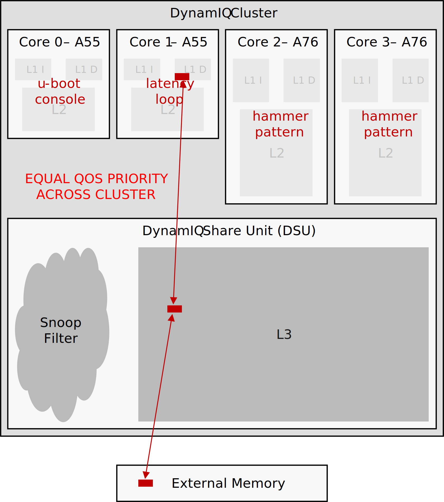</span>

## Mitigating the latency effects

### Mitigation 1 – Disabling no L3 Allocate Mode

In the Agilex &trade; 5 HPS DynamIQ Cluster there is a bit in the CLUSTERACTLR_EL1 register that can defeature the no L3 allocate mode that the DSU can drop into under high stress.  When we set this bit, we can force the random capacity evictions from the DSU snoop filter to be allocated into the L3 cache.

<span style="display:inline-block; max-width:500px;">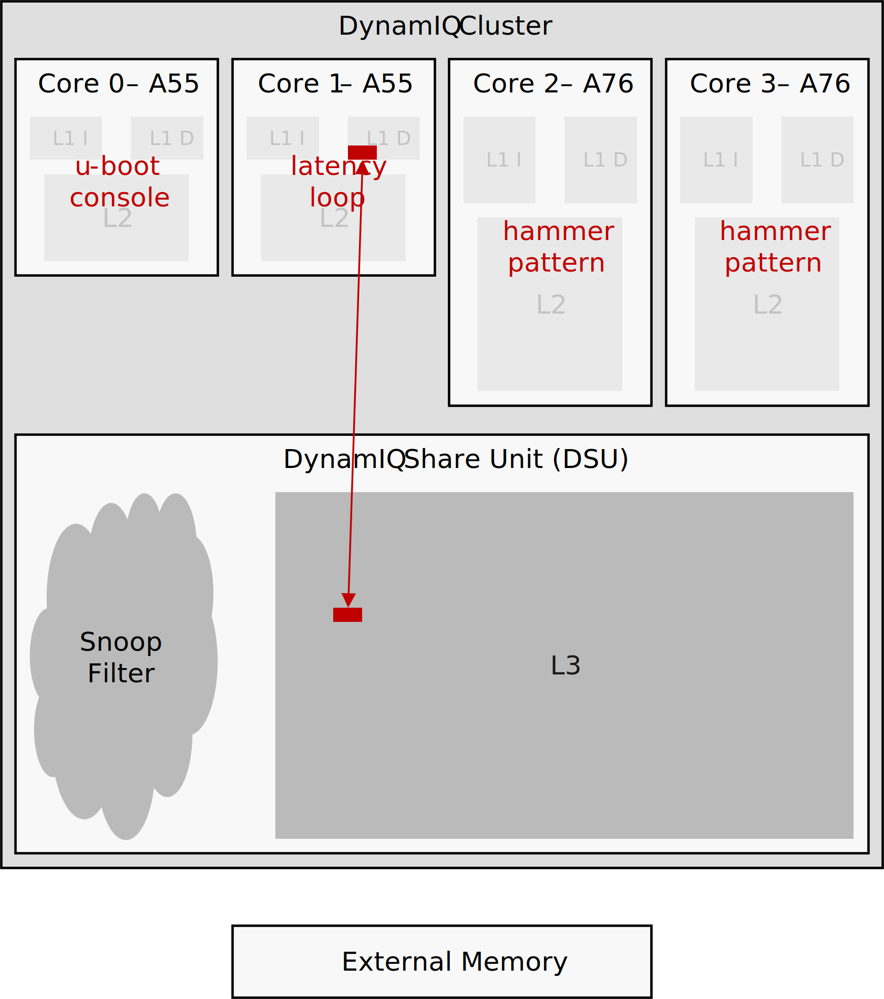</span>

### Mitigation 2 – L3 Cache Partitioning

The next thing we can do to protect the L3 cache allocations of Core 1 evictions is partition the L3 cache.  We can give Core 1 access to 4 ways of the L3 cache and give Core 0, Core 2 and Core 3 access to 12 ways of the L3 cache.

This is accomplished by configuring the CLUSTERPARTCR_EL1 register and aligning that with the CLUSTERTHREADSID_EL1 configuration within each core in the cluster.

<span style="display:inline-block; max-width:500px;">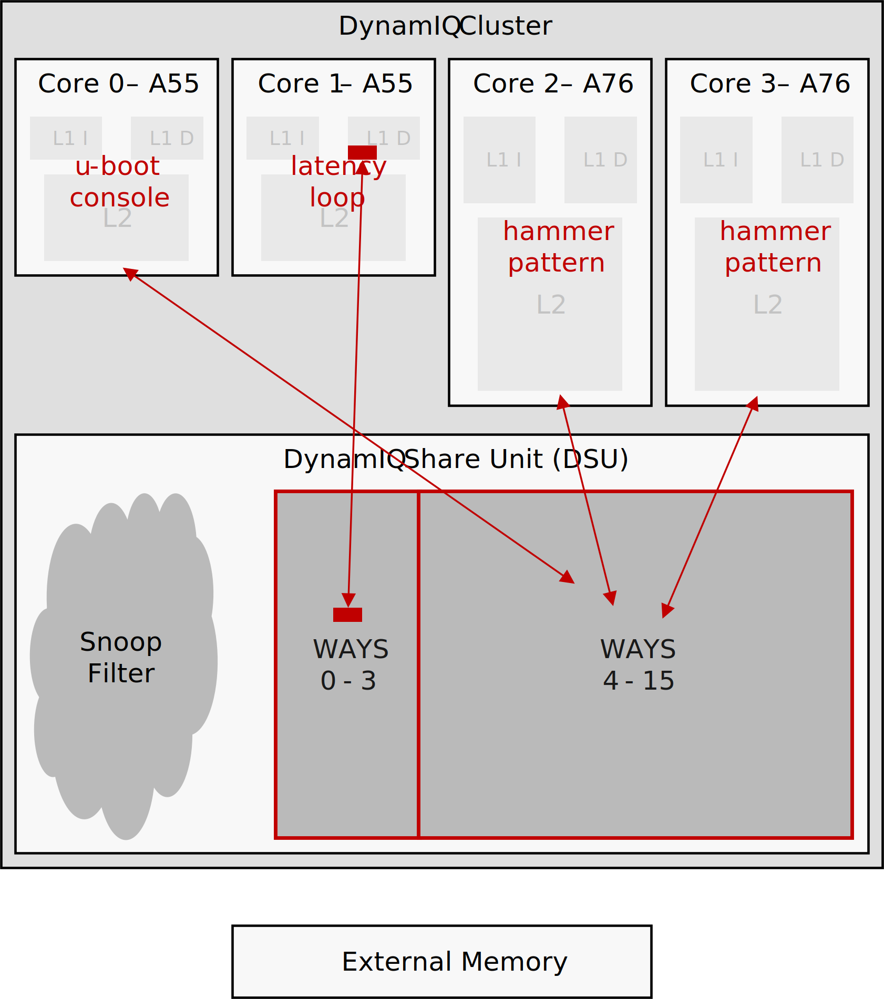</span>

### Mitigation 3 – QoS Priority Advantage

The final thing we can do is give Core 1 a priority advantage.  This starts within the DyanmIQ Cluster and provides an advantage throughout the cluster and propagates all the way out to the external memory.

This QoS advantage can influence the performance through various SoC queues, buffers, and arbitration points through the NOC, EMIF controller and other internal structures.

This is accomplished by configuring the CLUSTERBUSQOS_EL1 register and aligning that with the CLUSTERTHREADSID_EL1 configuration within each core in the cluster.

<span style="display:inline-block; max-width:500px;">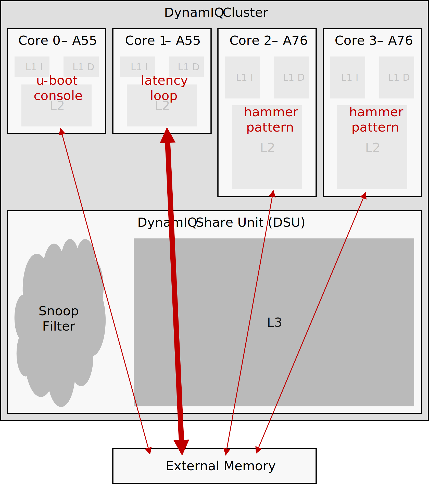</span>

## Mitigation Results

### Cluster Tuning Results

This table shows the results that we observe when applying the three mitigations that we've described as well as the default conditions that we started with.

| Applied<br/>Mitigation | Maximum<br/>Latency | Minimum<br/>Latency |
| :-: | :-: | :-: |
| none (default) | 10.780us | 57ns |
| nl3a | 9.475us | 57ns |
| nl3a + cp | 6.687us | 57ns |
| nl3a + cp + qos | 4.237us | 57ns |

nl3a = disable no L3 cache allocate mode

cp = enable L3 cache partitioning

qos = apply QoS priority

Measured on 065 Rev B PRQ silicon with 2MB L3 cache using the QPDS25.3 bootloaders in a bare metal environment.

## Effects outside the cluster

### External Memory Interface (EMIF) Tuning

In the default hardware and software configuration before any optimizations or tuning is applied, the behavior of the Agilex &trade; 5 EMIF controller is to prefer bandwidth over latency, and in that mode, it will prefer read commands over write commands.

Consider the EMIF patterns generated by our example on the right, Core 2 and Core 3 are generating a flood of EMIF read commands to constantly refill the caches in each core while Core 1 generates no traffic.  Every so often an eviction from Core 1 occurs which produces a write command to the EMIF followed very shortly after by a read to refill that evicted cache line.

With the cluster configured for each core at the same QoS priority, all these EMIF commands are equally weighted when they arrive.  But since the Core 1 eviction produces a write command, that write can be deprioritized in preference for all the read commands for a significant period of time.  And the refill read command for Core 1 will also be blocked behind the pending write command until it completes.

The Agilex &trade; 5 EMIF controller offers an age tuning that can accelerate how quickly these deprioritized commands will age and become eligible to execute.  This effectively changes the preference from bandwidth to latency within the EMIF controller.

<span style="display:inline-block; max-width:500px;">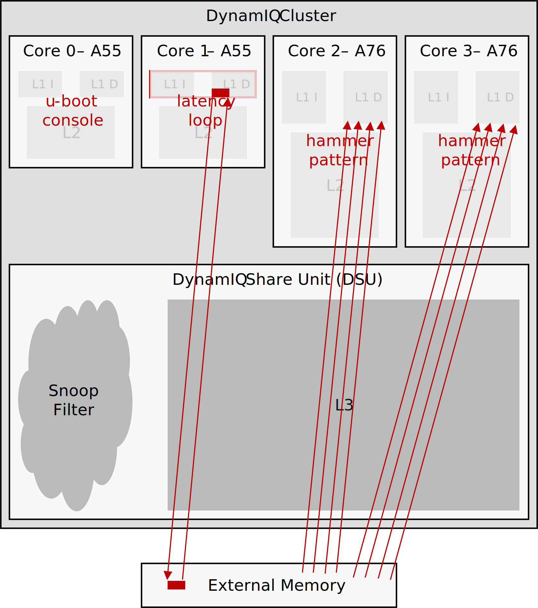</span>

### EMIF Configuration Impact

The EMIF configuration itself can influence the system in ways that create significant latency impacts as well as minimize latency impacts. When configured in various DDR4 and LPDDR4 configurations, we can observe the following type of latency impact.

| EMIF<br/>Configuration | Observed<br/>Latency |
| :-: | :-: |
| DDR4 no ECC | HIGH |
| DDR4 with ECC | HIGH |
| LPDDR4 no ECC | HIGH |
| LPDDR4 with ECC | LOW |

### SMC (System Memory Cache) Impact

The DMI0 and DMI1 data paths through the CCU implement system memory caches.  In the QPDS 25.3 eSW release of the u-boot bootloader, the SMCs are tuned down substantially to work around an errata that can cause lockup scenarios.  This tune down has resulted in a substantial reduction in the overall latency experienced by the testing that we've discussed and pulled the numbers into the realm that we observe today in the modern bootloaders.

The specific tune down that is performed is that read allocation and dirty write allocation into the SMC has been disabled.

Applying this change even in old legacy test environments that could produce 165us of latency show significant improvement into the range we now experience with these SMC tune down configurations.

## Cache coloring

### Cache Coloring Basics

Cache coloring is a software technique used to manage memory allocation in a way that partitions a CPU cache into distinct sets, improving performance by reducing cache conflicts. Cache coloring assigns specific memory regions to specific cache sets by carefully controlling the physical or virtual memory addresses allocated to data, leveraging the fact that memory addresses map to cache sets based on specific address bits.

Software assigns "colors" to memory pages, where each color corresponds to a specific subset of cache sets. By allocating memory such that different tasks or data structures map to different colors, cache conflicts are minimized because competing data avoids sharing the same cache sets. This is particularly useful in real-time systems, embedded systems, or high-performance computing, where cache misses can significantly degrade performance.

Key benefits include reduced cache contention, improved predictability in memory access times, and better performance for tasks with strict latency requirements. However, it requires detailed knowledge of the cache architecture and increases complexity in memory management.

If we apply this concept to our previous latency measurement environment, we could partition external memory into two colors which would map into alternating set regions of the L3 cache and we could map Core 1 to execute from one color (red), while Core 0, 2 and 3 would execute from the other color (green).

<span style="display:inline-block; max-width:500px;">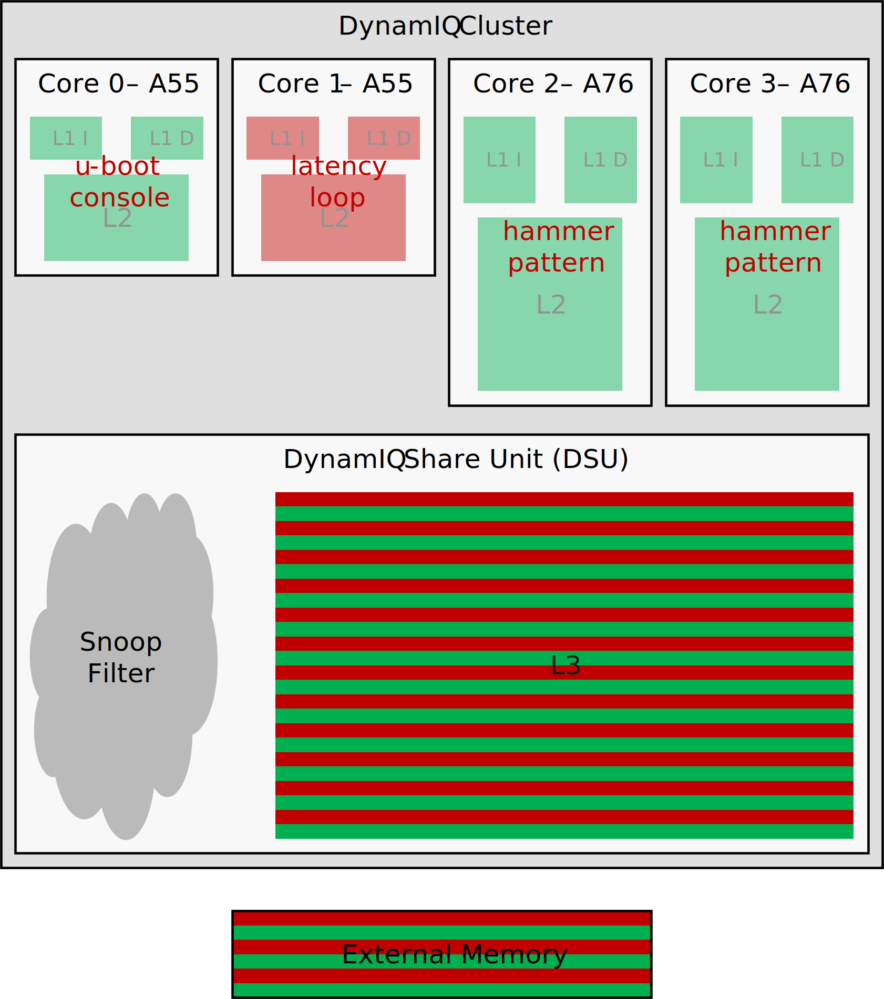</span>

### Cache coloring results

When we run our latency measurement environment using cache coloring, we observe the results below.

| Applied<br/>Mitigation | Maximum<br/>Latency | Minimum<br/>Latency |
| :-: | :-: | :-: |
| none (default) | 75ns | 57ns |

Measured on 065 Rev B PRQ silicon with 2MB L3 cache using the QPDS25.3 bootloaders in a bare metal environment.

## Recommendations

Users interested in deploying hard real-time applications on the DynamIQ Custer in the Agilex &trade; 5 HPS can now see what challenges exist and how they can overcome them.

The simplest way to mitigate these issues is to implement the three mitigation techniques describe into the Arm Trusted Firmware bootloader, to catch each core as it starts up and align it with the scheme ID that accomplishes the designers' goal and then configure the L3 cache partitioning and QoS priorities that map into that scheme ID.

When deploying a Linux environment with isolated real-time workloads, it's important to configure the kernel with core isolation support, as well as NO_HZ_FULL dynamic ticks mode to completely isolate a core from the kernel scheduler.  Along with mitigations applied in the ATF bootloader, a designer can deploy hard real-time workloads on isolated cores in practical and effective ways.  SMP RTOSes are typically able to provide the same type of core isolation that we described for the Linux Kernel in much the same way.

Designers who want to deploy cache coloring on their system are encouraged to leverage a hypervisor that can assist with memory allocations under that scheme.  Cache coloring is a very complex environment to deploy and manage and it can be very inefficient with memory resources as it attempts to spread multiple applications and tasks across a cache set wise partitioned fixed memory resource.  Cache coloring places significant restrictions on memory allocations within the system.

## Things to remember

Note that the examples presented here are trivial workloads that perform tiny amounts of work.  The code and data footprint required by these workloads is insignificant.  We are demonstrating how a minimalistic workload can be impacted by these effects.  For a real-world workload that consumes more cache footprint for code and data, the target area for random evictions will increase and the impact for such a workload could be significantly different than what we have demonstrated here.

When developing a real workload to deploy in this environment, it's important to test that workload in your actual hardware environment to ensure that you are meeting your real-time milestone requirements and to characterize how your workload may be impacted by these effects.

## Summary

This page highlights the potential of the Arm DynamIQ Cluster implementation in the Agilex &trade; 5 HPS, while noting that certain scenarios may introduce latency in the SMP cluster. With the right approach, these challenges can be addressed to unlock real-time performance requirements.

For hard real-time applications targeting the 10KHz to 100KHz response range, achieving precise milestone requirements is entirely within reach. By applying the mitigations we’ve shared, developers can enable their applications to perform reliably and efficiently in demanding environments.

Implementing these solutions involves thoughtfully tuning the real-time workload and incorporating appropriate timing margins to meet milestones with confidence. This proactive approach ensures smooth operation and consistent results.

As real-time workloads evolve, software updates may influence latency, but this is manageable. Regular testing of the platform ensures that it continues to meet milestone requirements, paving the way for sustained success and innovation.

## Example Data Measurements

This section presents the data measurements, including the raw data.

Refer to the following for details on the loops that are used:

* [latency_loop](#core-1-way_hammer-vs-set_crawler-latency_loop)
* [latency_loop_2ki](#core-1-way_hammer-vs-set_crawler-latency_loop_2ki)
* [latency_loop_2kl](#core-1-way_hammer-vs-set_crawler-latency_loop_2kl)

### Raw Data – Core 1

<span style="display:inline-block; max-width:800px;">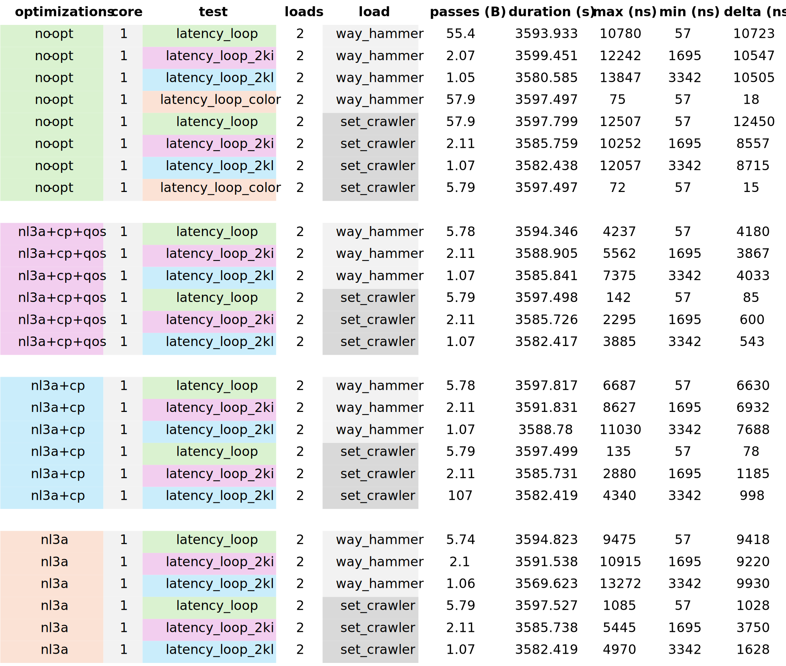</span>

### Raw Data – Core 3
<span style="display:inline-block; max-width:800px;">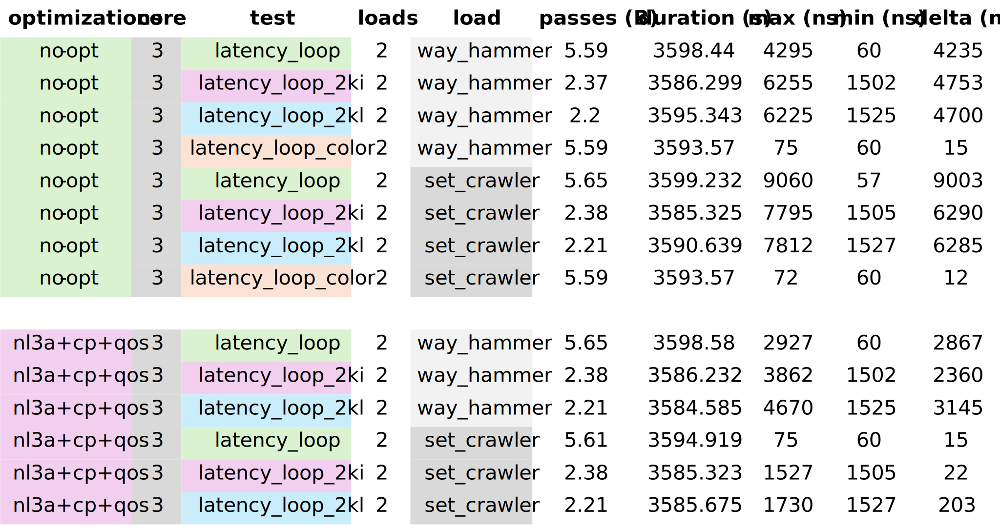</span>


### Core 1, way_hammer vs set_crawler, latency_loop

The following data illustrates how two different workloads can behave quite differently across the cluster configuration deploying various optimizations that we have previously discussed.  The way_hammer pattern walks across way boundaries to stress the DSU snoop filter and put pressure on the DSU to maintain coherency.  The set_crawler pattern walks across set boundaries to stress the DSU snoop filter and put pressure on the DSU to maintain coherency.  In the no-opt configuration, the observed latency jitter is substantial, and the optimizations applied to the cluster result in significantly different latency jitter results.  This demonstrates how different workloads can experience different latency jitter results under different configurations.

<span style="display:inline-block; max-width:500px;"></span>

<span style="display:inline-block; max-width:500px;">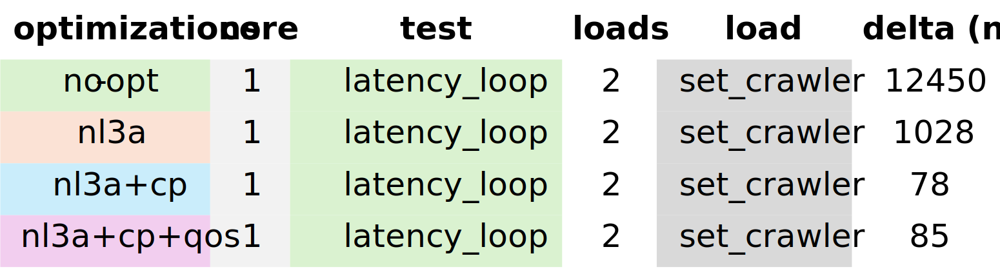</span>

### Core 1, way_hammer vs set_crawler, latency_loop_2ki

The following data illustrates the same basic fact that the previous slide illustrates about how the workload itself can influence the latency jitter experienced.  In this data, we change from the latency_loop to the latency_loop_2ki which inserts 2048 "add" instructions into the test loop.  While the same basic trend in the data can be seen, the actual values are substantially different when compared to the previous latency_loop example

<span style="display:inline-block; max-width:500px;"></span>

<span style="display:inline-block; max-width:500px;">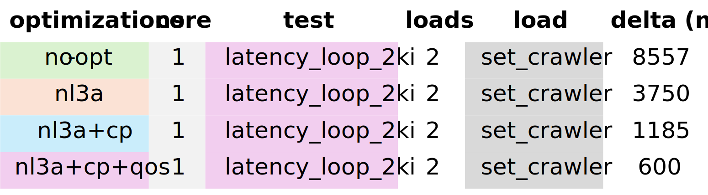</span>

### Core 1, way_hammer vs set_crawler, latency_loop_2kl

The following data illustrates the same basic fact that the previous slides illustrated about how the workload itself can influence the latency jitter experienced.  In this data, we change to the latency_loop_2kl which inserts a loop of 2048 increments into the test loop.  While the same basic trend in the data can be seen, the actual values are substantially different when compared to the previous latency_loop example and quite similar to the previous latency_loop_2ki example.

<span style="display:inline-block; max-width:500px;">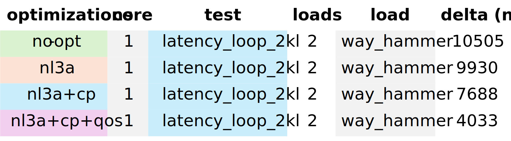</span>

<span style="display:inline-block; max-width:500px;"></span>

### CORE 1 vs CORE 3

This data simply compares the performance between core 1 and core 3 under the same two test configurations, no optimizations and all three mitigations applied.

Core 1 is a Cortex A55.
Core3 is a Cortex A76.

<span style="display:inline-block; max-width:500px;">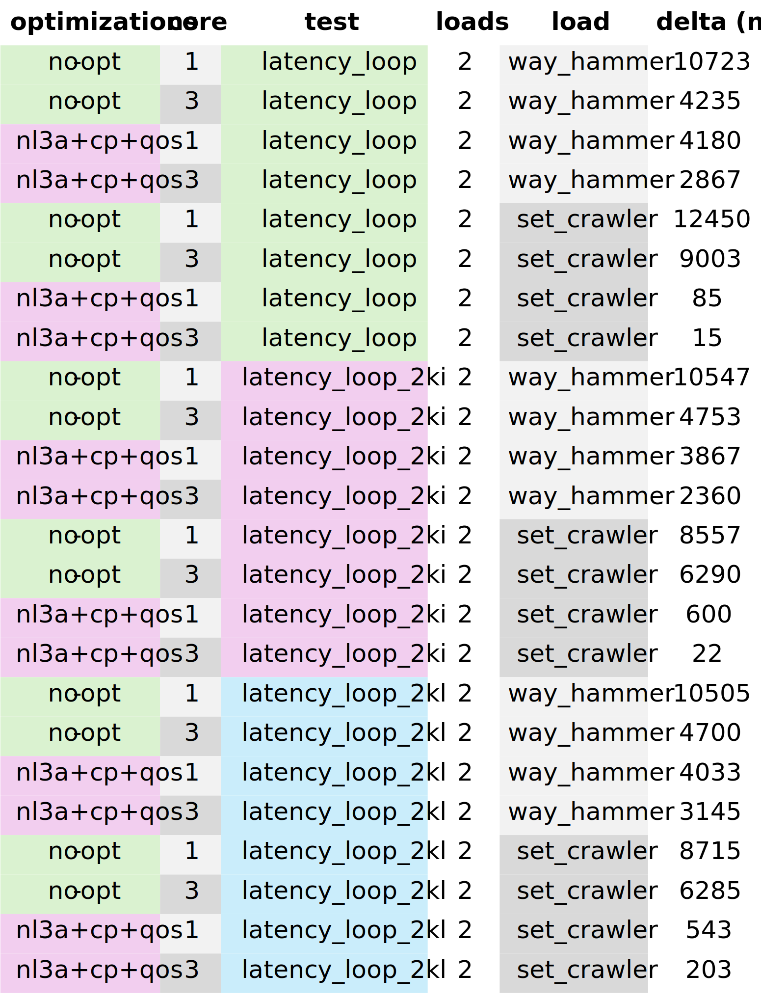</span>
## Notices & Disclaimers

Altera<sup>&reg;</sup> Corporation technologies may require enabled hardware, software or service activation.
No product or component can be absolutely secure. 
Performance varies by use, configuration and other factors.
Your costs and results may vary. 
You may not use or facilitate the use of this document in connection with any infringement or other legal analysis concerning Altera or Intel products described herein. You agree to grant Altera Corporation a non-exclusive, royalty-free license to any patent claim thereafter drafted which includes subject matter disclosed herein.
No license (express or implied, by estoppel or otherwise) to any intellectual property rights is granted by this document, with the sole exception that you may publish an unmodified copy. You may create software implementations based on this document and in compliance with the foregoing that are intended to execute on the Altera or Intel product(s) referenced in this document. No rights are granted to create modifications or derivatives of this document.
The products described may contain design defects or errors known as errata which may cause the product to deviate from published specifications.  Current characterized errata are available on request.
Altera disclaims all express and implied warranties, including without limitation, the implied warranties of merchantability, fitness for a particular purpose, and non-infringement, as well as any warranty arising from course of performance, course of dealing, or usage in trade.
You are responsible for safety of the overall system, including compliance with applicable safety-related requirements or standards. 
<sup>&copy;</sup> Altera Corporation.  Altera, the Altera logo, and other Altera marks are trademarks of Altera Corporation.  Other names and brands may be claimed as the property of others. 

OpenCL* and the OpenCL* logo are trademarks of Apple Inc. used by permission of the Khronos Group™. 
