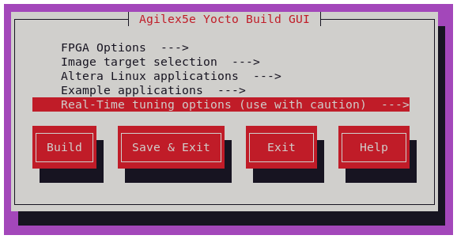
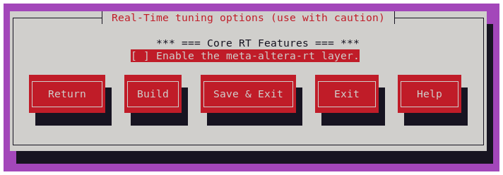
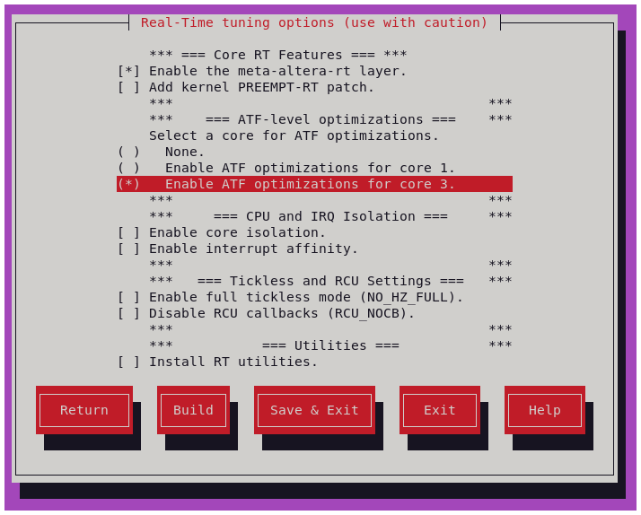
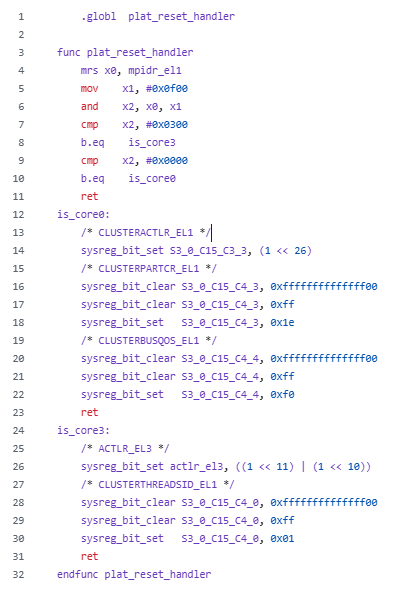
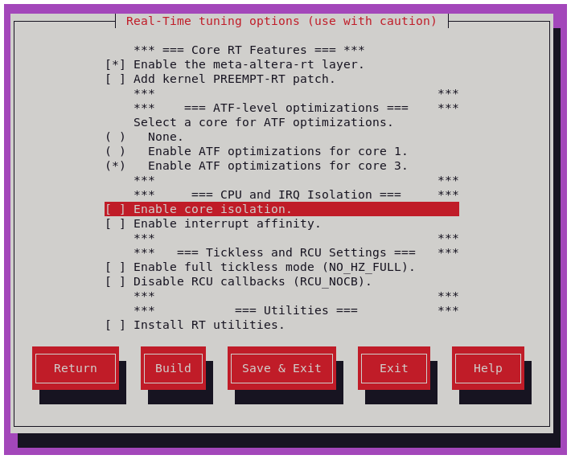
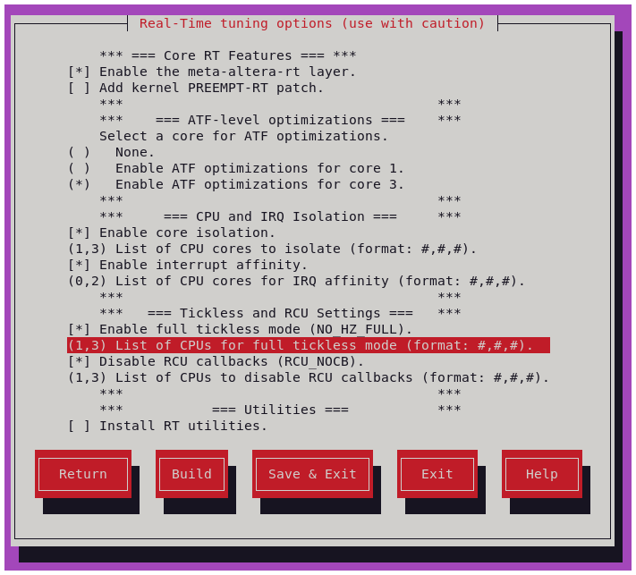
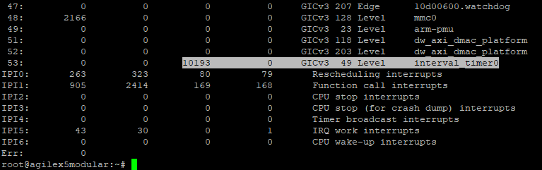
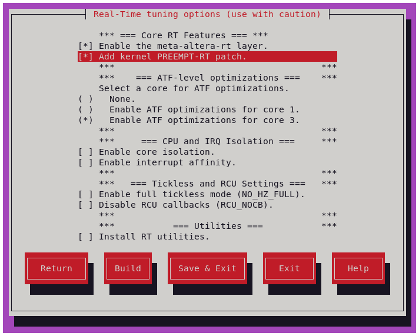
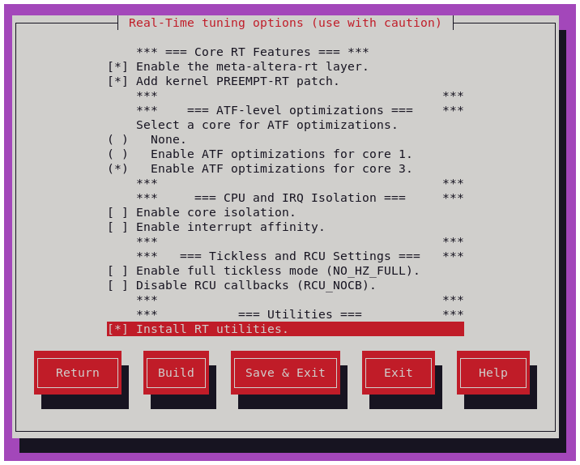
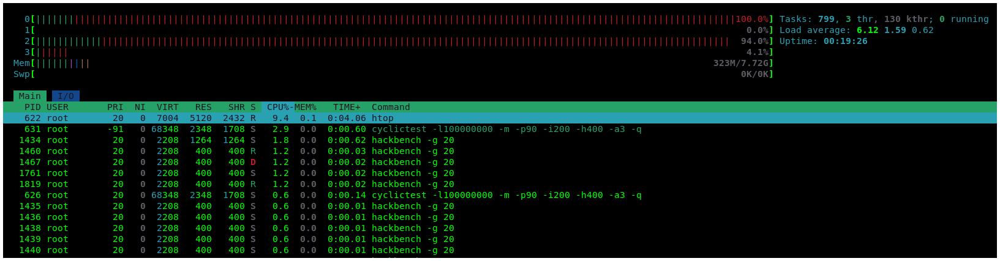

# Embedded Linux Real-Time Tuning using Kas/Yocto

<style>
r { color: Red; font-weight: bold;}
o { color: Orange; font-weight: bold;}
g { color: Green; font-weight: bold;}
y { color: #CCCC00; font-weight: bold;}
</style>

## Introduction

Achieving reliable and predictable real-time performance on a Linux-based system is often a challenging task. While
Linux provides good general-purpose performance, its default configuration is typically optimized for throughput
and fairness rather than deterministic response times. Many embedded and edge applications, however—such as
industrial control systems, robotics, video analytics, or network acceleration—require low-latency and consistent
behavior under varying workloads.

To address these needs, the system must often be tuned at multiple layers of the software stack. This involves careful
configuration of the Arm® Trusted Firmware (ATF), U-Boot, the Linux kernel, and the user-space applications themselves.

This guide, provided by Altera®, offers a collection of recommendations, configuration options, and design practices
that can help you adjust your Linux-based environment for near real-time or soft–real-time workloads. **The content is
based on internal validation for optimizing embedded Linux performance on Agilex™ 5 devices, but the general principles
may also apply to other SoC platforms.**

!!! danger "Important Notice"

    The configurations and techniques described in this document are not guaranteed to produce real-time behavior on
    every system or use case. There is no single “golden” configuration for real-time performance—different applications,
    hardware configurations, and workloads may require different tuning strategies.

    You should evaluate, test, and validate each recommendation individually within your system to ensure it aligns
    with your performance goals. Use this guide as a starting point for exploration, not as a prescriptive reference.

## Scope of This Guide

The following sections describe configuration options and recommendations at multiple levels of the system stack:

* **ATF level (ONLY FOR Agilex™ 5):** Provide higher CHI QoS to a particular set of cores, "cache-way" partitioning, and other L3
  cache level configuration.
* **U-Boot level:** Enable core isolation, core affinity and interrupt affinity using the boot arguments.
* **Kernel level:** Linux configuration and patching strategies.
* **Application level:** Best practices for user-space design, including CPU isolation, priority assignment,
  scheduling policy.

## Integration Example with Yocto/Kas

Kas is a Python-based lightweight build orchestration layer on top of BitBake/Yocto. Kas allows you to define your build
environment in a YAML manifest, so you can perform checkout, environment setup, configuration, and build invocation with
a single command.

To illustrate how these configurations can be practically applied, Altera® provides an example implementation using a
Yocto Project–based build system, managed via Kas. The example demonstrates how to define and integrate a dedicated
**“layer”** that encapsulates real-time–oriented settings through `.yml` and `Kconfig` files.

This meta-layer can be easily extended or combined with the **[HPS Linux Golden System Reference Design]**,
ensuring a reproducible and maintainable workflow for embedded software development.

Even if your system is built using Poky or other Yocto-derived distributions, the recommendations in this guide
remain relevant. They can be selectively applied to suit your system’s requirements, whether you are targeting
soft real-time responsiveness or pursuing more stringent hard real-time behavior.

!!! info "Kconfig and Kas/Yocto variables"
    Note that all Kconfig and Kas/Yocto variables are declared and managed from `kas/Kconfig` and `kas/rt.yml`
    in the example `meta-altera-rt` layer.

<br>

The provided layer has been validated using GSRD 2.0 for the Agilex™ 5 E-Series Premium Development Kit, but
it is readily portable to other Altera® platforms using Yocto/KAS. The table below lists the corresponding
verified release tags.

| GSRD 2.0 version | Location | Commit ID/Tag |
| ---------------------------------- | ---- | --- |
| [HPS GSRD User Guide for the Agilex™ 5 E-Series Premium Dev Kit]  | https://github.com/altera-fpga/meta-altera-rt  | [QPDS25.3.1_REL_GSRD_PR] |
| [HPS GSRD User Guide for the Agilex™ 5 E-Series Premium Dev Kit]  | https://github.com/altera-fpga/meta-altera-rt  | [QPDS26.1_REL_GSRD_PR] |

## Get Started

1. Get familiar with GSRD 2.0 dependencies, and get access to its source files. See: **[GSRD 2.0 with Kas Build System]**
2. Clone the `meta-altera-fpga` layer and follow the **[Altera® FPGA Real-Time Meta Layer]** Readme Instructions.
   You should be able to see <g>"Real-Time tuning options (use with caution)"</g>. Anytime, after applying your settings,
   press "Build".

   {:style="display:block; margin-left:auto; margin-right:auto;"}

   <center>

   **Kconfig Real-Time main menu**
   </center>
   <br>

3. In the GUI, enable the `meta-altera-rt` layer (<Space\> selects). The menu will expand.
   {:style="display:block; margin-left:auto; margin-right:auto;"}

   <center>

   **Enable the meta-altera-rt layer.**
   </center>
   <br>

4. Some concepts about the Hard Processor System in Agilex™ 5 SoC FPGA are well described in the
   **[Hard Processor System Technical Reference Manual: Agilex™ 5 SoCs]**.

The following sections explain the available configuration options. You can enable all of them or only those relevant
to your use case. More importantly, use this as a guide to help you tune your system for soft real-time workloads.

<br>

## ATF level optimizations for Yocto-Kas build

These optimizations are fully explained in the Real-time guide [Agilex 5 HPS CPU Cluster Latency]. They consist of a set of HPS cluster
configurations that can help in the execution of tasks. The configuration is integrated into the Yocto/Kas build through a
 `.bbappend` recipe that modifies the Arm Trusted Firmware (ATF) build process. The file can be found at:
`meta-altera-rt/recipes-bsp/arm-trusted-firmware/arm-trusted-firmware_%.bbappend`
two example configurations are provided, each enabled by one of two build variables:

{:style="display:block; margin-left:auto; margin-right:auto;"}

<center>

**ATF Optimization options Kconfig GUI**
</center>
<br>

The following table outlines the available options presented as configuration examples linking them with
corresponding Kconfig and Yocto/Kas variables. You can use these two examples as a reference to create
more configurations for other cores.

<center>

| GUI Configuration Option           | Kconfig Variables | Kas/Yocto Variable | Effective Action |
| ---------------------------------- | ---- | --- | :---: |
| Enable ATF optimizations for core 3.  | (bool) `RT_CORE3_OPT` = true <br> (string) `CONFIG_RT_CORE3_OPT` = "rt-atf-core3" <br> (bool) `RT_CORE1_OPT` = false <br> (string)`CONFIG_RT_CORE3_OPT` = ""  | `SOCFPGA_RT_FEATURES` =+ "rt-atf-core3" <br> `SOCFPGA_RT_FEATURES` =+ ""| Adds the assembler fragment `core3_nl3a_cp_qos_plat_helpers.S` <br> to the ATF build. |
| Enable ATF optimizations for core 1.  | (bool) `RT_CORE3_OPT` = false  <br> (string) `CONFIG_RT_CORE3_OPT` = ""  <br> (bool) `RT_CORE1_OPT` = true <br> (string) `CONFIG_RT_CORE3_OPT` = "rt-atf-core1" | `SOCFPGA_RT_FEATURES` =+ ""  <br> `SOCFPGA_RT_FEATURES` =+ "rt-atf-core1" | Adds the assembler fragment `core1_nl3a_cp_qos_plat_helpers.S` <br> to the ATF build. |
| None.                                 | (bool) `RT_CORE3_OPT` = false  <br> (string) `CONFIG_RT_CORE3_OPT` = ""  <br> (bool) `RT_CORE1_OPT` = false <br> (string) `CONFIG_RT_CORE3_OPT` = "" | `SOCFPGA_RT_FEATURES` =+ ""  <br> `SOCFPGA_RT_FEATURES` =+ "" | No change in ATF. |

</center>

The following table explains the contents of the ATF helper fragment (`core3_nl3a_cp_qos_plat_helpers.S`), which is
added by the `.bbappend` file to the `plat/intel/soc/common/aarch64/plat_helpers.S` file within the ATF source code.

<center>

<br>

| Example of an ATF plat_helper.S fragment |  Line description |
| :----------------------------------: | ---- |
|{:style="display:block; margin-left:auto; margin-right:auto;"} | <br> <br> - <g>Line 3-11: </g> This code is executed once per core, <br> the code is used to identify the core. <br> <br> <g> - Line 14: </g> disables "no L3 allocation mode" from the cluster. (`nl3a`) <br> <br> <g> - Line 18:</g> Assign `Way Group 0` to `Scheme ID 1` while <br> `Way groups 1,2,3` to `Scheme ID 0`. Each "way group" holds <br> "4 cache ways" hence it covers the 16 available cache ways in this cluster,<br> this enables "Cache Partitioning" (`cp`).  See: **[CLUSTERPARTCR]** <br><br> <g> - Line 22: </g> Assigns CHI (Coherent Hub Interface) QoS `"F"` <br> (highest priority), to `Scheme ID 1` and sets CHI QoS `"0"` <br> to `Scheme ID 0` (`qos`). See: **[CLUSTERBUSQOS]** <br> <br> <g> - Line 26: </g> "Scheme Management Registers enable" <br> and "Thread Scheme ID Register enable". See: **[ACTLR_EL3]** <br> <br> <g> - Line 30: </g> Assign this `thread (effectively core)` (in this example core3, <br> second A76) to `Scheme ID 1`. By default other <br> cores will be assigned to `Scheme ID 0`. See: **[CLUSTERTHREADSID]** |

</center>

You should evaluate and select the most appropriate options for your platform and application. You can enable or
disable the "No L3 Allocate Mode" (**`nl3a`**), "Cache Partitioning" (**`cp`**), and/or adjust the "HIC Quality
of Service" (**`qos`**) by enabling/disabling and /or incrementing/decrementing these settings for one or more
cores within the cluster. Similarly, you can assign cache `Way Groups` and `cores` to specific `Scheme IDs`,
while setting the "QoS priority" for those `Scheme IDs`.

The previous fragment is favouring Core 3, assigning it to `Scheme ID 1` that has higher HIC QoS than other
`Scheme IDs` and a 1/4 of the cache is allocated to said `Scheme ID`.(Note that at this point, no core is
isolated).

The provided example serves as a starting point for integrating these modifications into your Kas/Yocto build.

<br>

## Core Isolation, Interrupt affinity, Tickless and RCU Settings

**Core Isolation** involves dedicating specific CPU cores to handle real-time tasks, preventing them from being
interrupted by non-real-time processes. This helps ensure consistent performance and reduces latency.

**Interrupt Affinity** refers to the assignment of interrupts to specific CPU cores. By binding interrupts
to dedicated cores, you can optimize system responsiveness and prevent shared resource contention,
ensuring that time-sensitive operations are handled by the most appropriate cores.

You can configure core isolation and interrupt affinity using a combination of U-Boot boot arguments
and kernel settings.

### Modify boot arguments

The `bootargs` are added to a `u-boot-env.txt`  (or similar) using an `u-boot_script.its`

In this example the arguments are modified in the GUI with the following options:

{:style="display:block; margin-left:auto; margin-right:auto;"}

<center>

**CPU Isolation and Interrupt Affinity options Kconfig GUI**
</center>
<br>

You must select which cores to isolate and define the ones that handle interrupts. Typically, you should keep
interrupts off the isolated cores to prevent interference with real-time workloads. In the figure below, you
isolate cores 1 and 3 for dedicated applications, while cores 0 and 2 handle system interrupts.

The following table shows the available options and how they map to the corresponding Kconfig and Yocto/Kas
variables.

<br>

<center>

| GUI Configuration Option              | Kconfig Variables | Kas/Yocto Variable | Effective Action |
| ------------------------------------- | ---- | --- | :---: |
| List of CPUs to isolate               | (string) `CPU_ISOL`          | `KERNEL_BOOTARGS` += isolcpus=`CPU_ISOL`      | Adds `isolcpus` and core list to u-boot boot arguments. |
| List of CPUs for IRQ affinity         | (string) `CPU_IRQ_AFF`       | `KERNEL_BOOTARGS` += irqaffinity=`CPU_IRQ_AFF`| Adds `irqaffinity` and core list to u-boot boot arguments. |
| List of CPUs for full tickless mode   | (string) `CPU_NO_HZ_FULL`    | `KERNEL_BOOTARGS` += nohz_full=`CPU_NO_HZ_FULL`| Adds `nohz_full` and core list to u-boot boot arguments. |
| List of CPUs to disable RCU callbacks | (string) `CPU_RCU_NOCBS`     | `KERNEL_BOOTARGS` += rcu_nocbs=`CPU_RCU_NOCBSL`| Adds `rcu_nocbs` and core list to u-boot boot arguments. |

</center>

The **`nohz_full=`** parameter in U-Boot's bootargs enables full dynticks (also known as "No HZ Full") mode
in the Linux kernel at boot time. When this option is set, it instructs the kernel to run certain CPU
cores in a mode where the kernel avoids timer interrupts on those cores, effectively preventing any
unnecessary context switches or interrupts, which is particularly useful for real-time and low-latency
applications.

By specifying which CPUs should enter "No HZ Full" mode (e.g., nohz_full=1 for CPU 1), the system
ensures that these cores are dedicated to time-sensitive tasks without interruptions from the periodic
tick of the kernel’s scheduler. This can improve performance for workloads that require predictable,
low-latency processing.

!!! danger "Note"
    In this example, "No HZ Full" mode is applied to the isolated cores defined by `CPU_ISOL`.
    However, you should evaluate whether this setting is suitable for your system, as it may not be
    appropriate for all platforms. In some cases, enabling "no Hz Full" can actually degrade real-time
    performance, depending on the specific workload and system configuration.

**`rcu_nocbs`** stands for RCU "no callback CPUs" and tells the kernel not to run RCU callbacks on certain CPUs.
Normally, each CPU handles its own RCU callbacks, which free memory or complete deferred work. Using
rcu_nocbs offloads these callbacks to other CPUs, which is useful in real-time or latency-sensitive
systems to prevent RCU processing from interfering with critical tasks on designated CPUs.

!!! tip "RCU callback processing."
    Consider adding **`rcu_nocbs=<cpu_list>`** to your boot arguments. Normally, every CPU runs RCU
    (Read-Copy-Update) callbacks. When using `rcu_nocbs` in the isolated core list, the isolated cores
    will participate in RCU read-side sections but they won’t be interrupted by RCU housekeeping work.

The CPU Isolation, IRQ affinity, Tickless and RCU Settings u-boot environment arguments are added using the
Kas configuration file `meta-altera-rt/kas/rt.yml`

### Modify kernel configuration

Additional kernel configuration is needed to apply **"Core Isolation"** and **"Interrupt Affinity"** to your system.
This kernel configurations settings are applied using the example file
`meta-altera-rt/recipes-kernel/linux/linux-socfpga-rt.inc` which appends the file `config/rt-*.scc`
(subsequently `config/config_rt-*.cfg`)

* **`CONFIG_CPU_ISOLATION=y`**: This ensures that the isolated cores (defined in `isolcpus=`) are not scheduled
  to run regular tasks, which helps minimize interference from background processes.
* **`CONFIG_GENERIC_IRQ_AFFINITY=y`**: When enabled, the kernel accepts the irqaffinity= boot argument and parses
  the CPU mask (irq_default_affinity) to set IRQ affinities when devices register their interrupts.
* **`CONFIG_ARM64_PSEUDO_NMI=y`**: Enables support for pseudo Non-Maskable Interrupts (NMIs)
 on ARM64-based systems. Pseudo NMIs are used to handle high-priority, low-latency interrupts
 that cannot be masked by the CPU's interrupt controller.
* **`CONFIG_NO_HZ_FULL=y`**: Instructs the kernel to run in "No HZ Full" mode, where certain CPUs
  (as defined by the `nohz_full=` boot parameter) do not receive regular timer interrupts.
  This reduces the overhead caused by the kernel's periodic scheduler tick and ensures that
  the isolated CPUs can handle real-time tasks.
* **`CONFIG_RCU_NOCB_CPU=y`**: The `rcu_nocbs= boot argument` and `CONFIG_RCU_NOCB_CPU` kernel configuration work
  together to control RCU callback execution on specific CPUs. When `CONFIG_RCU_NOCB_CPU` is enabled, the kernel
  supports assigning certain CPUs as “no-CBs” CPUs, meaning they will not execute RCU callbacks.

These three kernel configuration options can be applied through the Kconfig GUI by selecting the corresponding
**"Enable <feature>”**.

{:style="display:block; margin-left:auto; margin-right:auto;"}

<center>

**Additional RT configurations options Kconfig GUI**
</center>
<br>

<center>

| GUI Configuration Option               | Kconfig Variables | Kas/Yocto Variable | Effective Action |
| -------------------------------------- | ---- | --- | --- |
| Enable core isolation                  | (bool) `EN_CORE_ISOL` <br> (string) `CONFIG_EN_CORE_ISOL`         | `SOCFPGA_RT_FEATURES` =+  `rt-core-isol`    | If `rt-core-isol` the Linux kernel is compiled with <br> `CONFIG_CPU_ISOLATION=y` |
| Enable interrupt affinity              | (bool) `EN_IRQ_AFF` <br> (string) `CONFIG_EN_IRQ_AFF`             | `SOCFPGA_RT_FEATURES` =+  `rt-irq-aff`      | If `rt-irq-aff` the Linux kernel is compiled with <br> `CONFIG_GENERIC_IRQ_AFFINITY=y` and `CONFIG_ARM64_PSEUDO_NMI=y` |
| Enable full tickless mode (NO_HZ_FULL) | (bool) `EN_NO_HZ_FULL` <br> (string) `CONFIG_EN_NO_HZ_FULL`       | `SOCFPGA_RT_FEATURES` =+  `rt-no-hz-full`   | If `rt-no-hz-full` the Linux kernel is compiled with <br> `CONFIG_NO_HZ_FULL=y` |
| Disable RCU callbacks (RCU_NOCB)       | (bool) `EN_RCU_NOCBS` <br> (string) `CONFIG_EN_RCU_NOCBS`         | `SOCFPGA_RT_FEATURES` =+  `rt-rcu-nocbs`   | If `rt-rcu-nocbs` the Linux kernel is compiled with <br> `CONFIG_RCU_NOCB_CPU=y` |

</center>

!!! danger "Note"
    This is just an example of how to enable or disable Linux kernel configurations
    using Kconfig and Kas/Yocto variables, applied through configuration fragments (`.cfg` and `.scc`)
    added via `.bbappend` and `.inc` files. You have the flexibility to choose or modify the
    variables and configurations, as well as decide where to place them within your build system.

The combination of boot arguments, kernel configuration options, and the specified list of
cores ensures that your system will have a set of isolated cores, as well as a separate set
of cores dedicated to handling system interrupts.

### Setting Interrupt Affinity (IRQ Affinity)

At times, you may need to assign a specific hardware interrupt to a target core. This can be achieved in Linux
by configuring the `smp_affinity`. Start by identifying the interrupt number with the following steps:

```bash

    cat /proc/interrupt
```

<br>

{:style="display:block; margin-left:auto; margin-right:auto"}
<center>

**Amount of Interrupts Triggered by the Interval
 Timer allocated to Core2 (3rd column)**
</center>
<br>

If you want to allocate interrupt 53, which is subscribed to the interval_timer (which is a device in the
FPGA fabric), to core 2, you can modify the **`smp_affinity`** as follows:

```bash

    echo 4 > /proc/irq/53/smp_affinity
```

In this case, the value 4 (binary 0100) corresponds to core 2. Similarly, a value of 2 (binary 0010)
would allocate the interrupt to core 1.

<br>

## Kernel level optimizations for Yocto/Kas build

The Real-Time (RT) patch, often referred to as `PREEMPT_RT`, is a set of modifications to the standard
Linux kernel that transforms it into a fully preemptive real-time operating system (RTOS). Its main
goal is to reduce system latency and make task scheduling more deterministic, ensuring that
high-priority tasks execute within predictable time bounds. In the standard Linux kernel, certain
sections of code are non-preemptible, meaning a high-priority task must wait until the kernel
finishes critical operations before it can run. This behavior introduces unpredictable latency,
which can be problematic for real-time applications such as industrial control, robotics, networking,
or audio processing.

This section demonstrates how easily you can apply the `PREEMPT-RT` patch to the Linux kernel for
Altera® devices using the Kas/Yocto infrastructure, transforming your system into a near-real-time
environment. Note that Linux is not a hard real-time operating system, and Altera® Agilex™ devices
feature an ARM cluster composed exclusively of A-class cores.

Enabling this functionality requires applying the appropriate Linux kernel patch from the
**[PREEMPT_RT patch versions]** repository and configuring the corresponding Linux kernel options.

The RT_PREEMPT Kernel patch and Kernel configurations can be applied through the Kconfig GUI by selecting
“Add kernel PREEMPT-RT patch”.

{:style="display:block; margin-left:auto; margin-right:auto;"}

<center>

**RT_PREEMPT configurations options Kconfig GUI**
</center>
<br>

<center>

| GUI Configuration Option             | Kconfig Variables | Kas/Yocto Variable | Effective Action |
| ----------------------------------   | ---- | --- | --- |
| Add kernel PREEMPT-RT patch          | (bool) `REALTIME_PATCH` <br> (string) `CONFIG_REALTIME_PATCH`    | `SOCFPGA_RT_FEATURES` =+ ` rt-patch`      | If `rt-patch` the Linux kernel is patched and configured with <br> `CONFIG_PREEMPT_RT=y`, `CONFIG_HIGH_RES_TIMERS=y` and `CONFIG_IRQ_FORCED_THREADING=y` |

</center>

The `CONFIG_PREEMPT_RT` option enables full kernel preemption for real-time responsiveness. `CONFIG_HIGH_RES_TIMERS`
activates high-resolution timers, allowing the kernel to use hardware timers with nanosecond precision instead of
relying on periodic timer ticks. With this option enabled, the system can schedule events and wake-ups with much
finer granularity. `CONFIG_IRQ_FORCED_THREADING` Forces hardware interrupt handlers to run as kernel threads
rather than in the traditional hard interrupt context. This allows interrupts to be scheduled and prioritized
using standard Linux scheduling mechanisms.

!!! danger "RT_PREEMPT Patch"
    The patch is applied through the `linux-socfpga-lts_<ver>.bbappend` file, while the kernel configuration is
    managed using the `linux-socfpga-rt.inc` file, which includes `.cfg` and `.scc` fragments. You can select or
    change the PREEMPT_RT patch version by modifying the `RT_LINUX_VERSION` and `RT_PATCH_VERSION` variables, and
    add additional kernel configurations as needed.

<br>

## Application Level: Recommended Real-Time utilities

### Linux standard Utilities

Some useful Linux-standard applications for quickly evaluating the configurations described above include:

* **rt-tests:** A collection of tools for measuring and validating real-time performance on Linux systems
  (e.g., cyclictest, hwlatdetect, hackbench).
* **util-linux:** A set of fundamental system utilities for Linux, including tools for managing
  partitions, mounts, and processes.
* **cpufrequtils:** Utilities for controlling and monitoring CPU frequency scaling, useful for managing
  performance and power trade-offs.
* **htop:** An interactive process viewer and system monitor that provides real-time CPU, memory,
  and task usage information

You can add these packages to the root filesystem by using the `IMAGE_INSTALL:append` directive within the
Yocto/Kas configuration file `kas/rt.yml` using the variable `rt-utils`. You can append any additional
utilities that you consider necessary for your real-time evaluation.

### Custom Utilities

* **System Register Dump:** Custom Linux module that allows displaying register configuration described
  in [ATF level optimizations for Yocto-Kas build](#atf-level-optimizations-for-yocto-kas-build). The
  system module source `system_reg_dump.c` is compiled when `rt-utils` variable is enabled.

* **Cyclictest and Hackbench script:** A script to run **[cyclictest]** in a core of your choosing while running
  hackbench recurrently in non-interest cores. Useful to measures the difference between a thread's
  intended wake-up time and the time at which it actually wakes up while the system is upset by running
  multiple instances of **[hackbench]** (stress test for kernel scheduler, parts of memory subsystem and inter-process
  communication).

  Usage:
  ```bash
    run_cyclictest_hackbench-core --iterations <#> --board <name> --priority <#> --max_us_scale <#> --loops <#> --interval <#> --core <#>
  ```

  * **`iterations`**: Number of times `cyclictest` command will execute.
  * **`board`**: Board name used for reference and to generate an output file.
  * **`priority`**: Execution priority of `cyclictest`.
  * **`max_us_scale`**: Maximum histogram value in microseconds.
  * **`loops`**: Number of interrupts to measure in each iteration.
  * **`interval`**: Interval between interrupts, in microseconds.
  * **`core`**: CPU core on which `cyclictest` is executed.

  An additional histogram plotter script installs with the tools. You can use it to find previously generated `output_`
  files and create the corresponding plots. Just run rt-plot-generator in the directory where your histograms were
  generated.

  ```bash
    rt-plot-generator
  ```

To install both Linux and custom utilities enable them in the Kconfig GUI

{:style="display:block; margin-left:auto; margin-right:auto;"}

<center>

**RT Utilities configurations options Kconfig GUI**
</center>

<br>

## Application Level: Check your system configuration at Runtime

* **`RT_PREEMPT`** patch was successfully applied.
  ```bash
    uname -r
    #should show your RT_PREEMPT patch version "-rt"

    cat /sys/kernel/realtime
    #should return 1 if real-time is enabled

    dmesg | grep -i PREEMPT
    #look for "SMP PREEMPT_RT ..."

  ```

* Obtain kernel config and settings in runtime.
  ```bash
    cat /proc/config.gz | gunzip > config && grep CONFIG_PREEMPT_RT config
    #returns "CONFIG_HIGH_RES_TIMERS=y" if applied

    cat /proc/config.gz | gunzip > config && grep CONFIG_HIGH_RES_TIMERS config
    #returns "CONFIG_HIGH_RES_TIMERS=y" if applied

    # Use for any other Kernel Configuration Setting

  ```

* Display register configuration described in
  [ATF level optimizations for Yocto-Kas build](#atf-level-optimizations-for-yocto-kas-build).
  ```bash
    cat /sys/kernel/system_registers

    # For example, returns:
    # CLUSTERACTLR_EL1: 0x141c0100
    # CLUSTERPARTCR_EL1: 0x1e
    # CLUSTERBUSQOS_EL1: 0xf0
    # CLUSTERTHREADSID_EL1 (CPU0): 0x0
    # CLUSTERTHREADSID_EL1 (CPU1): 0x0
    # CLUSTERTHREADSID_EL1 (CPU2): 0x0
    # CLUSTERTHREADSID_EL1 (CPU3): 0x1

  ```

* Show core isolation and nohz_full settings.

  ```bash
    cat /sys/devices/system/cpu/isolated
    #returns 1,3 - if core 1 and 3 were selected as isolated

    cat /sys/devices/system/cpu/nohz_full
    #returns 1,3 - if core 1 and 3 were selected as isolated
  ```

* You can see what command line parameters were passed into the kernel.
  ```bash
    cat /proc/cmdline
    #return a string like: console=ttyS0,115200 earlycon root=/dev/mmcblk0p2 rw rootwait panic=-1 console=ttyS0,115200 earlycon root=/dev/mmcblk0p2 rw rootwait panic=-1 isolcpus=1,3 nohz_full=1,3 irqaffinity=0,2
  ```

* See interrupt handling by core.
  ```bash
    cat /proc/interrupts
  ```

* Evaluate the system’s runtime behavior and monitor CPU usage, memory, and task activity using `htop`.

{:style="display:block; margin-left:auto; margin-right:auto;"}

<center>

**HTOP example**
</center>

  The previous figure shows the CPU utilization when running the custom utility `run_cyclictest_hackbench-core`
  ```bash 
    run_cyclictest_hackbench-core --iterations 1000000 --board test --core 3
  ```

  You can observe the `hackbench` instances running on cores 0 and 2, which act as non-isolated cores, while
  core 1 stays idle because you isolated it. The `cyclictest` threads run on core 3, another isolated core
  that you designated for the real-time workload in this example.

<br>

## Application Level: Core Affinity and Scheduling policy

You can define core affinity and scheduling policies using standard Linux utilities or directly in your programs.
The following examples show how you can modify these settings. Keep in mind that this is not an exhaustive list of
options or recommendations, but a starting point for developing and running your applications.

### `Taskset` and `chrt` in Linux

In Linux, you can use the `taskset` command to set CPU affinity for processes. This allows you to bind a
process to one or more specific CPU cores. To bind a process to specific CPUs, use the `taskset`
command followed by the CPU mask:

```bash
    taskset -c <cpu_list> <command>
```

Changing Scheduling Policies via `taskset` and `chrt` utilities

```bash
    taskset -c 0,1 chrt -f 50 ./my_program

```

Where `-f` specifies `SCHED_FIFO` policy, and you can replace it with `-r` for `SCHED_RR`, `-i` for `SCHED_IDLE`, etc. `50`
is the priority level for real-time policies (`SCHED_FIFO` and `SCHED_RR`), where 1 is the lowest and 99 is the highest.

You can use other tools like `nice` utility when using the default time-sharing scheduler (`SCHED_OTHER`).

<br>

### Available Scheduling Policies for Real-Time

These policies let you control task priority and execution for real-time workloads.

<center>

Summary of Scheduling Policies in Linux

|Policy         | Description |
| ------------- | ----------- |
|SCHED_OTHER    |Default policy used by most tasks (time-sharing, fair scheduler). |
|SCHED_FIFO     |First-in, first-out real-time policy with fixed priority. Higher priority tasks are executed first. |
|SCHED_RR       |Round-robin real-time policy. Similar to SCHED_FIFO but tasks get a time slice before the next task runs. |

</center>

### Basic Real-Time Thread creation in C programming

In C, setting CPU core affinity is done using the `sched_setaffinity()` system call, which allows
you to bind a process or thread to specific processor cores. The following code snippet provides
a starting point for adding CPU affinity control to your application.

```c

    #include <sched.h>
    #include <stdio.h>
    #include <unistd.h>

    int main() {
        cpu_set_t cpuset;

        // Clear the cpuset (set all CPUs to 0)
        CPU_ZERO(&cpuset);

        // Set CPU core 0 in the cpuset
        CPU_SET(0, &cpuset);

        // Get the PID of the current process
        pid_t pid = getpid();

        // Set the CPU affinity of the current process
        if (sched_setaffinity(pid, sizeof(cpu_set_t), &cpuset) == -1) {
            perror("sched_setaffinity failed");
            return 1;
        }

        printf("Process bound to CPU 0\n");
    (...)

```

<br>

Alternatively, you can create a thread with a defined CPU affinity to ensure it runs on specific cores, while setting
a fixed execution period and choosing a scheduling policy that controls its priority and timing behavior.

```c

    /*Real-Time thread parameters*/

    #define THREAD_CYCLE_TIME_MS                0.25
    #define CLOCKID                             CLOCK_REALTIME
    #define MSECONDS_TO_NS                      (1000 * 1000)
    #define SECONDS_SLEEP_TO_START              1

    pthread_t  userThreadID;
    static int userThreadPriority    = 90;
    static int  userThreadCore       = 3;
    static double  threadCycleInMsec = THREAD_CYCLE_TIME_MS;

    typedef struct {
        unsigned int    *data;
        int             *more_data;
        bool            *signalTerm;
     } threadArg;

    void nsOverflowCheck(struct timespec *expectedTime) {
        while (expectedTime->tv_nsec > (SECONDS_T0_NS - 1)) {            //If the expected ns is more than a second then
            expectedTime->tv_sec  += 1;                                  //Increment seconds by 1
            expectedTime->tv_nsec -= SECONDS_T0_NS;                      // clean out the ns portion of the expected
        }
    }

    void *userAppThread(void *arg) {
        struct timespec nextWakeUpTime;
        struct timespec threadStartTime;
        unsigned int *data;
        int  *more_data;
        bool *signalTerm;

        threadArg *threadArgumentsApp = (threadArg *)arg;

        data = threadArgumentsApp->data;
        more_data = threadArgumentsApp->qep_ptr;
        signalTerm = threadArgumentsApp->signalTerm;

        clock_gettime(CLOCKID, &threadStartTime);                                               //need to get the current time

        threadStartTime.tv_sec  += SECONDS_SLEEP_TO_START;                                      //add some seconds into the future, this can be zero
        threadStartTime.tv_nsec  = 0;

        nextWakeUpTime.tv_sec  = threadStartTime.tv_sec;                                        //copy the value of seconds to the next start time
        nextWakeUpTime.tv_nsec = threadStartTime.tv_nsec;                                       // there could be some adjustment if needed
        nsOverflowCheck(&nextWakeUpTime);                                                       //check the ns to see if it overflowed into seconds

        while (!(*signalTerm)) {                                                                //runs forever but a flag can be created to stop it
            clock_nanosleep(CLOCKID, TIMER_ABSTIME, &nextWakeUpTime, NULL);                     //This thread wakes up until the time calculated by nextWakeUpTime
            user_function(data, more_data);                                                                //do the user function

            nextWakeUpTime.tv_nsec += (__syscall_slong_t)(threadCycleInMsec * MSECONDS_TO_NS);  //recalculate the next wake up time
            nsOverflowCheck(&nextWakeUpTime);                                                   //check the ns to see if it overflowed into seconds
        }

        free(threadArgumentsApp);
        return NULL;
    }

    pthread_t createThread(int priority, size_t affinity, void *(*thread)(void *), char *userAppName, void *arguments) {

        cpu_set_t           cpu;                                                                // Variables to set core affinity
        pthread_t           threadIdentifier;
        struct sched_param  schedulerParams;

        int setParamsReturn  = 0;
        int errorAffinity    = 0;

        threadIdentifier = pthread_self();                                                      // Contains the ID for the thread
        schedulerParams.sched_priority = priority;
        setParamsReturn = pthread_setschedparam(threadIdentifier, SCHED_FIFO, &schedulerParams);

        if (setParamsReturn != 0) {
            printf("Could not create Schedule Parameters: pthread_setschedparam\n");
            exit(1);
        }

        printf("successful pthread_setschedparam:%s priority is %d\n", userAppName, schedulerParams.sched_priority);

        CPU_ZERO(&cpu);
        CPU_SET(affinity, &cpu);
        errorAffinity = pthread_setaffinity_np(threadIdentifier, sizeof(cpu_set_t), &cpu);
        if (errorAffinity) {
            fprintf(stderr, "pthread_setaffinity_np function failed: %s\n", strerror(errorAffinity));
            exit(1);
        }

        setParamsReturn = pthread_create(&threadIdentifier, NULL, thread, arguments);           //note here the argument passed to the thread
        if (setParamsReturn != 0)
            printf("Creation of the thread failed: pthread_create\n");

        if (CPU_ISSET(affinity, &cpu))
            printf("Using CPU CORE: %lu\n", (unsigned long)affinity);

        return threadIdentifier;
    }

    (...main)

    /* -- Create Real-Time thread for User Application ----*/

    threadArg *threadArguments  = (threadArg *) malloc(sizeof(threadArg));
    threadArguments->data         = data;
    threadArguments->more_data    = more_data;
    threadArguments->signalTerm   = signalTerm;
    char threadName[22]      = "UserAppThread";

    userThreadID = createThread((int) userThreadPriority, (size_t)userThreadCore, userAppThread, threadName, threadArguments);

    (...main)

```
## Notices & Disclaimers

Altera<sup>&reg;</sup> Corporation technologies may require enabled hardware, software or service activation.
No product or component can be absolutely secure. 
Performance varies by use, configuration and other factors.
Your costs and results may vary. 
You may not use or facilitate the use of this document in connection with any infringement or other legal analysis concerning Altera or Intel products described herein. You agree to grant Altera Corporation a non-exclusive, royalty-free license to any patent claim thereafter drafted which includes subject matter disclosed herein.
No license (express or implied, by estoppel or otherwise) to any intellectual property rights is granted by this document, with the sole exception that you may publish an unmodified copy. You may create software implementations based on this document and in compliance with the foregoing that are intended to execute on the Altera or Intel product(s) referenced in this document. No rights are granted to create modifications or derivatives of this document.
The products described may contain design defects or errors known as errata which may cause the product to deviate from published specifications.  Current characterized errata are available on request.
Altera disclaims all express and implied warranties, including without limitation, the implied warranties of merchantability, fitness for a particular purpose, and non-infringement, as well as any warranty arising from course of performance, course of dealing, or usage in trade.
You are responsible for safety of the overall system, including compliance with applicable safety-related requirements or standards. 
<sup>&copy;</sup> Altera Corporation.  Altera, the Altera logo, and other Altera marks are trademarks of Altera Corporation.  Other names and brands may be claimed as the property of others. 

OpenCL* and the OpenCL* logo are trademarks of Apple Inc. used by permission of the Khronos Group™. 
