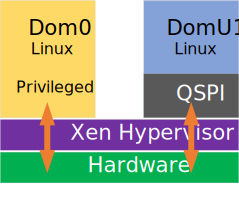

## Overview

This page presents the Xen GSRD, which is based on the [Linux GSRD for the Agilex™ 7 FPGA F-Series Transceiver-SoC Development Kit (P-Tiles & E-Tile)](https://altera-fpga.github.io/rel-24.3.1/embedded-designs/agilex-7/f-series/soc/gsrd/ug-gsrd-agx7f-soc/).

The Xen GSRD uses the SD card for storing the root filesystem.

### Prerequisites

The following are required in order to be able to fully exercise the Xen GSRD:

- [Agilex™ 7 FPGA F-Series Transceiver-SoC Development Kit (P-Tiles & E-Tile)](https://www.intel.com/content/www/us/en/products/details/fpga/development-kits/agilex/si-agf014.html) ordering code DK-SI-AGF014EB
- SD/MMC HPS Daughtercard
  - SDM QSPI Bootcard
  - Mini USB cable for serial output
  - Micro USB cable for on-board Intel FPGA Download Cable II
  - Micro SD card (4GB or greater)
- Host PC with
  - Linux - Ubuntu 22.04LTS was used to create this page, other versions and distributions may work too
  - Serial terminal (for example Minicom on Linux and TeraTerm or PuTTY on Windows)
  - Micro SD card slot or Micro SD card writer/reader
  - Altera&reg; Quartus<sup>&reg;</sup> Prime Pro Edition Version 24.3.1
  - Local Ethernet network, with DHCP server (will be used to provide IP address to the board)

You can determine your board version by referring to the following table from [https://www.intel.com/content/www/us/en/docs/programmable/683752/current/overview.html](https://www.intel.com/content/www/us/en/docs/programmable/683752/current/overview.html)

| Development Kit Version | Ordering Code | Device Part Number | Starting Serial Number |
| :-- | :-- | :-- | --: |
| Intel Agilex™ 7 FPGA F-Series Transceiver-SoC Development Kit (Production 2 P-Tiles & E-Tiles) | DK-SI-AGF014EB | AGFB014R24B2E2V (Power Solution 2) | 00205001 |
| Intel Agilex™ 7 FPGA F-Series Transceiver-SoC Development Kit (Production 1 P-Tiles & E-Tiles) | DK-SI-AGF014EA | AGFB014R24B2E2V (Power Solution 1) | 0001101 |
| Intel Agilex™ 7 FPGA F-Series Transceiver-SoC Development Kit (ES P-Tiles & E-Tiles) | DK-SI-AGF014E3ES | AGFB014E3ES (Power Solution 1) | 0001001 |

The DK-SI-AGF014E3ES and DK-SI-AGF014EA are deprecated, and not supported anymore.

The U-Boot and Linux compilation, Yocto compilation and creating the SD card image require a Linux host PC. The rest of the operations can be performed on either a Windows or Linux host PC.

### Release Notes

See [https://github.com/altera-opensource/gsrd-socfpga/releases/tag/QPDS24.3.1_REL_GSRD_PR](https://github.com/altera-opensource/gsrd-socfpga/releases/tag/QPDS24.3.1_REL_GSRD_PR).

### Prebuilt Binaries

The release files are accessible at [https://releases.rocketboards.org/2025.01/xen/agilex7_dk_si_agf014eb_xen/](https://releases.rocketboards.org/2025.01/xen/agilex7_dk_si_agf014eb_xen/)

The source code is also included on the SD card in the Linux rootfs path `/home/root`:

| File | Description |
| :-- | :-- |
| linux-socfpga-v6.6.51-lts-src.tar.gz | Source code for Linux kernel |
| u-boot-socfpga-v2024.07-src.tar.gz | Source code for U-Boot |
| arm-trusted-firmware-v2.11.1-src.tar.gz | Source code for Arm Trusted Firmware |

Before downloading the hardware design please read the agreement in the link [https://www.intel.com/content/www/us/en/programmable/downloads/software/license/lic-prog_lic.html](https://www.intel.com/content/www/us/en/programmable/downloads/software/license/lic-prog_lic.html)

#### Component Versions

Altera&reg; Quartus<sup>&reg;</sup> Prime Pro Edition Version 24.3.1 and the following software component versions are used to build the GSRD: 

| *Component* | *Location* | *Branch** | *Commit ID/Tag* |
| :-- | :-- | :-- | :-- |
| GHRD | [https://github.com/altera-opensource/ghrd-socfpga](https://github.com/altera-opensource/ghrd-socfpga) | master | QPDS24.3.1_REL_GSRD_PR |
| Linux | [https://github.com/altera-opensource/linux-socfpga](https://github.com/altera-opensource/linux-socfpga) | socfpga-6.6.51-lts | QPDS24.3.1_REL_GSRD_PR |
| Arm Trusted Firmware | [https://github.com/altera-opensource/arm-trusted-firmware](https://github.com/altera-opensource/arm-trusted-firmware) | socfpga_v2.11.1 | QPDS24.3.1_REL_GSRD_PR |
| U-Boot | [https://github.com/altera-opensource/u-boot-socfpga](https://github.com/altera-opensource/u-boot-socfpga) | socfpga_v2024.07 | QPDS24.3.1_REL_GSRD_PR |
| Yocto Project | [https://git.yoctoproject.org/poky](https://git.yoctoproject.org/poky) | styhead | latest | 
| Yocto Project: meta-intel-fpga | [https://git.yoctoproject.org/meta-intel-fpga](https://git.yoctoproject.org/meta-intel-fpga) | styhead | latest |
| Yocto Project: meta-intel-fpga-refdes | [https://github.com/altera-opensource/meta-intel-fpga-refdes](https://github.com/altera-opensource/meta-intel-fpga-refdes) | styhead | QPDS24.3.1_REL_GSRD_PR |
| Yocto Build Script: gsrd-socfpga | [https://github.com/altera-opensource/gsrd-socfpga](https://github.com/altera-opensource/gsrd-socfpga) | styhead | - |

## Exercise Xen GSRD Prebuilt Binaries

This section presents how to use the prebuilt binaries included with the Xen GSRD, on the Agilex™ 7 FPGA F-Series Transceiver-SoC Development Kit.

Refer to the following links for additional help on getting started:

| Link | Description |
| :- | :- |
| [Board Documentation](https://www.intel.com/content/www/us/en/products/details/fpga/development-kits/agilex/si-agf014.html) | Board user guide, schematics, etc |
| [GSRD Board Setup Section](https://altera-fpga.github.io/rel-24.3.1/embedded-designs/agilex-7/f-series/soc/gsrd/ug-gsrd-agx7f-soc/#configure-board) | Setting up the development kit |
| [GSRD Serial Console Section](https://altera-fpga.github.io/rel-24.3.1/embedded-designs/agilex-7/f-series/soc/gsrd/ug-gsrd-agx7f-soc/#configure-serial-console)  | Setting up serial console |
| [GSRD Write SD Card Section](https://altera-fpga.github.io/rel-24.3.1/embedded-designs/agilex-7/f-series/soc/gsrd/ug-gsrd-agx7f-soc/#write-sd-card-image)  | Writing SD card image |

### Write Binaries

This section shows presents downloading and flashing the SD card image and JIC files, and downloading the xen rootfs cpio archive to be used by DomUs VMs.

1\. Download and write to SD card the image [https://releases.rocketboards.org/2025.01/xen/agilex7_dk_si_agf014eb_xen/sdimage.tar.gz](https://releases.rocketboards.org/2025.01/xen/agilex7_dk_si_agf014eb_xen/sdimage.tar.gz)

2\. Download and write to QSPI flash the JIC file [https://releases.rocketboards.org/2025.01/xen/agilex7_dk_si_agf014eb_xen/ghrd_agfb014r24b2e2v.hps.jic.tar.gz](https://releases.rocketboards.org/2025.01/xen/agilex7_dk_si_agf014eb_xen/ghrd_agfb014r24b2e2v.hps.jic.tar.gz)

3\. Set MSEL to QSPI, and power cycle the board to boot to Linux.

4\. Once logged into Linux, run the following command to remove the source code archives, to make some room on the rootfs:

```bash
rm -rf *src*

```
**Note**: In future releases the rootfs partition will be In Xen's architecture, there are two domains. Dom0 is the privileged management domain that runs the hypervisor and has full access to physical hardware, acting as the bridge between the hypervisor and other virtual machines. DomUs are unprivileged guest domains that run operating systems or applications, relying on Dom0 for resource allocation. Dom0 and DomUs operate independently, ensuring isolation and security.

larger, and this step would not be necessary.

5\. On the host computer, download the xen rootf cpio archive:

```bash
wget https://releases.rocketboards.org/2025.01/xen/agilex7_dk_si_agf014eb_xen/xen-image-minimal-agilex7.cpio.gz
```

6\. On the Linux on target board, copy over the above downloaded file in 'xen' folder:

```bash
cd xen
scp <host_user>@<host-ip>:/<host-folder>/xen-image-minimal-agilex7.cpio.gz .
```

### Boot Xen GSRD

This section shows how to boot the Xen GSRD. By default, if no other operation is done, the board boots into normal, non-Xen enabled GSRD on a power cycle. In order to boot with the Xen Hypervisor, you need to stop the U-Boot countdown, and boot Linux manually using the commands shown in the below sections. This is provided for convenience, and when used in a real production system, U-Boot can be configured to boot the required Xen configuration automatically.


<h4>Boot Without Passthrough</h4>

1\. Set MSEL to QSPI, and power cycle the board

2\. Press any key during U-Boot countdown to stop it

3\. Run the following U-Boot commands:

```bash
fatls mmc 0:1
fatload mmc 0:1 $loadaddr boot.scr.xen.uimg
source $loadaddr
booti 0x0a000000 - 0x08000000
```

4\. Xen console messages will be shown, then regular Linux boot console messages.

5\. Log into Linux as usual with 'root' login and no passoword will be requested

<h4>Boot With Passthrough</h4>

The instructions are the same as without passthrough, just that the following command needs to be added befote the 'booti' command:

| Device Passthrough | Command |
| :- | :- |
| QSPI | fdt set /soc/spi@ff8d2000 xen,passthrough |
| Ethernet | fdt set /soc/ ethernet@ff800000 xen,passthrough |
| USB | fdt set /soc/usb@ffb00000 xen,passthrough |
| SD/eMMC | fdt set /soc/ ethernet@ff808000 xen,passthrough |

### Manage VMs

This section shows how to use the 'xl' Xen utility to manage VMs running on DomUs. Only a few options are used, refer to 'xl' command help for more options.

1\. Boot Xen GSRD as shown above. It can be either with or without passthrough

2\. Create VM1 configuration file:

```bash
cat << EOT > test_vm_1.cfg
# Guest name
name = "DomU1"

# Kernel image to boot
kernel = "/boot/Image"

ramdisk = "xen-image-minimal-agilex7.cpio.gz"

extra = "root=/dev/ram0 init=/bin/sh console=hvc0 rdinit=/sbin/init"

# Initial memory allocation (MB)
memory = 1024
EOT
```

3\. Start VM1:

```bash
xl create test_vm_1.cfg
```

4\. List running VMs:

```bash
xl list
```

5\. Connect to VM1 console:

```bash
xl console DomU1
```

6\. Run some commands in VM1:

```bash
pwd
ls -la
```

7\. Exit from VM1 console by pressing CTRL + ]. Note this works only from serial console, and not over SSH connection.

8\. Create VM2 configuration file:

```bash
cat << EOT > test_vm_2.cfg
# Guest name
name = "DomU2"

# Kernel image to boot
kernel = "/boot/Image"

ramdisk = "xen-image-minimal-agilex7.cpio.gz"

extra = "root=/dev/ram0 init=/bin/sh console=hvc0 rdinit=/sbin/init"

# Initial memory allocation (MB)
memory = 1024
EOT
```

9\. Start VM2:

```bash
xl create test_vm_2.cfg
```

10\. List running VMs:

```bash
xl list
```

11\. Shutdown VM1:

```bash
xl shutdown DomU1
```

The above command politely asks DomU1 to shut down by using the ACPI shutdown signal and letting the OS shut down.

Alternatively, when needed, you can also use 'destroy' commands which acts as a hard power cycle:

```bash
xl destroy DomU1
```

12\. List VMs again, it will not show VM1 anymore

```bash
xl list
```

### QSPI Passthrough

This section shows an example of how to assign the QSPI IP to a DomU VM, instead of being used by Dom0, which is the default.



1\. Write binaries

2\. Boot to U-Boot prompt by interrupting the U-Boot countdown

3\. Run the following U-Boot commands:

```bash
fatls mmc 0:1
fatload mmc 0:1 $loadaddr boot.scr.xen.uimg
source $loadaddr
fdt set /soc/spi@ff8d2000 xen,passthrough
booti 0x0a000000 - 0x08000000
```

4\. Xen console messages will be shown, then regular Linux boot console messages.

5\. Log into Linux as usual with 'root' login and no passoword will be requested

6\. Go to xen folder and look at the provided QSPI passthrough files (dtb file and VM configuration file):

```bash
root@agilex7dksiagf014eb:~/# cd xen
root@agilex7dksiagf014eb:~/xen# ls *spi*
spi@ff8d2000.cfg  spi@ff8d2000.dtb
root@agilex7dksiagf014eb:~/xen# cat spi@ff8d2000.cfg
# SPDX-License-Identifier: MIT-0
# Guest name
name = "DomU1"

# Kernel image to boot
kernel = "/boot/Image"

ramdisk = "/home/root/xen/xen-image-minimal-agilex7.cpio.gz"

extra = "root=/dev/ram0 init=/bin/sh console=hvc0 rdinit=/sbin/init"

# Initial memory allocation (MB)
memory = 1024

# Optional incase any passthrough or share mem
device_tree = "spi@ff8d2000.dtb"
iomem = [ "0xff8d2,1", "0xff900,100" ]
irqs = [ 35 ]
```

7\. Start the VM, and connect to its console

```bash
xl create spi@ff8d2000.cfg
xl console DomU1
```

8\. In the VM console, login with 'root' account, then run a couple of commands to see QSPI is enabled:

```bash
root@agilex7dksiagf014eb:~# cat /proc/mtd 
dev:    size   erasesize  name
mtd0: 04200000 00010000 "u-boot"
mtd1: 0be00000 00010000 "root"
root@agilex7dksiagf014eb:~# mtdinfo       
Count of MTD devices:           2
Present MTD devices:            mtd0, mtd1
Sysfs interface supported:      yes
```

## Rebuild Xen GSRD


#### Build Flow

The following diagram illustrates the full build flow for the GSRD based on source code from GitHub.

The instructions are the same as for the GSRD, except that the environment variable BUILD_HYP=1 needs to be set for building the Xen enabled GSRD version. This environment variable is only used by the Yocto GSRD script.


The current build flow creates a single boot image which is able to boot in different board configurations (either using OOBE or eMMC/NAND daughter card). For more information about how this single boot image is created, please refer to the following article: [https://rocketboards.org/foswiki/Documentation/SingleImageBoot](https://rocketboards.org/foswiki/Documentation/SingleImageBoot)

#### Set up Environment


Create a top folder for this example, as the rest of the commands assume this location:


```bash
sudo rm -rf agilex7f_gsrd.xen
mkdir agilex7f_gsrd.xen
cd agilex7f_gsrd.xen
export TOP_FOLDER=$(pwd)
```


Download the compiler toolchain, add it to the PATH variable, to be used by the GHRD makefile to build the HPS Debug FSBL:


```bash
cd $TOP_FOLDER
wget https://developer.arm.com/-/media/Files/downloads/gnu/11.2-2022.02/binrel/\
gcc-arm-11.2-2022.02-x86_64-aarch64-none-linux-gnu.tar.xz
tar xf gcc-arm-11.2-2022.02-x86_64-aarch64-none-linux-gnu.tar.xz
rm -f gcc-arm-11.2-2022.02-x86_64-aarch64-none-linux-gnu.tar.xz
export PATH=`pwd`/gcc-arm-11.2-2022.02-x86_64-aarch64-none-linux-gnu/bin:$PATH
export ARCH=arm64
export CROSS_COMPILE=aarch64-none-linux-gnu-
```

Enable Quartus tools to be called from command line:


```bash
export QUARTUS_ROOTDIR=~/intelFPGA_pro/24.3.1/quartus/
export PATH=$QUARTUS_ROOTDIR/bin:$QUARTUS_ROOTDIR/linux64:$QUARTUS_ROOTDIR/../qsys/bin:$PATH
```


#### Build Hardware Design


Use the following commands to build the hardware design:


```bash
cd $TOP_FOLDER
rm -rf ghrd-socfpga agilex_soc_devkit_ghrd
git clone -b QPDS24.3.1_REL_GSRD_PR https://github.com/altera-opensource/ghrd-socfpga
mv ghrd-socfpga/agilex_soc_devkit_ghrd .
rm -rf ghrd-socfpga
cd agilex_soc_devkit_ghrd
make BOARD_TYPE=DK-SI-AGF014E BOARD_PWRMGT=linear generate_from_tcl all
cd ..
```


The following files are created:

- $TOP_FOLDER/agilex_soc_devkit_ghrd/output_files/ghrd_agfb014r24b2e2v.sof - FPGA configuration file, without HPS FSBL
- $TOP_FOLDER/agilex_soc_devkit_ghrd/software/hps_debug/hps_debug.ihex - HPS Debug FSBL
- $TOP_FOLDER/agilex_soc_devkit_ghrd/output_files/ghrd_agfb014r24b2e2v_hps_debug.sof - FPGA configuration file, with HPS Debug FSBL


#### Build Core RBF


Create the Core RBF file to be used in the rootfs created by Yocto by using the HPS Debug SOF built by the GHRD makefile:


```bash
cd $TOP_FOLDER
rm -f *jic* *rbf*
quartus_pfg -c agilex_soc_devkit_ghrd/output_files/ghrd_agfb014r24b2e2v_hps_debug.sof \
 ghrd_agfb014r24b2e2v.jic \
 -o device=MT25QU02G \
 -o flash_loader=AGFB014R24B2E2V \
 -o mode=ASX4 \
 -o hps=1
rm ghrd_agfb014r24b2e2v.hps.jic
```


The following files will be created:

- $TOP_FOLDER/ghrd_agfb014r24b2e2v.core.rbf - HPS First configuration bitstream, phase 2: FPGA fabric

Note we are also creating an HPS JIC file, but we are discarding it, as it has the HPS Debug FSBL, while the final image needs to have the U-Boot SPL created by the Yocto recipes.


#### Set Up Yocto

1\. Make sure you have Yocto system requirements met: https://docs.yoctoproject.org/5.0.1/ref-manual/system-requirements.html#supported-linux-distributions.

The command to install the required packages on Ubuntu 22.04 is:

```bash
sudo apt-get update
sudo apt-get upgrade
sudo apt-get install openssh-server mc libgmp3-dev libmpc-dev gawk wget git diffstat unzip texinfo gcc \
build-essential chrpath socat cpio python3 python3-pip python3-pexpect xz-utils debianutils iputils-ping \
python3-git python3-jinja2 libegl1-mesa libsdl1.2-dev pylint xterm python3-subunit mesa-common-dev zstd \
liblz4-tool git fakeroot build-essential ncurses-dev xz-utils libssl-dev bc flex libelf-dev bison xinetd \
tftpd tftp nfs-kernel-server libncurses5 libc6-i386 libstdc++6:i386 libgcc++1:i386 lib32z1 \
device-tree-compiler curl mtd-utils u-boot-tools net-tools swig -y
```

On Ubuntu 22.04 you will also need to point the /bin/sh to /bin/bash, as the default is a link to /bin/dash:

```bash
 sudo ln -sf /bin/bash /bin/sh
```

**Note**: You can also use a Docker container to build the Yocto recipes, refer to https://rocketboards.org/foswiki/Documentation/DockerYoctoBuild for details. When using a Docker container, it does not matter what Linux distribution or packages you have installed on your host, as all dependencies are provided by the Docker container.

2\. Clone the Yocto script and prepare the build:


```bash
cd $TOP_FOLDER
rm -rf gsrd-socfpga
git clone -b styhead https://github.com/altera-opensource/gsrd-socfpga
cd gsrd-socfpga
export HYP_BUILD=1
. agilex7_dk_si_agf014eb-gsrd-build.sh
build_setup
```


**Note**: Run the following commands to set up again the yocto build environments, if you closed the current window (for example when rebooting the Linux host) and want to resume the next steps:

```bash
cd $TOP_FOLDER/gsrd-socfpga
. ./poky/oe-init-build-env agilex-gsrd-rootfs/
```

#### Customize Yocto

1\. Copy the rebuilt files to `$WORKSPACE/meta-intel-fpga-refdes/recipes-bsp/ghrd/files` using the following names, as expected by the yocto recipes:

- agilex7_dk_si_agf014eb_gsrd_ghrd.core.rbf
- agilex7_dk_si_agf014eb_nand_ghrd.core.rbf: not applicable
- agilex7_dk_si_agf014eb_pr_ghrd.core.rbf: not applicable
- agilex7_dk_si_agf014eb_pr_persona0.rbf: not applicable
- agilex7_dk_si_agf014eb_pr_persona1.rbf: not applicable

In our case we just copy the core.ghrd file in the Yocto recipe location:


```bash
CORE_RBF=$WORKSPACE/meta-intel-fpga-refdes/recipes-bsp/ghrd/files/agilex7_dk_si_agf014eb_gsrd_ghrd.core.rbf
ln -s $TOP_FOLDER/ghrd_agfb014r24b2e2v.core.rbf $CORE_RBF
```


2\. In the Yocto recipe `$WORKSPACE/meta-intel-fpga-refdes/recipes-bsp/ghrd/hw-ref-design.bb` modify the agilex_gsrd_code file location:

```bash
SRC_URI:agilex7_dk_si_agf014eb ?= "\
 ${GHRD_REPO}/agilex7_dk_si_agf014eb_gsrd_${ARM64_GHRD_CORE_RBF};name=agilex7_dk_si_agf014eb_gsrd_core \
 ${GHRD_REPO}/agilex7_dk_si_agf014eb_nand_${ARM64_GHRD_CORE_RBF};name=agilex7_dk_si_agf014eb_nand_core \
 ${GHRD_REPO}/agilex7_dk_si_agf014eb_pr_${ARM64_GHRD_CORE_RBF};name=agilex7_dk_si_agf014eb_pr_core \
 ${GHRD_REPO}/agilex7_dk_si_agf014eb_pr_persona0.rbf;name=agilex7_dk_si_agf014eb_pr_persona0 \
 ${GHRD_REPO}/agilex7_dk_si_agf014eb_pr_persona1.rbf;name=agilex7_dk_si_agf014eb_pr_persona1 \
 "
```

to look like this:

```bash
SRC_URI:agilex7_dk_si_agf014eb ?= "\
 file://agilex7_dk_si_agf014eb_gsrd_ghrd.core.rbf;sha256sum=xxxxxxxxx \
 ${GHRD_REPO}/agilex7_dk_si_agf014eb_nand_${ARM64_GHRD_CORE_RBF};name=agilex7_dk_si_agf014eb_nand_core \
 ${GHRD_REPO}/agilex7_dk_si_agf014eb_pr_${ARM64_GHRD_CORE_RBF};name=agilex7_dk_si_agf014eb_pr_core \
 ${GHRD_REPO}/agilex7_dk_si_agf014eb_pr_persona0.rbf;name=agilex7_dk_si_agf014eb_pr_persona0 \
 ${GHRD_REPO}/agilex7_dk_si_agf014eb_pr_persona1.rbf;name=agilex7_dk_si_agf014eb_pr_persona1 \
 "
```

using the following commands:


```bash
OLD_URI="\${GHRD_REPO}\/agilex7_dk_si_agf014eb_gsrd_\${ARM64_GHRD_CORE_RBF};name=agilex7_dk_si_agf014eb_gsrd_core"
CORE_SHA=$(sha256sum $CORE_RBF | cut -f1 -d" ")
NEW_URI="file:\/\/agilex7_dk_si_agf014eb_gsrd_ghrd.core.rbf;sha256sum=$CORE_SHA"
sed -i "s/$OLD_URI/$NEW_URI/g" $WORKSPACE/meta-intel-fpga-refdes/recipes-bsp/ghrd/hw-ref-design.bb
```


3\. In the same Yocto recipe delete the old SHA256 checksum for the file:

```bash
SRC_URI[agilex7_dk_si_agf014eb_gsrd_core.sha256sum] = "5d633ee561d5cc8c22b51211a144654fdc0be47ee14b07ac134074cbff84eb8b"
```

by using the following commands:


```bash
sed -i "/agilex7_dk_si_agf014eb_gsrd_core\.sha256sum/d" $WORKSPACE/meta-intel-fpga-refdes/recipes-bsp/ghrd/hw-ref-design.bb
```


4\. Optionally change the following files in `$WORKSPACE/meta-intel-fpga-refdes/recipes-bsp/u-boot/files/`:

- [uboot.txt](https://github.com/altera-opensource/meta-intel-fpga-refdes/blob/styhead/recipes-bsp/u-boot/files/uboot.txt) - distroboot script
- [uboot_script.its](https://github.com/altera-opensource/meta-intel-fpga-refdes/blob/styhead/recipes-bsp/u-boot/files/uboot_script.its) - its file for creating FIT image from the above script

5\. Optionally change the following file in `$WORKSPACE/meta-intel-fpga-refdes/recipes-kernel/linux/linux-socfpga-lts`:

- fit_kernel_agilex7_dk_si_agf014eb.its

 \- its file for creating the kernel.itb image, containing by default:

 - Kernel
 - Device trees for SD, NAND and PR board configurations
 - Core RBF files for SD, NAND and PR board configurations
 - Board configurations for SD, NAND and PR cases

#### Build Yocto

Build Yocto:


```bash
bitbake_image
```


Gather files:


```bash
package
```


Once the build is completed successfully, you will see the following two folders are created:

- `agilex7_dk_si_agf014eb-gsrd-rootfs`: area used by OpenEmbedded build system for builds. Description of build directory structure - https://docs.yoctoproject.org/ref-manual/structure.html#the-build-directory-build
- `agilex7_dk_si_agf014eb-gsrd-images`: the build script copies here relevant files built by Yocto from the `agilex7_dk_si_agf014eb-gsrd-rootfs/tmp/deploy/images/agilex` folder, but also other relevant files.

The two most relevant files created in the `$TOP_FOLDER/gsrd-socfpga/agilex7_dk_si_agf014eb-gsrd-images` folder are:

| File | Description |
| :-- | :-- |
| sdimage.tar.gz | SD Card Image |
| u-boot-agilex-socdk-gsrd-atf/u-boot-spl-dtb.hex | U-Boot SPL Hex file |


#### Create QSPI Image


The QSPI image will contain the FPGA configuration data and the HPS FSBL and it can be built using the following command:


```bash
cd $TOP_FOLDER
rm -f *jic* *rbf*
quartus_pfg -c agilex_soc_devkit_ghrd/output_files/ghrd_agfb014r24b2e2v.sof \
 ghrd_agfb014r24b2e2v.jic \
 -o hps_path=gsrd-socfpga/agilex7_dk_si_agf014eb-gsrd-images/u-boot-agilex7-socdk-gsrd-atf/u-boot-spl-dtb.hex \
 -o device=MT25QU02G \
 -o flash_loader=AGFB014R24B2E2V \
 -o mode=ASX4 \
 -o hps=1
```


The following files will be created:

- $TOP_FOLDER/ghrd_agfb014r24b2e2v.hps.jic - Flash image for HPS First configuration bitstream, phase 1: HPS and DDR
- $TOP_FOLDER/ghrd.core.rbf - HPS First configuration bitstream, phase 2: FPGA fabric, discarded, as we already have it on the SD card


## Notices & Disclaimers

Altera<sup>&reg;</sup> Corporation technologies may require enabled hardware, software or service activation.
No product or component can be absolutely secure. 
Performance varies by use, configuration and other factors.
Your costs and results may vary. 
You may not use or facilitate the use of this document in connection with any infringement or other legal analysis concerning Altera or Intel products described herein. You agree to grant Altera Corporation a non-exclusive, royalty-free license to any patent claim thereafter drafted which includes subject matter disclosed herein.
No license (express or implied, by estoppel or otherwise) to any intellectual property rights is granted by this document, with the sole exception that you may publish an unmodified copy. You may create software implementations based on this document and in compliance with the foregoing that are intended to execute on the Altera or Intel product(s) referenced in this document. No rights are granted to create modifications or derivatives of this document.
The products described may contain design defects or errors known as errata which may cause the product to deviate from published specifications.  Current characterized errata are available on request.
Altera disclaims all express and implied warranties, including without limitation, the implied warranties of merchantability, fitness for a particular purpose, and non-infringement, as well as any warranty arising from course of performance, course of dealing, or usage in trade.
You are responsible for safety of the overall system, including compliance with applicable safety-related requirements or standards. 
<sup>&copy;</sup> Altera Corporation.  Altera, the Altera logo, and other Altera marks are trademarks of Altera Corporation.  Other names and brands may be claimed as the property of others. 

OpenCL* and the OpenCL* logo are trademarks of Apple Inc. used by permission of the Khronos Group™. 