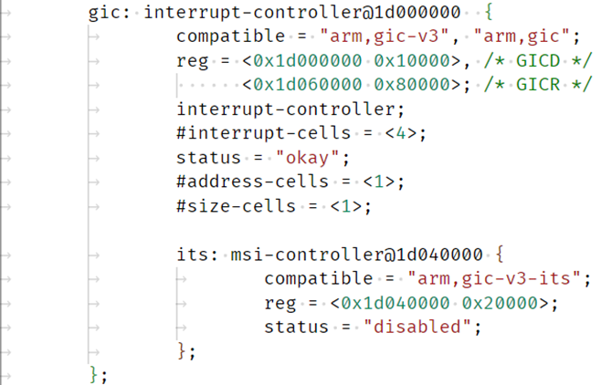

# **Interrupt controller (GICv3) Driver for Hard Processor System**

Last updated: **May 21, 2024** 

**Upstream Status**: [Upstreamed](https://github.com/zephyrproject-rtos/zephyr/blob/main/drivers/interrupt_controller/intc_gicv3.c)

**Devices supported**: Agilex 5

Note: The ARM GIC controller IP is different in Agilex5 vs Agilex7.
In Agilex5, GIC version3 IP is used and in Agilex7 GIC version2 is used.
Both the drivers are available in the upstream repository by the community. Here in this document, Agilex5 GICV3 will be described with all the details and most of the description will also apply for Agilex7 GICV2.

## **Introduction**

The GIC-600 is a generic interrupt controller that handles interrupts from peripherals to the cores and between cores. It manages all the interrupts coming in from the SOC and routes them to the proper core. It also handles all the core-to-core interrupts. The GIC-600 supports the GICv3 architecture.

The figure below gives an overview of the GIC-600 in a multiprocessor system.

**The GIC-600 in CPU Subsystem consists of the following blocks:**

* Distributor: The Distributor is the hub of all the GIC communications and contains the functionality for all Shared Peripheral Interrupts (SPIs).
* Redistributor: The Redistributor maintains the Private Peripheral Interrupts (PPIs) and Software Generated Interrupts (SGIs) for a particular core set (4 cores in case of Agilex5 HPS).
* Interrupt Translation Service: The ITS translates message-based interrupts, MSI/MSIx from PCIe or other sources.
* SPI Collator: The GIC-600 supports 512 SPIs that are spread across subsystems. The SPI Collator enables SPIs to be converted into messages remotely from the Distributor.
* Wake Request: The Wake Request contains all the architecturally defined wake request signals for each core of the ARM big.LITTLE cluster.

For more information please refer to the [Intel Agilex 5 Hard Processor System Technical Reference Manual](https://www.intel.com/content/www/us/en/docs/programmable/814346).

## **Driver Sources**

The source code for this driver can be found at:

[https://github.com/zephyrproject-rtos/zephyr/blob/main/drivers/interrupt_controller/intc_gicv3.c](https://github.com/zephyrproject-rtos/zephyr/blob/main/drivers/interrupt_controller/intc_gicv3.c)

## **Driver Capabilities**

* Manages all the interrupts coming in from the peripherals, fabric, power manager and MPFE ports and routes them to the proper core. It also handles all the core-to-core interrupts.

## **Kernel Configurations**

No KCONFIG variable is required to enable the GIC V3 driver in the system.

On the recent Zephyr release (version 3.5 onwards), selecting `CONFIG_GIC_V3` directly in Kconfig has been deprecated. Instead, the GIC version should now be specified by adding the appropriate DT compatible string, for example :dtcompatible:`arm,gic-v3`, to the GIC node in the device tree.

## **Device Tree**

Example Device tree location to configure the gic:

[https://github.com/zephyrproject-rtos/zephyr/blob/main/dts/arm64/intel/intel_socfpga_agilex5.dtsi](https://github.com/zephyrproject-rtos/zephyr/blob/main/dts/arm64/intel/intel_socfpga_agilex5.dtsi)

The usage of GIC node in other peripherals node is shown in below, where UART peripheral uses SPI interrupt number 108, interrupt type, interrupt priority etc.

## **Known Issues**

None Known