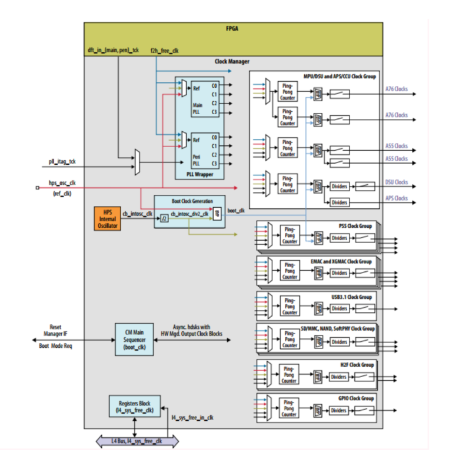
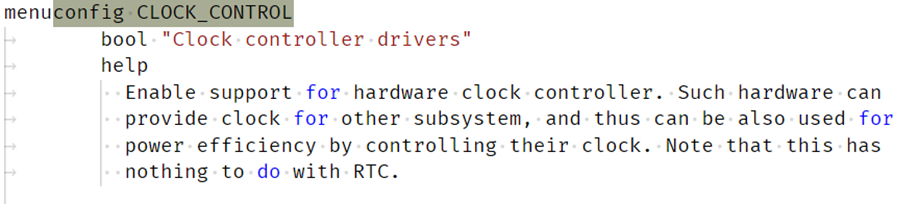
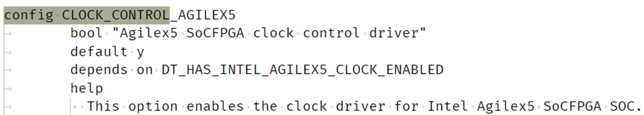
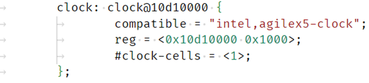
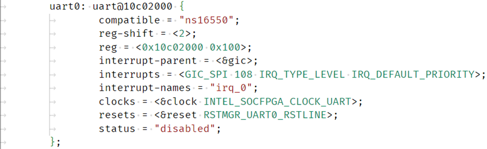

# **Clock Manager Driver for Hard Processor System**

Last updated: **January 28, 2025** 

**Upstream Status**: [Upstreamed](https://github.com/zephyrproject-rtos/zephyr/blob/main/drivers/clock_control/clock_control_agilex5.c)

**Devices supported**: Agilex 5

## **Introduction**

The hard processor system (HPS) clock generation is centralized in the clock manager. The clock manager is responsible for providing software-programmable clock control to configure all clocks generated in the HPS. Clocks are organized in clock groups. A clock group is a set of clock signals that originate from the same clock source which may be synchronous to each other. The clock manager has two phase-locked loop (PLL) clock group where the clock source is a common PLL voltage-controlled oscillator (VCO). A clock group that is independent and asynchronous to other clocks may only have a single clock, also known as a clock slice. Peripheral clocks are a group of independent clock slices.

For more information please refer to the [Intel Agilex 5 Hard Processor System Technical Reference Manual](https://www.intel.com/content/www/us/en/docs/programmable/814346).

## **Driver Sources**

The source code for this driver can be found at [https://github.com/zephyrproject-rtos/zephyr/blob/main/drivers/clock_control/clock_control_agilex5.c](https://github.com/zephyrproject-rtos/zephyr/blob/main/drivers/clock_control/clock_control_agilex5.c).

## **Driver Capabilities**

* Supply clock to each HPS peripheral as configured in the boot loader and provide an API to retrieve the clock for each peripheral.
* Clock Manager will be initialized only one time during boot up by FSBL (ATF BL2) based on external user settings stored in HPS handoff data in bitstream.

## **Kernel Configurations**

CONFIG_CLOCK_CONTROL

CONFIG_CLOCK_CONTROL_AGILEX5

## **Device Tree**

Example Device tree location:

[https://github.com/zephyrproject-rtos/zephyr/blob/main/dts/arm64/intel/intel_socfpga_agilex5.dtsi](https://github.com/zephyrproject-rtos/zephyr/blob/main/dts/arm64/intel/intel_socfpga_agilex5.dtsi)

A clock manager node will be added in device tree.  Then, the peripheral can associate the clock manager in device tree so that the peripheral driver code can retrieve the clock frequency from clock manager. One such example is shown below.

## **Known Issues**

None Known. 
