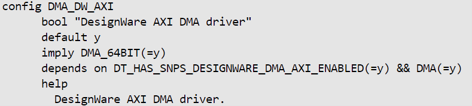

# **DMA Driver for Hard Processor System**


Last updated: **January 08, 2025** 

**Upstream Status**: No

**Devices supported**: Agilex 5

## **Introduction**

DMA Controller controls the transfer of data between I/O devices and memory without CPU involvement. DMA controller can access the memory directly for reading and writing. This helps to enhance the performance of the cores to do some other operations, as the data transfers are handled by the DMA controller.

The hard processor system (HPS) provides two DMA Controllers based on the Synopsis-Designware IP.

For more information please refer to the [Intel Agilex 5 Hard Processor System Technical Reference Manual](https://www.intel.com/content/www/us/en/docs/programmable/814346).

## **Driver Sources**
The source code for this driver can be found at [https://github.com/altera-opensource/zephyr-socfpga/blob/socfpga_rel_23.4/drivers/dma/dma_dw_axi.c](https://github.com/altera-opensource/zephyr-socfpga/blob/socfpga_rel_23.4/drivers/dma/dma_dw_axi.c).

## **Driver Capabilities**

* Driver supports scatter-gather list.
* Driver can be configured for one of the possible three use cases.
    * Memory to Memory Transfer
    * Device to Memory Transfer
    * Memory to Device Transfer
* Each DMA controller can support up to four channels for DMA transfer.
* Driver supports DMA transfer suspend.
* Driver supports DMA transfer resume.
* Driver supports to stop active DMA transfer.

## **Kernel Configurations**




## **Device Tree**

Device Tree location to configure DMA is

[https://github.com/zephyrproject-rtos/zephyr/blob/main/dts/arm64/intel/intel_socfpga_agilex5.dtsi](https://github.com/zephyrproject-rtos/zephyr/blob/main/dts/arm64/intel/intel_socfpga_agilex5.dtsi)

```
dma0: dma@10DB0000 {
compatible = "snps,dw-axi-dma";
#dma-cells = <2>;
reg = <0x10DB0000 0x1000>;
interrupt-parent = <&gic>;
interrupts = <GIC_SPI 81 IRQ_TYPE_LEVEL
		 IRQ_DEFAULT_PRIORITY>,
	     <GIC_SPI 82 IRQ_TYPE_LEVEL
		 IRQ_DEFAULT_PRIORITY>,
	     <GIC_SPI 83 IRQ_TYPE_LEVEL
		 IRQ_DEFAULT_PRIORITY>,
	     <GIC_SPI 84 IRQ_TYPE_LEVEL
		 IRQ_DEFAULT_PRIORITY>;
dma-channels = <4>;
resets = <&reset RSTMGR_DMA_RSTLINE>;
status = "disabled";
};
```


## **Driver Sample**

The source code for the driver sample can be found at: [https://github.com/altera-opensource/zephyr-socfpga/blob/socfpga_rel_23.4/samples/drivers/dma/mem_to_mem/](https://github.com/altera-opensource/zephyr-socfpga/blob/socfpga_rel_23.4/samples/drivers/dma/mem_to_mem/).

The most relevant files are:

1. Project yml -> sample.yml:

 ```
  1 sample:
  2   name: DMA
  3   description: DMA Driver sample application
  4 common:
  5   tags:
  6     - drivers
  7     - dma
  8 tests:
  9   sample.drivers.dma.mem_to_mem:
 10     build_only: true
 11     harness: console
 12     integration_platforms:
 13       - intel_socfpga_agilex5_socdk
 14     harness_config:
 15       type: multi_line
 16       ordered: true
 17       regex:
 18         - "Sample application for Memory to Memory transfer using dma controller"
 19         - "Successfully transferred"
 20         - "Sample application for dma transfer complete"
 21     filter: DT_HAS_SNPS_DESIGNWARE_DMA_ENABLED
 22     depends_on: dma
 ```

2. Config overlay -> prj.conf:
```
  1 CONFIG_DMA=y
  2 CONFIG_LOG=y
```

3. Device tree overlay -> intel_socfpga_agilex5_socdk.overlay:

```
  1 /*
  2  * Copyright (c) 2023 Intel Corporation
  3  *
  4  * SPDX-License-Identifier: Apache-2.0
  5  */
  6 
  7 &dma0 {
  8         status = "okay";
  9 };
      
```           
4. Source code: [https://github.com/altera-opensource/zephyr-socfpga/blob/socfpga_rel_23.4/samples/drivers/dma/mem_to_mem/src/main.c](https://github.com/altera-opensource/zephyr-socfpga/blob/socfpga_rel_23.4/samples/drivers/dma/mem_to_mem/src/main.c).

## **Steps to build**

1. Execute the following commands:
```
rm -rf agilex5
west build -b intel_socfpga_agilex5_socdk samples/drivers/dma/mem_to_mem/  -d agilex5
```
## **Output**
```
NOTICE:  return = 0 Hz
NOTICE:  mmc_clk = 200000000 Hz
NOTICE:  SDMMC boot
NOTICE:  BL2: v2.9.1(release):QPDS23.4_REL_GSRD_PR
NOTICE:  BL2: Built : 18:22:43, Jul  2 2024
NOTICE:  BL2: Booting BL31
NOTICE:  BL31: Boot Core = 0
NOTICE:  BL31: CPU ID = 81000000
NOTICE:  BL31: v2.9.1(release):QPDS23.4_REL_GSRD_PR
NOTICE:  BL31: Built : 18:22:43, Jul  2 2024
[00:00:00.125,000] <inf> clock_control_agilex5: Intel Agilex5 clock driver initialized!
*** Booting Zephyr OS build 33d4a115fbed ***
Secondary CPU core 1 (MPID:0x100) is up
Secondary CPU core 2 (MPID:0x200) is up
Secondary CPU core 3 (MPID:0x300) is up
Sample application for Memory to Memory transfer using dma controller
dma@10DB0000: Successfully transferred 10 blocks of size:200 channel:1
Sample application for dma transfer complete

```


## **Known Issues**

None Known. 


