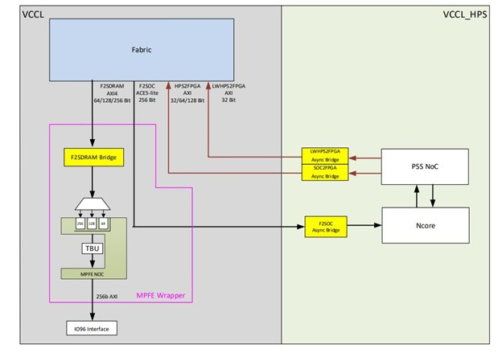
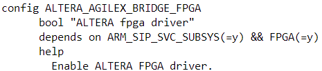
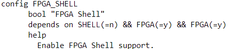
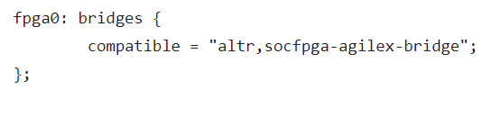

**HPS – FPGA Bridges for Hard Processor System**

Last updated: **May 21, 2024** 

**Upstream Status**: In Progress

**Devices supported**: Agilex 5

## **Introduction**

HPS Bridges provide AXI-4 or ACE interfaces between the HPS subsystem and soft-logic implemented in the FPGA. 
The HPS contains the following bridges:

- FPGA2SDRAM
- FPGA2HPS  
- HPS2FPGA
- LWHPS2FPGA

**SOC2FPGA** Bridge extends the HPS peripherals to the FPGA. Additional **Ips** implemented on the FPGA can be used as part of the HPS subsystem. The SOC2FPGA Bridge can also be connected to another 4 GB of FPGA SDRAM, extending the amount of physical memory available to HPS.

**LWSOC2FPGA** Bridge extends the HPS peripherals to the FPGA. It is like **SOC2FPGA** in this way. Crucially though, the **LWSOC2FPGA** is meant for a narrower use case involving simple peripherals on the FPGA. The **LWSOC2FPGA** Bridge is meant for strongly ordered single transactions. This allows customers to use **LWSOC2FPGA** as the “configuration” bus for FPGA Ips. The FPGA IP can then make use of **SOC2FPGA** or **FPGA2SOC/FPGA2SDRAM** as the main “data mover” bus. However, this does not mean **LWSOC2FPGA** does not advance transactions such as bursts.

The **F2S** bridge consists of a single physical ACELITE interface, it has a configurable width of 128,256,512.  The FPGA master can direct the transactions to either the CCU or the SDRAM by using the transaction attribute passed along with the AXI transaction as a user bit.

For more information, please refer to the [Agilex 5 Hard Processor System Technical Reference Manual](https://www.intel.com/content/www/us/en/docs/programmable/814346).

## **Driver Sources**

The source code for this driver can be found at [https://github.com/zephyrproject-rtos/zephyr/blob/main/drivers/fpga/fpga_altera_agilex_bridge.c](https://github.com/zephyrproject-rtos/zephyr/blob/main/drivers/fpga/fpga_altera_agilex_bridge.c).

## **Driver Capabilities**

- Enable & Disable communication between HPS – FPGA.

## **Kernel Configurations**

CONFIG_ALTERA_AGILEX_BRIDGE_FPGA

CONFIG_FPGA_SHELL

## **Device Tree**

Device tree location to configure the SDHC is at [https://github.com/zephyrproject-rtos/zephyr/blob/main/dts/arm64/intel/intel_socfpga_agilex5.dtsi](https://github.com/zephyrproject-rtos/zephyr/blob/main/dts/arm64/intel/intel_socfpga_agilex5.dtsi).

## **Known Issues**

None Known
