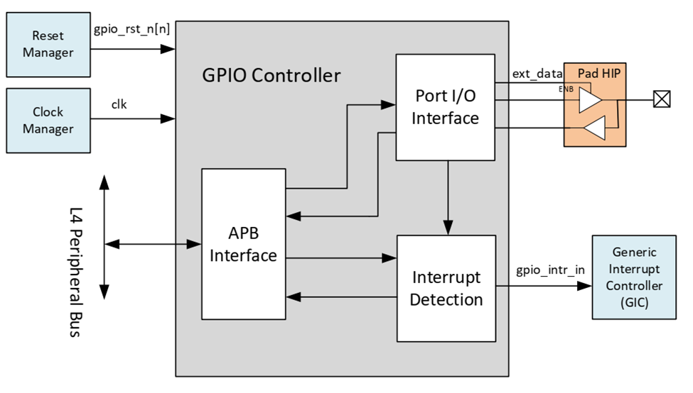
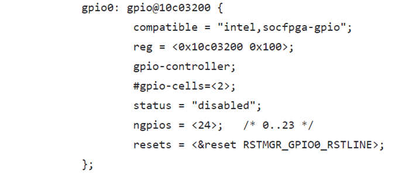

# **General Purpose I/O Driver for Hard Processor System**

Last updated: **November 22, 2024** 

**Upstream Status**: Not Upstreamed

**Devices supported**: Agilex 5

## **Introduction**

General Purpose Input/Output (GPIO) Controller provides the low-level configuration through software or hardware to control the actual general purpose IO cells/pads present in the HPS. 
The below diagram represents block diagram of the GPIO controller connected with other components in the system.



Two GPIO module instances present in HPS and each having support of 24 GPIO ports. Only Port A of GPIO Controller is configured.
All the design contained of this document is referred from “Synopsys GPIO Databook”.

**Functional Modes:**

* Software Control Mode: In the software control mode, the port direction is set by writing to the corresponding port control register of a GPIO pin. These port control registers are memory mapped.
* Hardware Control Mode : If a signal is configured for hardware control, an external auxiliary hardware-signal controls the direction of the port. For the SM, Auxiliary H/W support is not enabled.

For More information please refer to the following link:
[Agilex 5 Hard Processor System Technical Reference Manual](https://www.intel.com/content/www/us/en/docs/programmable/814346)

## **Features**

* Digital debounce
* Configurable interrupt mode
* Up to 48 dedicated I/O pins

## **Driver Sources**

The source code for this driver can be found at [https://github.com/altera-opensource/zephyr-socfpga/blob/socfpga_rel_23.4/drivers/gpio/gpio_intel_socfpga.c](https://github.com/altera-opensource/zephyr-socfpga/blob/socfpga_rel_23.4/drivers/gpio/gpio_intel_socfpga.c).

## **Driver Capabilities**

* GPIO Pin configure as input or output.
* GPIO Port/Pin set value using mask.
* GPIO Port/Pin get value using mask.
* GPIO Port/Pin toggle using mask.


## **Kernel Configurations**

No additional Kernel configurations needed to enable GPIO driver functionality.

## **Device Tree**

Example Device tree location:

[https://github.com/altera-opensource/zephyr-socfpga/blob/socfpga_rel_23.4/dts/arm64/intel/intel_socfpga_agilex5.dtsi](https://github.com/altera-opensource/zephyr-socfpga/blob/socfpga_rel_23.4/dts/arm64/intel/intel_socfpga_agilex5.dtsi)


## **Driver Sample**

The source code for the driver sample can be found at: [https://github.com/altera-opensource/zephyr-socfpga/blob/socfpga_rel_23.4/samples/basic/blinky](https://github.com/altera-opensource/zephyr-socfpga/blob/socfpga_rel_23.4/samples/basic/blinky).

The most relevant files are:
1. Project yml -> sample.yml:

 ```
  1 sample:
  2   name: Blinky Sample
  3 tests:
  4   sample.basic.blinky:
  5     tags:
  6       - LED
  7       - gpio
  8     filter: dt_enabled_alias_with_parent_compat("led0", "gpio-leds")
  9     depends_on: gpio
 10     harness: led
 11     integration_platforms:
 12       - frdm_k64f

 ```

2. Config overlay -> prj.conf:

```
CONFIG_GPIO=y
```

3. Device tree overlay -> intel_socfpga_agilex5_socdk.overlay:

```
  1 /*
  2  * Copyright (C) 2023 Intel Corporation
  3  *
  4  * SPDX-License-Identifier: Apache-2.0
  5  */
  6 
  7 #include <dt-bindings/gpio/gpio.h>
  8 
  9 / {
 10         aliases {
 11                 led0 = &myled0;
 12         };
 13 
 14         leds {
 15                 compatible = "gpio-leds";
 16                 myled0: led_0 {
 17                         gpios = <&gpio1 19 GPIO_ACTIVE_HIGH>;
 18                 };
 19         };
 20 };
 21 
 22 &gpio1 {
 23         status = "okay";
 24 };

```
4. Agilex™ 5 specific board configuration ->  intel_socfpga_agilex5_socdk.conf 
```
  1 # Copyright (c) 2023, Intel Corporation.
  2 # SPDX-License-Identifier: Apache-2.0
  3 
  4 CONFIG_STDOUT_CONSOLE=y
  5 CONFIG_PRINTK=y
                   
```
5. Source code: [https://github.com/altera-opensource/zephyr-socfpga/blob/socfpga_rel_23.4/samples/basic/blinky](https://github.com/altera-opensource/zephyr-socfpga/blob/socfpga_rel_23.4/samples/basic/blinky/src/main.c).

## **Steps to build**


1. Execute the following commands:
```
rm -rf agilex5
west build -b intel_socfpga_agilex5_socdk samples/basic/blinky  -d agilex5

```
## **Output**

```
NOTICE:  return = 0 Hz
NOTICE:  mmc_clk = 200000000 Hz
NOTICE:  SDMMC boot
NOTICE:  BL2: v2.9.1(release):QPDS23.4_REL_GSRD_PR
NOTICE:  BL2: Built : 18:22:43, Jul  2 2024
NOTICE:  BL2: Booting BL31
NOTICE:  BL31: Boot Core = 0
NOTICE:  BL31: CPU ID = 81000000
NOTICE:  BL31: v2.9.1(release):QPDS23.4_REL_GSRD_PR
NOTICE:  BL31: Built : 18:22:43, Jul  2 2024
*** Booting Zephyr OS build 33d4a115fbed ***
Secondary CPU core 1 (MPID:0x100) is up
Secondary CPU core 2 (MPID:0x200) is up
Secondary CPU core 3 (MPID:0x300) is up
GPIO blinky application started
GPIO toggle started for 10 times
GPIO blinky Application completed!!!

```


## **Known Issues**

None known

## **Other Consideration**

Pinmux configuration should be in GPIO mode to use respective IO functionality.

