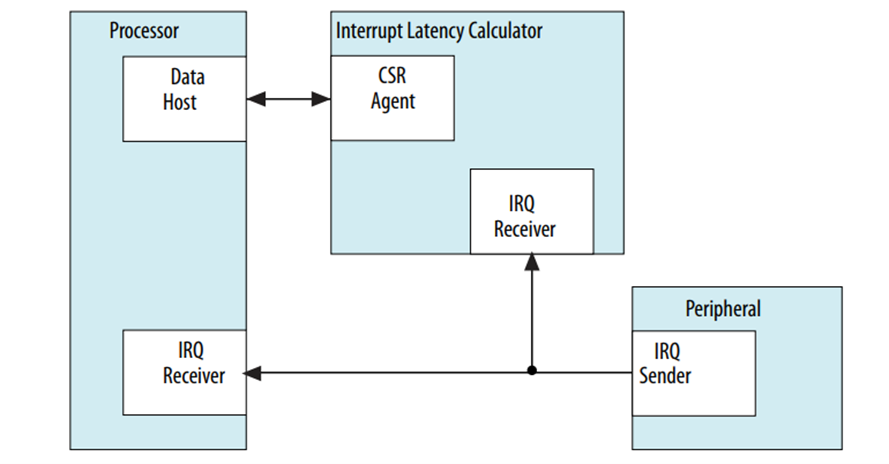

**Interrupt Latency Calculator (ILC) Driver for Hard Processor System**

Last updated: **May 21, 2024** 

**Upstream Status**: In Progress

**Devices supported**: Agilex 5

## **Introduction**

Intel FPGA's Interrupt Latency Calculator (ILC) is developed to measure the time taken in clock cycles to complete the interrupt service routine. Data obtained from the ILC is used by other latency sensitive IPs to maintain proper operation. The data from the ILC can also be used to help the general firmware debugging exercise.
The ILC sits as a parallel to any interrupt receiver that will consume and perform an interrupt service routine. The following figure shows the orientation of an ILC in a system design.

For more information, please refer to the [Agilex 5 Hard Processor System Technical Reference Manual](https://www.intel.com/content/www/us/en/docs/programmable/814346).

## **Driver Sources**

The source code for this driver can be found at [https://github.com/zephyrproject-rtos/zephyr/pull/68518](https://github.com/zephyrproject-rtos/zephyr/pull/68518).

## **Driver Capabilities**

- Measure Interrupt Latency 
- Shell it will display time taken by all counters

## **Kernel Configurations**

CONFIG_ILC=y

CONFIG_ILC_SHELL=y

CONFIG_ILC_INTEL_SOC_FPGA=y

## **Device Tree**

None

## **Known Issues**

None Known
