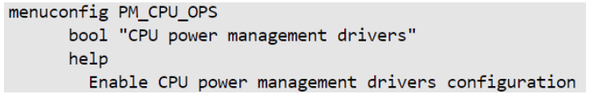
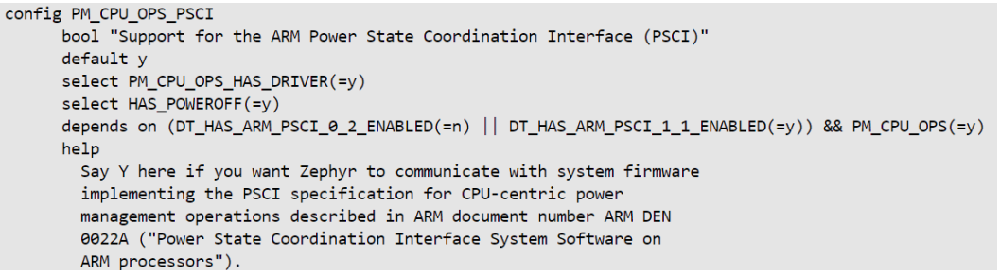

# **Power State Coordination Interface (PSCI) driver for Hard Processor System**

Last updated: **April 22, 2025** 

**Upstream Status**: [Upstreamed](https://github.com/zephyrproject-rtos/zephyr/blob/main/drivers/pm_cpu_ops/pm_cpu_ops_psci.c)

**Devices supported**: Agilex 5

## **Introduction**

Power State Coordination Interface (PSCI) is an Arm&reg; standard that describes a software interface for power management between and operating system and supervisory firmware. Refer to [Arm PSCI Platform Design Document](https://developer.arm.com/documentation/den0022/latest) for the PSCI interface specification.

The following diagram shows the interaction between Zephyr/OS and Secure Monitor firmware ATF BL31 for PSCI interface.

For More information please refer to the [Intel Agilex 5 Hard Processor System Technical Reference Manual](https://www.intel.com/content/www/us/en/docs/programmable/814346).

## **Driver Sources**

The source code for this driver can be found at:

[https://github.com/zephyrproject-rtos/zephyr/blob/main/drivers/pm_cpu_ops/pm_cpu_ops_psci.c](https://github.com/zephyrproject-rtos/zephyr/blob/main/drivers/pm_cpu_ops/pm_cpu_ops_psci.c)

## **Driver Capabilities**

* This driver provides the cold and warm reset functionality.
* This driver/module also provides a shell interface via which user can issue cold/warm reset commands.

## **Kernel Configurations**

CONFIG_PM_CPU_OPS

CONFIG_PM_CPU_OPS_PSCI

## **Device Tree**

Example Device tree location to configure the PSCI:

[https://github.com/zephyrproject-rtos/zephyr/blob/main/dts/arm64/intel/intel_socfpga_agilex5.dtsi](https://github.com/zephyrproject-rtos/zephyr/blob/main/dts/arm64/intel/intel_socfpga_agilex5.dtsi)

## **Known Issues**

None known
