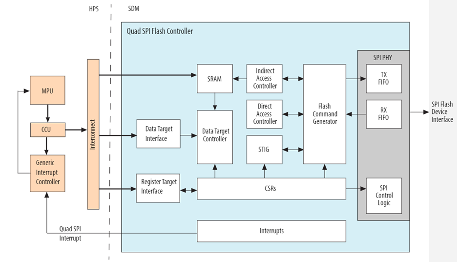
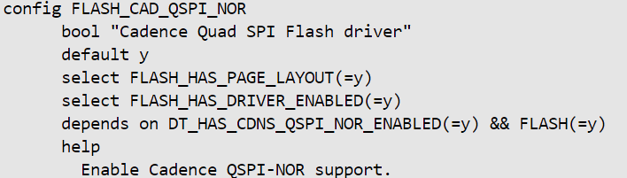
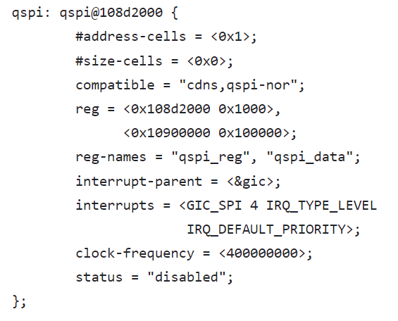

# **QSPI Driver for Hard Processor System**

**Upstream Status**: [Upstreamed](https://github.com/altera-opensource/zephyr-socfpga/blob/socfpga_rel_23.4/drivers/flash/flash_cadence_qspi_nor.c)

**Devices supported**: Agilex 5

## **Introduction**

The HPS has the capability to access serial NOR Flash connected to the SDM quad serial peripheral interface (SPI). The quad SPI flash controller supports standard SPI Flash devices as well as high-performance dual and quad SPI Flash devices.

On power up, the SDM owns the QSPI controller. For the HPS to use the QSPI controller, the HPS must request ownership from the SDM.

For more information, please refer to the following link:
[Agilex 5 Hard Processor System Technical Reference Manual](https://www.intel.com/content/www/us/en/docs/programmable/814346)

## **Driver Sources**

The source code for this driver can be found at [https://github.com/altera-opensource/zephyr-socfpga/blob/socfpga_rel_23.4/drivers/flash/flash_cadence_qspi_nor.c](https://github.com/altera-opensource/zephyr-socfpga/blob/socfpga_rel_23.4/drivers/flash/flash_cadence_qspi_nor.c).

## **Driver Capabilities**

* Supported Operations: Read, Write, Erase

## **Kernel Configurations**
CONFIG_FLASH_CAD_QSPI_NOR

## **Device Tree**

Device tree location to configure the QSPI: [https://github.com/altera-opensource/zephyr-socfpga/blob/socfpga_rel_23.4/dts/arm64/intel/intel_socfpga_agilex5.dtsi](https://github.com/altera-opensource/zephyr-socfpga/blob/socfpga_rel_23.4/dts/arm64/intel/intel_socfpga_agilex5.dtsi)

## **Known Issues**

None known
