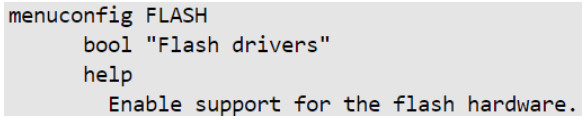
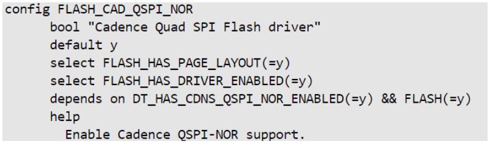
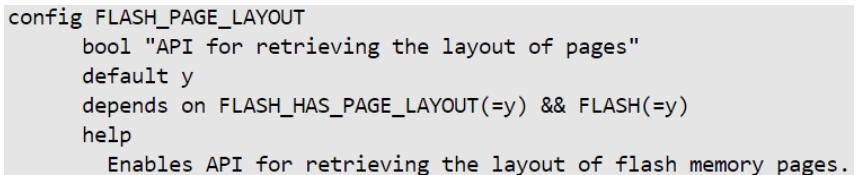

# **QSPI Driver for Hard Processor System**

**Upstream Status**: [Upstreamed](https://github.com/altera-opensource/zephyr-socfpga/blob/socfpga_rel_23.4/drivers/flash/flash_cadence_qspi_nor.c)

**Devices supported**: Agilex 5

## **Introduction**

The HPS has the capability to access serial NOR Flash connected to the SDM quad serial peripheral interface (SPI). The quad SPI flash controller supports standard SPI Flash devices as well as high-performance dual and quad SPI Flash devices.

On power up, the SDM owns the QSPI controller. For the HPS to use the QSPI controller, the HPS must request ownership from the SDM.


For more information, please refer to the following link:
[Agilex 5 Hard Processor System Technical Reference Manual](https://www.intel.com/content/www/us/en/docs/programmable/814346)


## **Driver Sources**

The source code for this driver can be found at:

QSPI driver (Polling-based mechanism - Upstreamed):
[https://github.com/zephyrprojectrtos/zephyr/blob/main/drivers/flash/flash_cadence_qspi_nor.c](https://github.com/zephyrprojectrtos/zephyr/blob/main/drivers/flash/flash_cadence_qspi_nor.c)

QSPI driver (with Interrupt-based mechanism – Not yet Upstreamed):
[https://github.com/altera-opensource/zephyrsocfpga/blob/socfpga_rel_23.4/drivers/flash/flash_cadence_qspi_nor.c](https://github.com/zephyrprojectrtos/zephyr/blob/main/drivers/flash/flash_cadence_qspi_nor.c)

## **Driver Capabilities**

* Supported Operations: Read, Write, Erase

## **Kernel Configurations**

CONFIG_FLASH



CONFIG_FLASH_CAD_QSPI_NOR



CONFIG_FLASH_PAGE_LAYOUT



## **Device Tree**

Device tree location to configure the QSPI: [https://github.com/altera-opensource/zephyr-socfpga/blob/socfpga_rel_23.4/dts/arm64/intel/intel_socfpga_agilex5.dtsi](https://github.com/altera-opensource/zephyr-socfpga/blob/socfpga_rel_23.4/dts/arm64/intel/intel_socfpga_agilex5.dtsi)


## **Driver Sample**


The source code for the driver sample can be found at: [https://github.com/altera-opensource/zephyr-socfpga/blob/socfpga_rel_23.4/samples/drivers/soc_flash_qspi](https://github.com/altera-opensource/zephyr-socfpga/blob/socfpga_rel_23.4/samples/drivers/soc_flash_qspi).

The most relevant files are:
1. Project yml -> sample.yml:

 ```
  1  sample:
  2   description: Cadence QSPI Driver sample application.
  3   name: cdns_qspi_nor
  4 tests:
  5   sample.drivers.flash.soc_flash_qspi:
  6     platform_allow:
  7       - intel_socfpga_agilex5_socdk
  8     integration_platforms:
  9       - intel_socfpga_agilex5_socdk
 10     tags:
 11       - flash
 12       - cdns
 13     harness: console
 14     harness_config:
 15       fixture: external_flash
 16       type: multi_line
 17       ordered: true

   ```

2. Config overlay -> prj.conf:

```
  1 # Copyright (c) 2023, Intel Corporation.
  2 # SPDX-License-Identifier: Apache-2.0
  3 
  4 # Misc
  5 CONFIG_HEAP_MEM_POOL_SIZE=363840
  6 
  7 # Enable Flash
  8 CONFIG_FLASH=y
  9 CONFIG_FLASH_PAGE_LAYOUT=y
 10 CONFIG_LOG=y

```
4. Device tree overlay -> intel_socfpga_agilex5_socdk.overlay  
```
  1 /*
  2  * Copyright (C) 2023 Intel Corporation
  3  * SPDX-License-Identifier: Apache-2.0
  4  */
  5
  6 /* The overlay file should be used to enable any
  7  * dts nodes required by this application for this
  8  * board.
  9  */
 10
 11 / {
 12         aliases {
 13                 qspi = &qspi;
 14         };
 15 };
 16
 17 &qspi {
 18         status = "okay";
 19 };
```
5. Source code: [https://github.com/altera-opensource/zephyr-socfpga/blob/socfpga_rel_23.4/samples/drivers/soc_flash_qspi/src/main.c](https://github.com/altera-opensource/zephyr-socfpga/blob/socfpga_rel_23.4/samples/drivers/soc_flash_qspi/src/main.c).
## **Steps to build**


1. Execute the following commands:
```
rm -rf agilex5
west build -b intel_socfpga_agilex5_socdk samples/drivers/soc_flash_qspi/  -d agilex5

```
## **Output**

```
NOTICE:  return = 0 Hz
NOTICE:  mmc_clk = 200000000 Hz
NOTICE:  SDMMC boot
NOTICE:  BL2: v2.9.1(release):QPDS23.4_REL_GSRD_PR
NOTICE:  BL2: Built : 18:22:43, Jul  2 2024
NOTICE:  BL2: Booting BL31
NOTICE:  BL31: Boot Core = 0
NOTICE:  BL31: CPU ID = 81000000
NOTICE:  BL31: v2.9.1(release):QPDS23.4_REL_GSRD_PR
NOTICE:  BL31: Built : 18:22:43, Jul  2 2024
[00:00:00.219,000] <inf> clock_control_agilex5: Intel Agilex5 clock driver initialized!
[00:00:00.000,000] <inf> flash_cadence_ll: Initializing Qspi
[00:00:00.000,000] <inf> flash_cadence_ll: QSPI Capacity: 10000000
[00:00:00.000,000] <inf> flash_cadence_ll: Flash size: 268435456 Bytes
*** Booting Zephyr OS build 33d4a115fbed ***
Secondary CPU core 1 (MPID:0x100) is up
Secondary CPU core 2 (MPID:0x200) is up
Secondary CPU core 3 (MPID:0x300) is up
QSPI flash driver test sample
QSPI flash device block size = 100
QSPI flash number of pages = 100000
QSPI flash driver block size 100
The Page size of 100
QSPI flash driver data erase successful....
QSPI flash driver write completed....
QSPI flash driver read completed....
QSPI flash driver read verified
QSPI flash driver data erase successful....
QSPI flash driver read verified after erase....
QSPI flash driver test sample completed....
```
## **Known Issues**

None known
