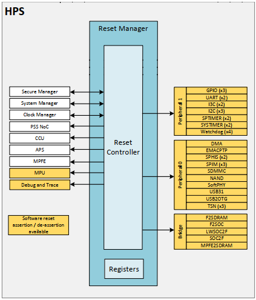
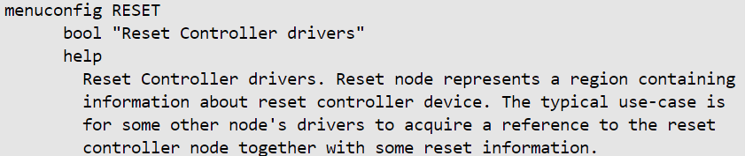
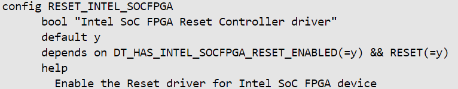
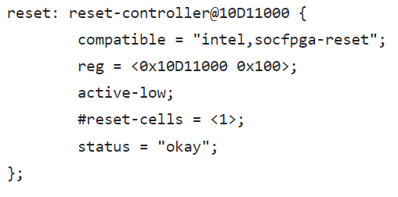

# **Reset Manager for Hard Processor System**

**Upstream Status**: [Upstreamed](https://github.com/zephyrproject-rtos/zephyr/commits/main/drivers/reset/reset_intel_socfpga.c)

**Devices supported**: Agilex 5

## **Introduction**

The Reset Manager generates individual module reset signals. Each module takes its module reset signal from the Reset Manager and conditions it to match the reset requirements of that module. The reset controller is designed to work with the SDM, which acts as the software-controlled master reset for the HPS. 

The following diagram shows the Reset Manager connectivity with Agilex5 HPS.

For more information, please refer to the following link:
[Agilex 5 Hard Processor System Technical Reference Manual](https://www.intel.com/content/www/us/en/docs/programmable/814346/24-1/hard-processor-system-technical-reference.html)

## **Driver Sources**

The source code for this driver can be found at [https://github.com/zephyrproject-rtos/zephyr/commits/main/drivers/reset/reset_intel_socfpga.c](https://github.com/zephyrproject-rtos/zephyr/commits/main/drivers/reset/reset_intel_socfpga.c).

## **Driver Capabilities**

* Reset manager provides the capability to reset (bring it out of reset state) each peripheral in the system separately.
* It provides API to assert, de-assert, and toggle the reset line of each peripheral.

## **Kernel Configurations**
CONFIG_RESET

CONFIG_RESET_INTEL_SOCFPGA

## **Device Tree**

Device tree location to configure the Reset manager IP:[https://github.com/zephyrproject-rtos/zephyr/blob/main/dts/arm64/intel/intel_socfpga_agilex5.dtsi](https://github.com/zephyrproject-rtos/zephyr/blob/main/dts/arm64/intel/intel_socfpga_agilex5.dtsi)

## **Known Issues**

None known
