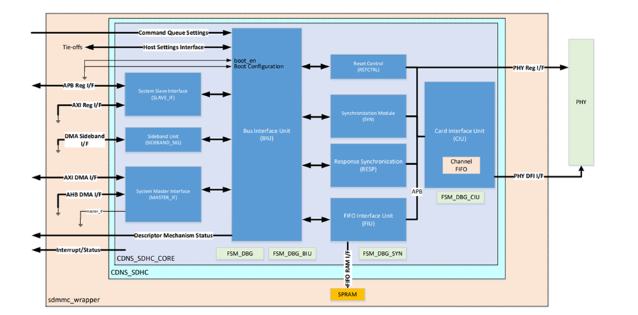
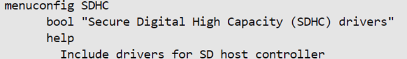
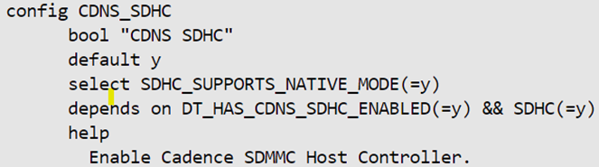
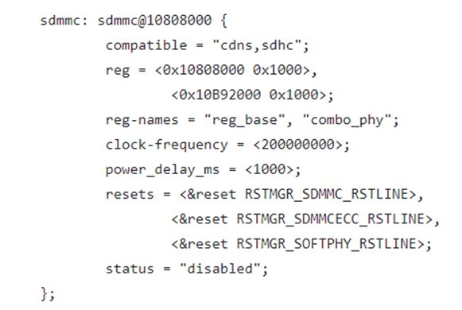

# **SD/eMMC Driver for Hard Processor System**

Last updated: **May 21, 2024** 

**Upstream Status**: [Upstreamed](https://git.kernel.org/pub/scm/linux/kernel/git/torvalds/linux.git/tree/drivers/mmc/host/sdhci-cadence.c)

**Devices supported**: Agilex 5

## **Introduction**

The hard processor system (HPS) provides a Secure Digital/Multimedia Card (SD/MMC) controller for interfacing external SD and MMC flash cards, secure digital I/O (SDIO) devices. The SD/MMC flash controller enables you to use the flash card to expand the on-board storage capacity for larger applications or user data. Other applications include interfacing to embedded MMC (eMMC) non-removable flash devices.

For More information please refer to the [Intel Agilex 5 Hard Processor System Technical Reference Manual](https://www.intel.com/content/www/us/en/docs/programmable/814346).

## **Driver Sources**

The source code for this driver can be found at:

[https://github.com/zephyrproject-rtos/zephyr/blob/main/drivers/sdhc/sdhc_cdns.c](https://github.com/zephyrproject-rtos/zephyr/blob/main/drivers/sdhc/sdhc_cdns.c)

## **Driver Capabilities**

* Support for ADMA
* Supports for read, write and Erase

## **Kernel Configurations**

CONFIG_SDHC

CONFIG_CDNS_SDHC

## **Device Tree**

Example Device tree location to configure the SD/eMMC:

[https://github.com/zephyrproject-rtos/zephyr/blob/main/dts/arm64/intel/intel_socfpga_agilex5.dtsi](https://github.com/zephyrproject-rtos/zephyr/blob/main/dts/arm64/intel/intel_socfpga_agilex5.dtsi)

## **Known Issues**

None known
