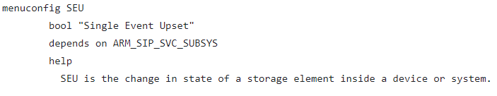
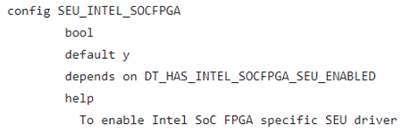
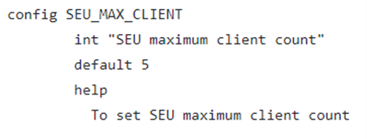
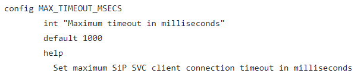
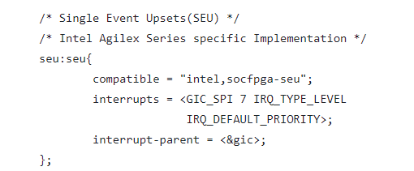

**Single Error Upset (SEU) Driver for Hard Processor System**

Last updated: **November 01, 2024** 

**Upstream Status**: [In Progress](https://github.com/zephyrproject-rtos/zephyr/pull/67097)

**Devices supported**: Agilex 5

## **Introduction**

The SEU driver is meticulously crafted to fulfill a dual purpose within its operational framework. Its primary function lies in promptly detecting and reporting single event upsets errors to users. Additionally, this subsystem offers a streamlined mechanism for the deliberate insertion of errors.

For more information, please refer to the [Agilex5 SEU Mitigation](https://www.intel.com/content/www/us/en/docs/programmable/813649/24-1/seu-mitigation-overview-fm-sm.html).

## **Driver Sources**

The source code for this driver can be found at [https://github.com/zephyrproject-rtos/zephyr/pull/67097](https://github.com/zephyrproject-rtos/zephyr/pull/67097).

## **Driver Capabilities**

- Supports user register/unregister callback
- Support inject ECC error
- Support injects single/multibit errors

## **Kernel Configurations**

CONFIG_SEU

CONFIG_SEU_INTEL_SOCFPGA

CONFIG_SEU_MAX_CLIENT

CONFIG_ MAX_TIMEOUT_MSECS

## **Device Tree**

Example Device tree location to configure the SEU is at [https://github.com/zephyrproject-rtos/zephyr/blob/main/dts/arm64/intel/intel_socfpga_agilex5.dtsi](https://github.com/zephyrproject-rtos/zephyr/blob/main/dts/arm64/intel/intel_socfpga_agilex5.dtsi).

## **Known Issues**

None Known
