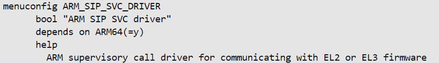

**SiP-SVC Subsystem Driver for Hard Processor System**

Last updated: **May 21, 2024** 

**Upstream Status**: [Upstreamed](https://github.com/zephyrproject-rtos/zephyr/tree/main/subsys/sip_svc)

**Devices supported**: Agilex 5

## **Introduction**

Arm&reg; SiP service subsystem provides the capability to send the smc/hvc call from kernel to hypervisor/secure monitor firmware running at EL2/EL3. In the Agilex 5 use model, only one SMC and one HVC driver per system. The SiP service supports multiple clients. The client must open a channel before sending any request and close the channel immediately after completed. The service only allows one channel at a time. The service will return the smc/hvc return value to the client via the callback function. A set of public APIs will be exposed to the Zephyr kernel interface for developers to leverage the service.

For more information, please refer to the following links:

- [Mailbox Client Intel® FPGA IPs User Guide](https://www.intel.com/content/www/us/en/docs/programmable/683290/24-1/mailbox-client-fpga-ip-user-guide.html)
- [SMC calling convention](https://developer.arm.com/documentation/den0028/latest/)

## **Driver Sources**

The source code for the subsystem is at [https://github.com/zephyrproject-rtos/zephyr/tree/main/subsys/sip_svc](https://github.com/zephyrproject-rtos/zephyr/tree/main/subsys/sip_svc).

The source code for the driver is at [https://github.com/zephyrproject-rtos/zephyr/blob/main/drivers/sip_svc/sip_smc_intel_socfpga.c](https://github.com/zephyrproject-rtos/zephyr/blob/main/drivers/sip_svc/sip_smc_intel_socfpga.c).

## **Subsystem and Driver Capabilities**

- Provides a mechanism to communicate with EL3 secure firmware and Secure device manager.
- 16 clients can be connected to the subsystem.
- Provides synchronous (to EL3 firmware) and asynchronous (to SDM) mode of communication.
- Brings polling of SDM response to zephyr (EL1).
- Implements a state machine for clients to connect with subsystem (register, open, send, close, deregister)
- Optionally allow for multiple clients to perform simultaneous communication with SDM.

## **Kernel Configurations**

CONFIG_ARM_SIP_SVC_DRIVER

CONFIG_ARM_SIP_SVC_SUBSYS

CONFIG_ARM_SIP_SVC_SUBSYS_SINGLY_OPEN

## **Device Tree**

Example Device tree location to configure the SiP SVC is at [https://github.com/zephyrproject-rtos/zephyr/blob/main/dts/arm64/intel/intel_socfpga_agilex5.dtsi](https://github.com/zephyrproject-rtos/zephyr/blob/main/dts/arm64/intel/intel_socfpga_agilex5.dtsi).

## **Known Issues**

None Known
