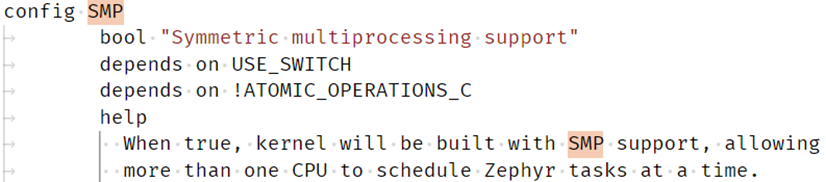
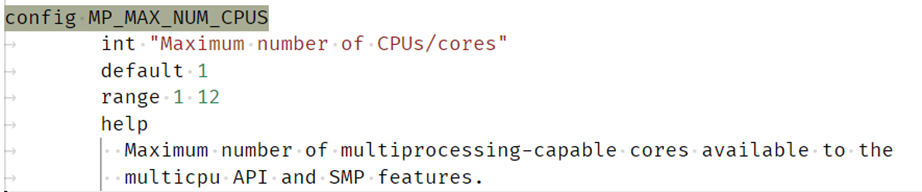
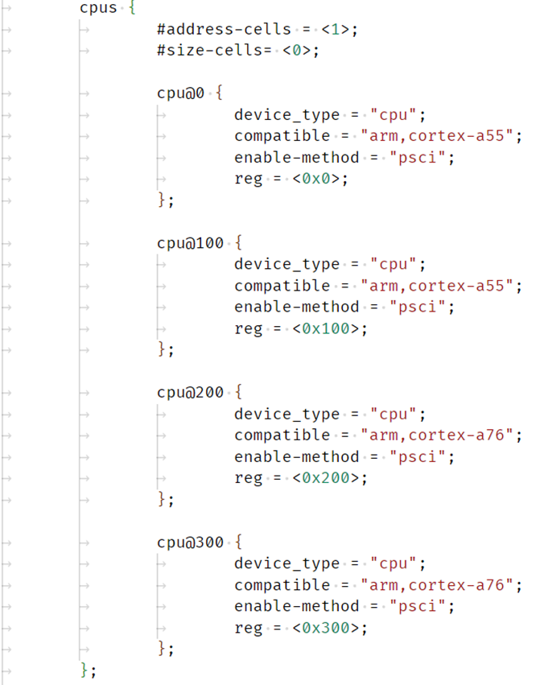

# **SMP (Symmetric Multi-Processing) support for Hard Processor System**

Last updated: **May 21, 2024** 

**Upstream Status**: [Upstreamed](https://github.com/zephyrproject-rtos/zephyr/blob/main/arch/arm64/core/smp.c)

**Devices supported**: Agilex 5

## **Introduction**

SMP (Symmetric Multi-Processing) refers to running operating system on multiple CPU cores. Zephyr kernel supports SMP which can turn on and off the non-boot cores (aka secondary cores).

Zephyr sends “CPU_ON” and “CPU_OFF” functions via PSCI SMC to ATF BL31 to turn on and off individual core. Zephyr supports CPU hot plug which provides public API and command line to turn on and off the individual core including both boot and non-boot cores during runtime. 

The below diagram shows HPS SMP flow (CPU_ON and CPU_OFF) supported by Zephyr:

For More information please refer to the [Intel Agilex 5 Hard Processor System Technical Reference Manual](https://www.intel.com/content/www/us/en/docs/programmable/814346).

## **Driver Sources**

The source code for this driver can be found at:

[https://github.com/zephyrproject-rtos/zephyr/blob/main/arch/arm64/core/smp.c](https://github.com/zephyrproject-rtos/zephyr/blob/main/arch/arm64/core/smp.c)

## **Driver Capabilities**

* Bring up secondary cores; power-on, initialize the secondary cores and make them ready to run as part of multi-core boot system.

## **Kernel Configurations**

CONFIG_SMP

CONFIG_MP_MAX_NUM_CPUS=4

## **Device Tree**

Example Device tree location to configure the smp:

[https://github.com/zephyrproject-rtos/zephyr/blob/main/dts/arm64/intel/intel_socfpga_agilex5.dtsi](https://github.com/zephyrproject-rtos/zephyr/blob/main/dts/arm64/intel/intel_socfpga_agilex5.dtsi)

## **Known Issues**

None known
