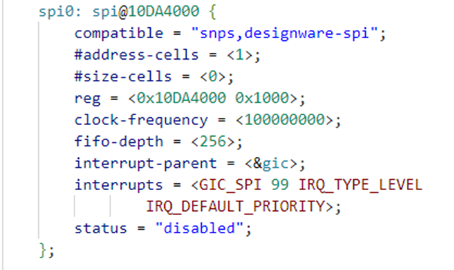

# **SPI Driver for Hard Processor System**

Last updated: **May 21, 2024** 

**Upstream Status**: [Upstreamed](https://github.com/zephyrproject-rtos/zephyr/blob/main/drivers/spi/spi_dw.c)

**Devices supported**: Agilex 5

## **Introduction**

Serial Peripheral Interface (SPI) has widely used application. This wired protocol is to communicate with various classes of slaves. Few generic applications of SPI
as below:

* Sensors: Temperature, pressure, touch screen etc.
* Communications: Ethernet, USB etc.
* Control Devices: Audio codecs, digital potentiometers, DAC
* Memory: Flash and EEPROM
* Real-time clocks
* Any MMC or SSD card

The below diagram represents block diagram of the SPI controller connected with other components in the system.

**Functional Modes:**

* Transmit and Receive: When TMOD = 0, both transmit and receive logic are valid. The data transfer occurs as normal according to the selected frame format (serial protocol).
* Transmit Only: When TMOD = 1, any receive data are ignored. The data transfer occurs as normal, according to the selected frame format (serial protocol).
* Receive Only: When TMOD = 2, the transmit data are invalid. In the case of the SPI slave, the transmit FIFO buffer is never popped in Receive Only mode.

For More information please refer to the following link:
[Agilex 5 Hard Processor System Technical Reference Manual](https://www.intel.com/content/www/us/en/docs/programmable/814346)

## **Features**

* Serial master and serial slave controllers
* Enable serial communication with serial-master or serial-slave devices.
* Each SPI master has a maximum bit rate of 60 Mbps
* Each SPI slave has a maximum bit rate of 33.33 Mbps
* DMA controller interface integrated with HPS DMA controller.
* SPI master supports received serial data bit (RXD) sample delay.
* Transmit and receive FIFO buffers are 256 words deep.
* SPI master supports up to four slave selects.
* Programmable master serial bit rate
* Programmable data frame size of 4 to 16 or 32 bits

## **Driver Sources**

The source code for this driver can be found at [https://github.com/zephyrproject-rtos/zephyr/blob/main/drivers/spi/spi_dw.c](https://github.com/zephyrproject-rtos/zephyr/blob/main/drivers/spi/spi_dw.c).

## **Driver Capabilities**

* Manage the synchronous communication between HPS CPU and device, and vice versa.
* Supports Full Duplex communication and Polling/Interrupt based mechanism for data transfer. 
* Supports 16 bytes FIFO with automatic hardware flow control (RTS and CTS lines). 

## **Kernel Configurations**

CONFIG_SPI_DW_ACCESS_WORD_ONLY

## **Device Tree**

Example Device tree location to configure the SPI:

[https://github.com/zephyrproject-rtos/zephyr/blob/main/dts/arm64/intel/intel_socfpga_agilex5.dtsi](https://github.com/zephyrproject-rtos/zephyr/blob/main/dts/arm64/intel/intel_socfpga_agilex5.dtsi)

Application specific overlay for slave select pin configuration:

## **Known Issues**

None Known

## **Other Consideration**

Pinmux configuration should be in GPIO mode to use respective slave select pins.