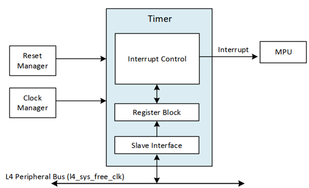
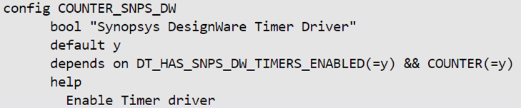
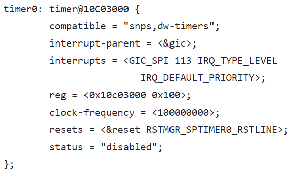

# **General Purpose Timer Driver for Hard Processor System**

**Upstream Status**: [Upstreamed](https://github.com/zephyrproject-rtos/zephyr/blob/main/drivers/counter/counter_dw_timer.c)

**Devices supported**: Agilex 5

## **Introduction**

The hard processor system (HPS) provides four 32-bit general-purpose timers. The timer generates an interrupt when the 32-bit binary count-down timer reaches zero.

Each timer can operate in one-shot mode (alarm mode) or periodic mode.

For more information, please refer to the following link:
[Agilex 5 Hard Processor System Technical Reference Manual](https://www.intel.com/content/www/us/en/docs/programmable/814346/24-1/hard-processor-system-technical-reference.html)



## **Driver Sources**

The source code for this driver can be found at [https://github.com/zephyrproject-rtos/zephyr/blob/main/drivers/counter/counter_dw_timer.c](https://github.com/zephyrproject-rtos/zephyr/blob/main/drivers/counter/counter_dw_timer.c).

## **Driver Capabilities**

* The timer can be configured to run as a one-shot timer(alarm).
* The timer can be configured to run as a periodic timer.
* Run timer in free running mode.
* Stop Timer.


## **Kernel Configurations**
CONFIG_COUNTER_SNPS_DW



## **Device Tree**

Device tree location to configure the timer:[https://github.com/zephyrproject-rtos/zephyr/blob/main/dts/arm64/intel/intel_socfpga_agilex5.dtsi](https://github.com/zephyrproject-rtos/zephyr/blob/main/dts/arm64/intel/intel_socfpga_agilex5.dtsi)


## **Driver Sample**

The source code for the driver sample can be found at: [https://github.com/altera-opensource/zephyr-socfpga/blob/socfpga_rel_23.4/samples/drivers/counter/alarm](https://github.com/altera-opensource/zephyr-socfpga/blob/socfpga_rel_23.4/samples/drivers/counter/alarm).

The most relevant files are:
1. Project yml -> sample.yml:

 ```
  1 sample:
  2   name: Counter RTC Driver Sample
  3 tests:
  4   sample.drivers.counter.alarm:
  5     tags:
  6       - drivers
  7       - counter
  8     harness: console
  9     platform_allow:
 10       - nucleo_f746zg
        .....   
 27       - stm32h573i_dk
 28     integration_platforms:
 29       - nucleo_f746zg
 30     harness_config:
 31       type: multi_line
 32       ordered: true
 33       regex:
 34         - "Counter alarm sample"
 35         - "Set alarm in 2 sec"
 36         - "!!! Alarm !!!"
 37         - "Now: [2|3]"
 38     depends_on: counter

 ```

2. Config overlay -> prj.conf:

```
 1 CONFIG_PRINTK=y
 2 CONFIG_COUNTER=y                     
```

3. Device tree overlay -> intel_socfpga_agilex5_socdk.overlay:

```
  1 /*
  2  * Copyright (C) 2023 Intel Corporation
  3  *
  4  * SPDX-License-Identifier: Apache-2.0
  5  */
  6 
  7 &timer0 {
  8         status = "okay";
  9 };
```
4. Source code: [https://github.com/altera-opensource/zephyr-socfpga/blob/socfpga_rel_23.4/samples/drivers/counter/alarm/src/main.c](https://github.com/altera-opensource/zephyr-socfpga/blob/socfpga_rel_23.4/samples/drivers/counter/alarm/src/main.c).

## **Steps to build**


1. Execute the following commands:
```
rm -rf agilex5
west build -b intel_socfpga_agilex5_socdk samples/drivers/counter/alarm  -d agilex5

```
## **Output**

```
NOTICE:  mmc_clk = 200000000 Hz
NOTICE:  SDMMC boot
NOTICE:  BL2: v2.9.1(release):QPDS23.4_REL_GSRD_PR
NOTICE:  BL2: Built : 18:22:43, Jul  2 2024
NOTICE:  BL2: Booting BL31
NOTICE:  BL31: Boot Core = 0
NOTICE:  BL31: CPU ID = 81000000
NOTICE:  BL31: v2.9.1(release):QPDS23.4_REL_GSRD_PR
NOTICE:  BL31: Built : 18:22:43, Jul  2 2024
*** Booting Zephyr OS build 33d4a115fbed ***
Secondary CPU core 1 (MPID:0x100) is up
Secondary CPU core 2 (MPID:0x200) is up
Secondary CPU core 3 (MPID:0x300) is up
Counter alarm sample

Set alarm in 2 sec (200000000 ticks)
!!! Alarm !!!
Now: 1
Set alarm in 4 sec (400000000 ticks)
```
## **Known Issues**

None known
