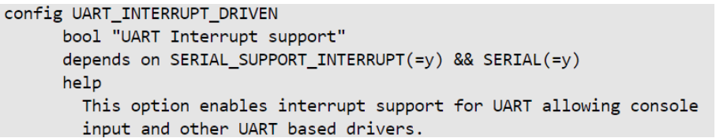
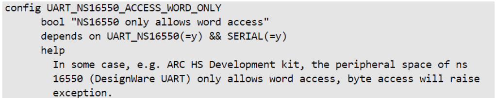

# **UART Driver for Hard Processor System**

Last updated: **May 21, 2024** 

**Upstream Status**: [Upstreamed](https://github.com/zephyrproject-rtos/zephyr/blob/main/drivers/serial/uart_ns16550.c)

**Devices supported**: Agilex 5

## **Introduction**

Universal Asynchronous Receiver/Transmitter (UART) that is part of the hardened Hard Processor System (HPS) of the FPGA performs parallel to serial data conversion from HPS CPU to device or serial-to-parallel data conversion from device to HPS CPU. The UART controllers are based on an industry standard 16550 UART controller.

The below diagram represents block diagram of the UART controller connected with other components in the system.

**Functional blocks**:

* Slave interface: connects to APB bus.
* Register block: responsible for the main UART functionality including control, status, and interrupt generation.
* FIFO block: responsible for FIFO control and storage.
* Baud block generator: produces the transmitter and receiver baud clock along with the output reference clock signal.
* Serial transmitter: converts the parallel data-written to the UART-into serial form and adds all additional bits, as specified by the control register, for transmission. These serial data referred to as a character.
* Serial receiver: converts the serial data character-specified by the control register-receive in the UART to parallel form. This block controls, parity, framing and line break detection errors.

For More information please refer to the following link:

[Agilex 5 Hard Processor System Technical Reference Manual](https://www.intel.com/content/www/us/en/docs/programmable/814346)

## **Features**
* Programmable character properties, such as number of data bits per character, optional parity bits, and number of stop bits.
* Automatic hardware flow control as per the 16750 standards.
* 128-byte transmit and receive FIFO buffers.
* Transmit Holding Register Empty (THRE) interrupt mode.
* DMA controller handshaking interface.
* Parity error detection, Framing error detection and, Line break detection.
* Prioritized interrupt identification with different interrupt types.

## **Driver Sources**

The source code for this driver can be found at [https://github.com/zephyrproject-rtos/zephyr/commits/main/drivers/serial/uart_ns16550.c](https://github.com/zephyrproject-rtos/zephyr/commits/main/drivers/serial/uart_ns16550.c).

## **Driver Capabilities**

* Manage the asynchronous communication between HPS CPU and device, and vice versa.
* Supports Full Duplex communication and Polling/Interrupt based mechanism for data transfer. 
* Supports 16 bytes FIFO with automatic hardware flow control (RTS and CTS lines).

## **Kernel Configurations**

CONFIG_UART_INTERRUPT_DRIVEN

CONFIG_UART_NS16550_ACCESS_WORD_ONLY

## **Device Tree**

Example Device tree location to configure the uart:

[https://github.com/zephyrproject-rtos/zephyr/blob/main/dts/arm64/intel/intel_socfpga_agilex5.dtsi](https://github.com/zephyrproject-rtos/zephyr/blob/main/dts/arm64/intel/intel_socfpga_agilex5.dtsi)

## **Known Issues**

None Known