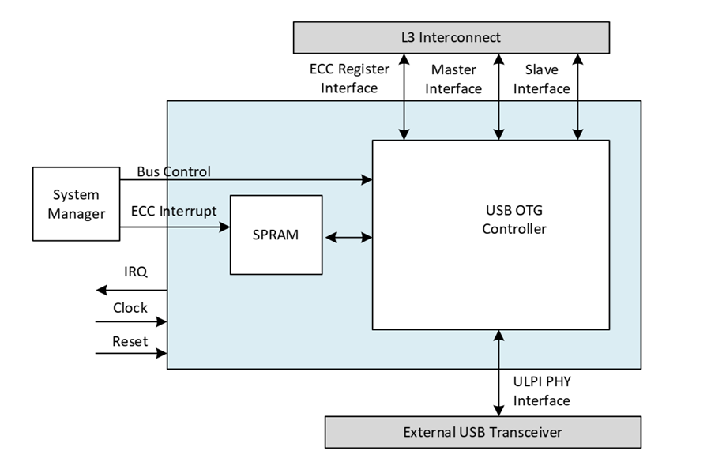
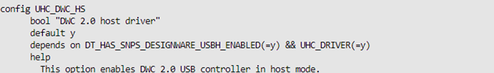
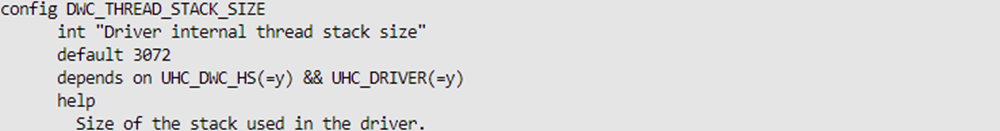
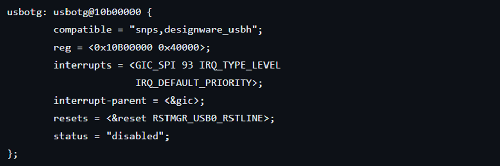

# **USB 2.0 OTG Driver for Hard Processor System**

Last updated: **May 21, 2024** 

**Upstream Status**: Not Upstreamed

**Devices supported**: Agilex 5

## **Introduction**

Universal Serial Bus (USB) is used to connect peripheral devices to HPS. The USB 2.0 OTG (On-The-Go) IP supports host mode, device mode and OTG mode. However, in both Agilex 7 and Agilex 5, the IP was tested in host mode with support for Mass Storage Class (MSC) integrated with a FAT32 file system. This would enable us to do file operations on an attached device.
The below diagram represents the block diagram of the USB 2.0 controller connected with other components in the system.

For More information please refer to the following link:

[Agilex 5 Hard Processor System Technical Reference Manual](https://www.intel.com/content/www/us/en/docs/programmable/814346)

## **Features**

* Supports all USB 2.0 speeds.
* Integrated scatter-gather DMA supports moving data between memory and the controller either in buffer DMA mode or scatter-gather DMA mode depending on the controller’s function.
* Supports USB 2.0 in ULPI mode.
* Supports all USB transaction types.
* Supports up to 16 endpoints, including bidirectional control endpoint.
* Only a single line interrupt is used from a USB OTG instance.

## **Driver Sources**

The source code for this driver can be found at:

[https://github.com/altera-opensource/zephyr-socfpga/blob/socfpga_rel_23.4/drivers/usb/uhc/uhc_dwc_hs.c](https://github.com/altera-opensource/zephyr-socfpga/blob/socfpga_rel_23.4/drivers/usb/uhc/uhc_dwc_hs.c)

## **Driver Capabilities**

* Control and Bulk endpoints are supported in host mode.
* Auto enumeration support is enabled.
* Supports Mass Storage Class which is integrated with FAT 32 file system in host mode.
* Hot plugging feature is supported.

## **Kernel Configurations**

CONFIG_ UHC_DWC_HS

CONFIG_ DWC_THREAD_STACK_SIZE

## **Device Tree**

Example Device tree location to configure the usb2_0_otg:

[https://github.com/altera-opensource/zephyr-socfpga/blob/socfpga_rel_23.4/dts/arm64/intel/intel_socfpga_agilex5.dtsi](https://github.com/altera-opensource/zephyr-socfpga/blob/socfpga_rel_23.4/dts/arm64/intel/intel_socfpga_agilex5.dtsi)

## **Known Issues**

None Known
