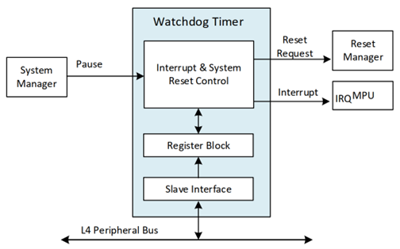

# **Watchdog Timer Driver for Hard Processor System**

**Upstream Status**: [Upstreamed](https://github.com/zephyrproject-rtos/zephyr/blob/main/drivers/watchdog/wdt_dw.c )

**Devices supported**: Agilex 5

## **Introduction**

The watchdog timer is used mainly to recover from system lockup that might be caused by software or system-related issues. 

The hard processor system (HPS) provides five Watchdog Timers based on synopsis designware.

For more information, please refer to the following link:
[Agilex 5 Hard Processor System Technical Reference Manual](https://www.intel.com/content/www/us/en/docs/programmable/814346)

## **Driver Sources**

The source code for this driver can be found at [https://github.com/zephyrproject-rtos/zephyr/blob/main/drivers/watchdog/wdt_dw.c](https://github.com/zephyrproject-rtos/zephyr/blob/main/drivers/watchdog/wdt_dw.c).

## **Driver Capabilities**

* Watchdog can be enabled/disabled in driver initialization when zephyr boots through Kconfig option.
* Enable/Disable watchdog interrupt when the timer expires.
* Watchdog Timers counts down from a preset value to zero, then performs one of the following user-configurable operations:
    * Generates a system reset.
    * Generates an interrupt, restarts the timer, and if the timer is not cleared before a second timeout occurs, generates a system reset Driver can be configured for one of the possible three use cases.

## **Kernel Configurations**
CONFIG_ WDT_DW

## **Device Tree**

Device tree location to configure the Watchdog:[https://github.com/zephyrproject-rtos/zephyr/blob/main/dts/arm64/intel/intel_socfpga_agilex5.dtsi](https://github.com/zephyrproject-rtos/zephyr/blob/main/dts/arm64/intel/intel_socfpga_agilex5.dtsi)

## **Known Issues**

None known

