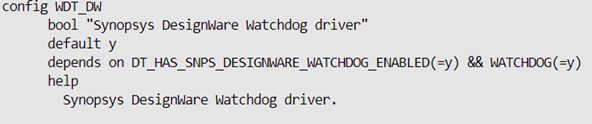
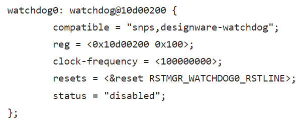

# **Watchdog Timer Driver for Hard Processor System**
**Upstream Status**: [Upstreamed](https://github.com/zephyrproject-rtos/zephyr/blob/main/drivers/watchdog/wdt_dw.c )

**Devices supported**: Agilex 5

## **Introduction**

The watchdog timer is used mainly to recover from system lockup that might be caused by software or system-related issues. 

The hard processor system (HPS) provides five Watchdog Timers based on synopsis designware.

For more information, please refer to the following link:
[Agilex 5 Hard Processor System Technical Reference Manual](https://www.intel.com/content/www/us/en/docs/programmable/814346)


## **Driver Sources**

The source code for this driver can be found at [https://github.com/zephyrproject-rtos/zephyr/blob/main/drivers/watchdog/wdt_dw.c](https://github.com/zephyrproject-rtos/zephyr/blob/main/drivers/watchdog/wdt_dw.c).

## **Driver Capabilities**

* Watchdog can be enabled/disabled in driver initialization when zephyr boots through Kconfig option.
* Enable/Disable watchdog interrupt when the timer expires.
* Watchdog Timers counts down from a preset value to zero, then performs one of the following user-configurable operations:
    * Generates a system reset.
    * Generates an interrupt, restarts the timer, and if the timer is not cleared before a second timeout occurs, generates a system reset Driver can be configured for one of the possible three use cases.


## **Kernel Configurations**
CONFIG_ WDT_DW



## **Device Tree**

Device tree location to configure the Watchdog:[https://github.com/zephyrproject-rtos/zephyr/blob/main/dts/arm64/intel/intel_socfpga_agilex5.dtsi](https://github.com/zephyrproject-rtos/zephyr/blob/main/dts/arm64/intel/intel_socfpga_agilex5.dtsi)


## **Driver Sample**


The source code for the driver sample can be found at: [https://github.com/altera-opensource/zephyr-socfpga/blob/socfpga_rel_23.4/samples/drivers/watchdog](https://github.com/altera-opensource/zephyr-socfpga/blob/socfpga_rel_23.4/samples/drivers/watchdog).

The most relevant files are:
1. Project yml -> sample.yml:

 ```
  1 sample:
  2   name: Watchdog Driver Sample
  3 common:
  4   tags:
  5     - drivers
  6     - watchdog
  7   harness: console
  8   harness_config:
  9     type: multi_line
 10     ordered: true
 11     regex:
 12       - "Watchdog sample application"
 13       - "Feeding watchdog..."
 14       - "Waiting for reset..."
 15       - "Watchdog sample application"
 16   depends_on: watchdog

  ```

2. Config overlay -> prj.conf:

```
  1 CONFIG_LOG=y
  2 CONFIG_LOG_MODE_IMMEDIATE=y
  3 CONFIG_WDT_LOG_LEVEL_DBG=y
  4 CONFIG_WATCHDOG=y
  5 CONFIG_WDT_DISABLE_AT_BOOT=n

```
3. Specific board config -> intel_socfpga_agilex5_socdk.conf 
```
  1 CONFIG_WDT_DW_RESET_MODE=2
  2 CONFIG_WDT_DW_PAUSE_BY_DBG=y
```
4. Device tree overlay -> intel_socfpga_agilex5_socdk.overlay  
```
  1 /*
  2  * Copyright (C) 2023 Intel Corporation
  3  *
  4  * SPDX-License-Identifier: Apache-2.0
  5  */
  6
  7 / {
  8         aliases {
  9                 watchdog0 = &watchdog0;
 10         };
 11 };
 12
 13 &watchdog0 {
 14         interrupt-parent = <&gic>;
 15         interrupts = <GIC_SPI 117 IRQ_TYPE_LEVEL
 16                         IRQ_DEFAULT_PRIORITY>;
 17         status = "okay";
 18 };             
```
5. Source code: [https://github.com/altera-opensource/zephyr-socfpga/blob/socfpga_rel_23.4/samples/drivers/watchdog/src/main.c](https://github.com/altera-opensource/zephyr-socfpga/blob/socfpga_rel_23.4/samples/drivers/watchdog/src/main.c).
## **Steps to build**


1. Execute the following commands:
```
rm -rf agilex5
west build -b intel_socfpga_agilex5_socdk samples/drivers/watchdog/  -d agilex5

```
## **Output**

```
NOTICE:  return = 0 Hz
NOTICE:  mmc_clk = 200000000 Hz
NOTICE:  SDMMC boot
NOTICE:  BL2: v2.9.1(release):QPDS23.4_REL_GSRD_PR
NOTICE:  BL2: Built : 18:22:43, Jul  2 2024
NOTICE:  BL2: Booting BL31
NOTICE:  BL31: Boot Core = 0
NOTICE:  BL31: CPU ID = 81000000
NOTICE:  BL31: v2.9.1(release):QPDS23.4_REL_GSRD_PR
NOTICE:  BL31: Built : 18:22:43, Jul  2 2024
*** Booting Zephyr OS build 33d4a115fbed ***
Secondary CPU core 1 (MPID:0x100) is up
Secondary CPU core 2 (MPID:0x200) is up
Secondary CPU core 3 (MPID:0x300) is up
Watchdog sample application
Attempting to test pre-reset callback
Feeding watchdog 5 times
Feeding watchdog...
Feeding watchdog...
Feeding watchdog...
Feeding watchdog...
Feeding watchdog...
Waiting for reset...
Handled things..ready to reset
NOTICE:  return = 0 Hz
NOTICE:  mmc_clk = 200000000 Hz
NOTICE:  SDMMC boot
NOTICE:  BL2: v2.9.1(release):QPDS23.4_REL_GSRD_PR
NOTICE:  BL2: Built : 18:22:43, Jul  2 2024
NOTICE:  BL2: Booting BL31
NOTICE:  BL31: Boot Core = 0
NOTICE:  BL31: CPU ID = 81000000
NOTICE:  BL31: v2.9.1(release):QPDS23.4_REL_GSRD_PR
NOTICE:  BL31: Built : 18:22:43, Jul  2 2024
*** Booting Zephyr OS build 33d4a115fbed ***
Secondary CPU core 1 (MPID:0x100) is up
Secondary CPU core 2 (MPID:0x200) is up
Secondary CPU core 3 (MPID:0x300) is up
Watchdog sample application
Attempting to test pre-reset callback
Feeding watchdog 5 times
Feeding watchdog...
Feeding watchdog...
Feeding watchdog...
Feeding watchdog...
Feeding watchdog...
Waiting for reset...
```
## **Known Issues**
None known


